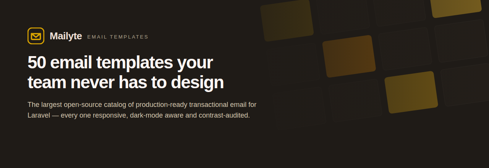
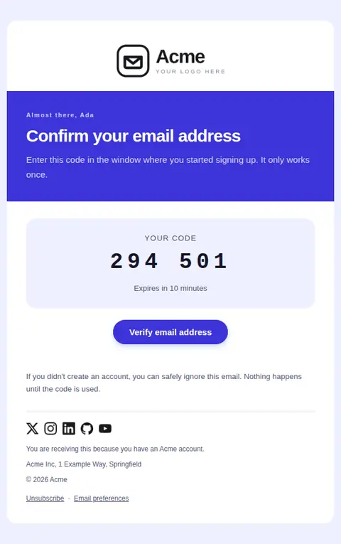
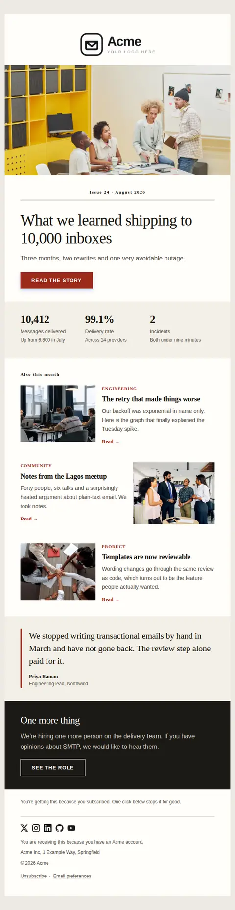
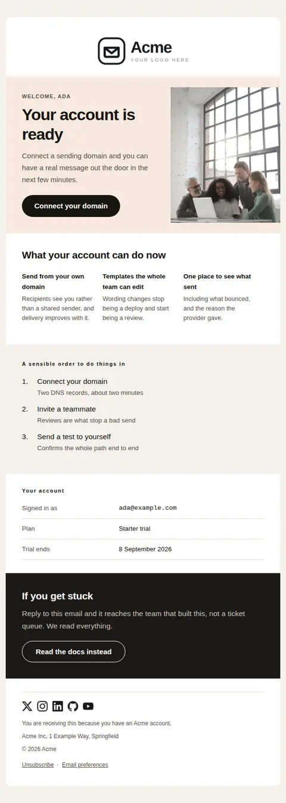
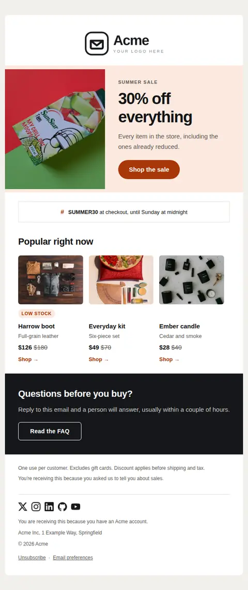
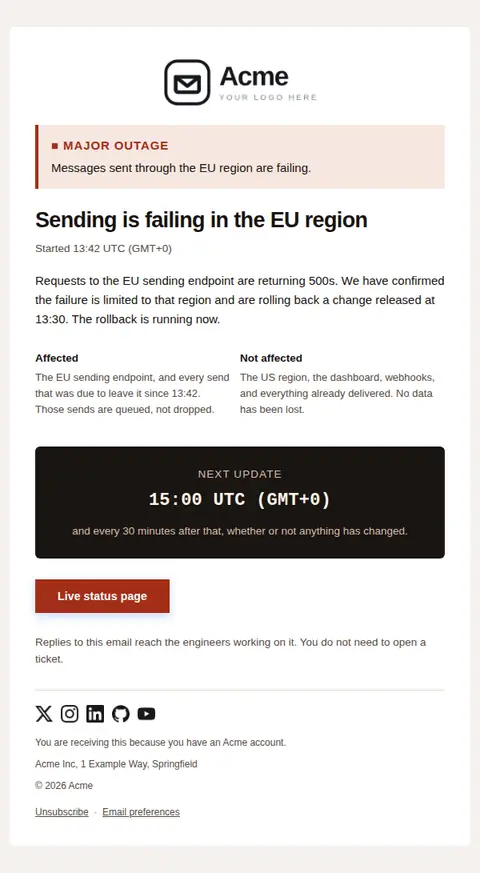

<p align="center">
  
</p>

<p align="center">
  <a href="https://packagist.org/packages/mailyte/laravel-email-templates"></a>
  <a href="https://github.com/Techies-Africa/mailyte-laravel-email-templates/actions/workflows/tests.yml"></a>
  <a href="LICENSE"></a>
  
  
  
</p>

# Mailyte Email Templates — free HTML email templates for Laravel

**The largest open-source library of ready-to-use transactional email templates
for Laravel and PHP.** Fifty free, responsive, dark-mode HTML email templates —
welcome, verify email, password reset, invoice, receipt, newsletter and the rest —
each with its own design, MIT licensed, ready to send in one line.

Part of **[Mailyte](https://mailyte.com)** — open-source mail and collaboration
infrastructure — a product of **[Techies Africa](https://techies.africa)**.

Laravel already tells you *how* to send mail. It has never told you what the mail
should look like — so every team rewrites the same welcome email, the same
receipt, the same password reset, and every one of them ships an invoice where
the amount due is set in the same 15px grey as the VAT line.

This package is the other half. Not a mechanism for storing templates: the
templates themselves.

```bash
composer require mailyte/laravel-email-templates
```

```php
Mailyte::template('password-reset')
    ->with(['reset_url' => $url, 'expires_in' => '1 hour'])
    ->send($user);
```

That is the whole integration. No Blade to write, no mailable to scaffold, no
designer to brief.

---

## See all 50 before you install

<p align="center">
<a href="docs/gallery/invoice.md"></a> <a href="docs/gallery/verify-email-vivid.md"></a> <a href="docs/gallery/newsletter.md"></a> <a href="docs/gallery/welcome.md"></a> <a href="docs/gallery/promotion.md"></a> <a href="docs/gallery/incident-notice.md"></a>
</p>

**[Browse the full gallery →](docs/gallery.md)** — every template, every layout it
supports (`plain`, `minimal`, `branded`, `editorial`), in light *and* dark. 294
renders, the data each template expects, and the line of code that sends it.
No install required to look.

---

## What is in the box

**50 templates across 10 categories**, every one of them a distinct piece of
design work — 49 different design registers between them, so no two look alike.

| Category | Templates |
|---|---|
| **Account** (9) | [`account-deleted`](docs/gallery/account-deleted.md), [`email-changed`](docs/gallery/email-changed.md), [`password-changed`](docs/gallery/password-changed.md), [`password-reset`](docs/gallery/password-reset.md), [`verify-email`](docs/gallery/verify-email.md), [`verify-email-code`](docs/gallery/verify-email-code.md), [`verify-email-link`](docs/gallery/verify-email-link.md), [`verify-email-typeset`](docs/gallery/verify-email-typeset.md), [`verify-email-vivid`](docs/gallery/verify-email-vivid.md) |
| **Billing** (9) | [`card-expiring`](docs/gallery/card-expiring.md), [`invoice`](docs/gallery/invoice.md), [`payment-failed`](docs/gallery/payment-failed.md), [`receipt`](docs/gallery/receipt.md), [`refund-issued`](docs/gallery/refund-issued.md), [`subscription-activated`](docs/gallery/subscription-activated.md), [`subscription-cancelled`](docs/gallery/subscription-cancelled.md), [`subscription-renewing`](docs/gallery/subscription-renewing.md), [`usage-limit-warning`](docs/gallery/usage-limit-warning.md) |
| **Onboarding** (8) | [`account-activated`](docs/gallery/account-activated.md), [`first-milestone`](docs/gallery/first-milestone.md), [`getting-started`](docs/gallery/getting-started.md), [`setup-incomplete`](docs/gallery/setup-incomplete.md), [`trial-ending`](docs/gallery/trial-ending.md), [`trial-expired`](docs/gallery/trial-expired.md), [`trial-started`](docs/gallery/trial-started.md), [`welcome`](docs/gallery/welcome.md) |
| **Notifications** (5) | [`comment-reply`](docs/gallery/comment-reply.md), [`mention`](docs/gallery/mention.md), [`notification`](docs/gallery/notification.md), [`task-assigned`](docs/gallery/task-assigned.md), [`weekly-digest`](docs/gallery/weekly-digest.md) |
| **Security** (5) | [`api-key-created`](docs/gallery/api-key-created.md), [`new-device-login`](docs/gallery/new-device-login.md), [`password-breach`](docs/gallery/password-breach.md), [`suspicious-activity`](docs/gallery/suspicious-activity.md), [`two-factor-enabled`](docs/gallery/two-factor-enabled.md) |
| **System** (5) | [`import-complete`](docs/gallery/import-complete.md), [`incident-notice`](docs/gallery/incident-notice.md), [`incident-resolved`](docs/gallery/incident-resolved.md), [`maintenance-scheduled`](docs/gallery/maintenance-scheduled.md), [`status-update`](docs/gallery/status-update.md) |
| **Collaboration** (4) | [`invite-accepted`](docs/gallery/invite-accepted.md), [`role-changed`](docs/gallery/role-changed.md), [`seat-limit-reached`](docs/gallery/seat-limit-reached.md), [`team-invitation`](docs/gallery/team-invitation.md) |
| **Marketing** (3) | [`product-tips`](docs/gallery/product-tips.md), [`promotion`](docs/gallery/promotion.md), [`re-engagement`](docs/gallery/re-engagement.md) |
| **Newsletter** (1) | [`newsletter`](docs/gallery/newsletter.md) |
| **Events** (1) | [`event-invite`](docs/gallery/event-invite.md) |

For comparison: [Postmark's template collection](https://github.com/ActiveCampaign/postmark-templates)
ships 11, and the nearest Laravel packages ship around five.

### Variants, not near-duplicates

Some jobs need more than one answer. `verify-email` ships five, and they differ
by **contract**, not by colour:

| Variant | Code | Link | Why it exists |
|---|---|---|---|
| `verify-email` | ✓ | optional | Both paths, dark terminal design |
| `verify-email-typeset` | ✓ | optional | Warm paper, serif |
| `verify-email-vivid` | ✓ | optional | Saturated band, consumer register |
| `verify-email-link` | — | required | One click, nothing to type |
| `verify-email-code` | required | — | Survives a security gateway rewriting your links |

A link-only flow breaks when the recipient opens the mail on a different device
than the one that started signup. A code-only flow is the only one that survives
a corporate gateway. That is a real difference, and it deserves a real template.

---

## Why these are not the templates you have used before

**Every template carries its own design.** Not one house style with fifty
bodies — a `design.json` per bundle with its own palette, type scale, font stack,
radii and rhythm. The invoice is a ledger with the amount at 56px and figures
right-aligned on tabular numerals. The verification email is a dark terminal. The
personal nudge has no logo, no social row and no canvas, because it has to look
like a person typed it.

**They are audited, not asserted.** Every claim below is enforced by something
that runs:

| Audit | What it covers |
|---|---|
| Render | Every template × every layout × every sample |
| Responsiveness | 588 renders at 320 / 375 / 480 / 600px — zero overflow |
| Contrast | Every text/background pair, light **and** dark, to WCAG AA |
| Alignment | Body and footer share one measure, in every layout |
| Catalog | Text alternative, alt text, subject length, Outlook ghost tables, marketing compliance |
| Lint | `mailyte:lint` — schema, variable cross-check both ways, content and compliance rules |
| Deliverability | `mailyte:deliverability` — Gmail clip threshold, text-to-image balance, link shape, phrase heuristics |

**Dark mode is handled properly.** Not a media query bolted on: a light/dark pair
on every colour token, `[data-ogsb]` hooks for Outlook.com, a logo that swaps to a
light-ink version, social icons whose ink is derived from the surface they sit on,
and button plates that move with their labels.

**The rendering engine is sandboxed.** Templates are Twig with an allowlist —
no filesystem, no `include`, no object methods, no `raw` filter, autoescaping that
cannot be turned off. A template from a stranger is safe to render, which is what
makes a public catalog possible at all.

---

## Using it

### Send

```php
use Mailyte\EmailTemplates\Facades\Mailyte;

Mailyte::template('email-changed')
    ->with([
        'old_email'  => $user->email,
        'new_email'  => $request->string('email'),
        'cancel_url' => URL::signedRoute('account.email.cancel', $user),
    ])
    ->send($user);        // or ->queue($user)
```

### Or design every email you already send

One flag, and every mail notification in the application — including Laravel's
own password reset and email verification — renders through Mailyte. No
notification class changes.

```bash
php artisan mailyte:adopt email-changed
```

One command: every email Laravel already sends — its password reset, its email
verification, your notifications, your markdown mailables — now wears the
`email-changed` design. Laravel still builds the message; this replaces only the
rendering step, so what your emails *say* is untouched. A message that chose its own view or markdown
template is left alone, and if rendering ever fails the email still sends
through Laravel's renderer. See
**[Laravel integration](docs/laravel-integration.md)**.

### Or keep your own Mailable

The same swap as `view:` or `markdown:` — your class, your constructor, your
attachments, our body:

```php
class AddressChanging extends Mailable
{
    use Queueable, SerializesModels, UsesMailyteTemplate;

    public function __construct(private User $user, private string $newAddress) {}

    protected function mailyte(): TemplateBuilder
    {
        return Mailyte::template('email-changed')->with([...]);
    }
}
```

### Brand it once

Everything shared across all fifty lives in one config block:

```php
'brand' => [
    'logo'   => ['url' => ..., 'dark_url' => ..., 'align' => 'center'],
    'social' => [['name' => 'X', 'url' => 'https://x.com/acme']],
    'footer' => ['address' => ..., 'reason' => ..., 'show_unsubscribe' => null],
],
```

Per-tenant branding still overrides it at send time:

```php
->theme(['color.primary' => $org->brand_colour, 'logo.url' => $org->logo_url])
```

### Make one your own

```bash
php artisan mailyte:publish-template email-changed
```

Four files land in `resources/views/vendor/mailyte/templates/email-changed/` —
manifest, design tokens, composition, sample data. Edit any of them. Your copy
takes precedence everywhere that slug is already used, with no code changes.

`--as=my-slug` keeps the original and gives you a second template instead.

---

## The preview gallery

```
/mailyte
```

Every template rendered live against your own data, across every theme, layout,
colour scheme and viewport width — 320px is where a design either holds together
or does not. Edit any variable and the preview re-renders as you type. Send a
test to yourself from the same screen.

Gated to local environments by default; open it up with `Dashboard::auth()`.

---

## Commands

```bash
php artisan mailyte:list                       # the catalog
php artisan mailyte:list email-changed         # one template and the data it expects
php artisan mailyte:adopt <slug>               # make every Laravel email use one design
php artisan mailyte:adopt --reset              # hand mail rendering back to Laravel
php artisan mailyte:lint --strict              # check every bundle you can resolve
php artisan mailyte:deliverability --strict    # what a spam filter makes of the rendered message
php artisan mailyte:deliverability <slug> --eml=storage/eml   # export .eml for mail-tester.com
php artisan mailyte:send-test <slug> --to=you@example.com
php artisan mailyte:publish-template <slug>    # copy it into your app to edit
php artisan mailyte:usage                      # which templates you actually send
php artisan vendor:publish --tag=mailyte-assets        # social icons
php artisan vendor:publish --tag=mailyte-mail-themes   # themes
```

---

## Documentation

- [Gallery](docs/gallery.md) — all 50, every layout, light and dark
- [Deliverability](docs/deliverability.md) — what the template controls, and what only your DNS can fix
- [Laravel integration](docs/laravel-integration.md) — one email, one Mailable, or every notification you already send
- [Sending](docs/sending.md) — the three ways in, and publishing a template
- [Theming](docs/theming.md) — brand config, design tokens, per-tenant branding
- [Catalog plan](docs/catalog-plan.md) — what is here and why
- [Credits](CREDITS.md) — every third-party asset, its author and its licence
- [Changelog](CHANGELOG.md) · [Contributing](CONTRIBUTING.md) · [Security](SECURITY.md)

---

## Requirements

PHP 8.2+, Laravel 11, 12 or 13. (Laravel 13 requires PHP 8.3+.)

## Contributing

Templates are contributed as four files and validated by `mailyte:lint` — a JSON
schema, a variable cross-check in both directions, and the catalog's content and
compliance rules, each with a code you can waive only by writing down why. A
contribution that overflows at 320px or fails contrast in dark mode does not
merge. See [CONTRIBUTING.md](CONTRIBUTING.md).

## Authors

**Mailyte Email Templates** was created by
**[Confidence Ugolo](https://www.linkedin.com/in/confidence-ugolo)** — original
author of the package and founder of Mailyte — with
**[Joel Omojefe](https://www.linkedin.com/in/joel-omojefe)** as co-author.

| | | |
|---|---|---|
| **Confidence Ugolo** | Creator, original author, founder of Mailyte | [LinkedIn](https://www.linkedin.com/in/confidence-ugolo) |
| **Joel Omojefe** | Co-author | [LinkedIn](https://www.linkedin.com/in/joel-omojefe) |

**Mailyte Email Templates** is part of [Mailyte](https://mailyte.com),
open-source mail and collaboration infrastructure, and a product of
**[Techies Africa](https://techies.africa)** — who maintain this package.

Contributions are welcome under the MIT licence — see
[CONTRIBUTING.md](CONTRIBUTING.md), and [CREDITS.md](CREDITS.md) for every
third-party asset the sample data references.

## Licence

MIT. The templates too — use them, edit them, ship them, sell what you build with
them.

Photography in sample data is credited in [CREDITS.md](CREDITS.md) and is never a
shipped default: installing this package does not make your application hotlink
anyone's images.
