# Free Laravel email templates — the whole catalog, in pictures

All 50 free HTML email templates, every layout each one supports, in both light and dark — 294 renders in total. Responsive, dark-mode, WCAG AA, MIT licensed. Nothing to install to look.

Every shot is a real render at 600px wide, taken from the preview gallery that ships with the package, against the sample data in the bundle. Click any template for its full set, the data it expects, and the line of code that sends it.

> Photography in sample data is credited on each template's page and in [CREDITS.md](../CREDITS.md). Shipped defaults never hotlink third-party media.

**Jump to:** [Account](#account) (9) · [Security](#security) (5) · [Onboarding](#onboarding) (8) · [Billing](#billing) (9) · [Collaboration](#collaboration) (4) · [Notifications](#notifications) (5) · [System](#system) (5) · [Marketing](#marketing) (3) · [Newsletter](#newsletter) (1) · [Events](#events) (1)

## Account

| Template | Light | Dark |
|---|---|---|
| **[Account scheduled for deletion](gallery/account-deleted.md)** `account-deleted` plain · minimal · branded |  |  |
| **[Email address changed](gallery/email-changed.md)** `email-changed` plain · minimal · branded |  |  |
| **[Password changed](gallery/password-changed.md)** `password-changed` plain · minimal · branded | <a href="gallery/password-changed.md">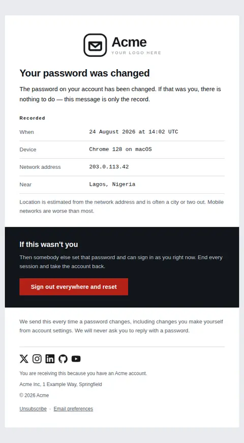</a> | <a href="gallery/password-changed.md">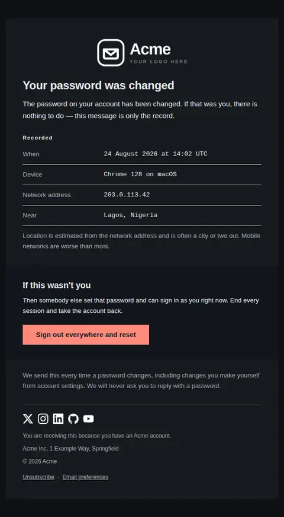</a> |
| **[Reset your password](gallery/password-reset.md)** `password-reset` plain · minimal · branded |  |  |
| **[Verify email address](gallery/verify-email.md)** _Default_ `verify-email` plain · minimal · branded | <a href="gallery/verify-email.md">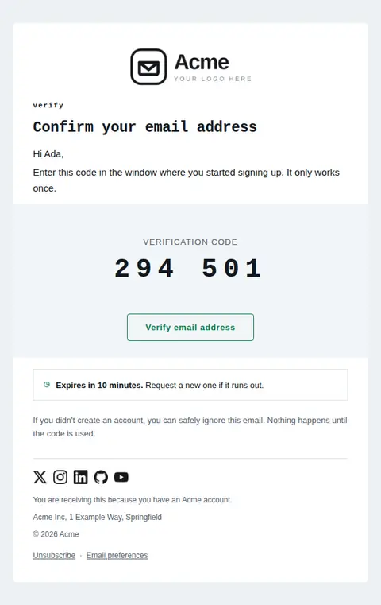</a> | <a href="gallery/verify-email.md">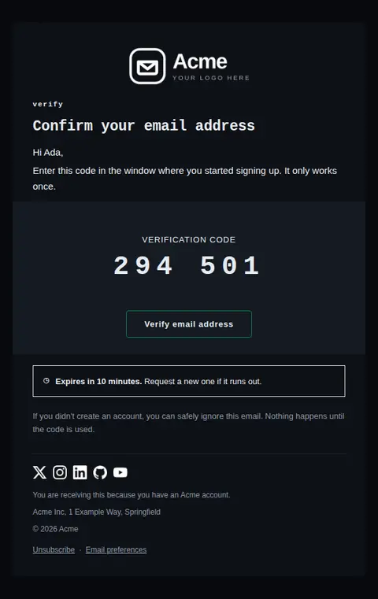</a> |
| **[Verify email address](gallery/verify-email-code.md)** _Code only_ `verify-email-code` plain · minimal · branded |  |  |
| **[Verify email address](gallery/verify-email-link.md)** _Link only_ `verify-email-link` plain · minimal · branded |  |  |
| **[Verify email address](gallery/verify-email-typeset.md)** _Typeset_ `verify-email-typeset` plain · minimal · branded |  |  |
| **[Verify email address](gallery/verify-email-vivid.md)** _Vivid_ `verify-email-vivid` minimal · branded |  | <a href="gallery/verify-email-vivid.md">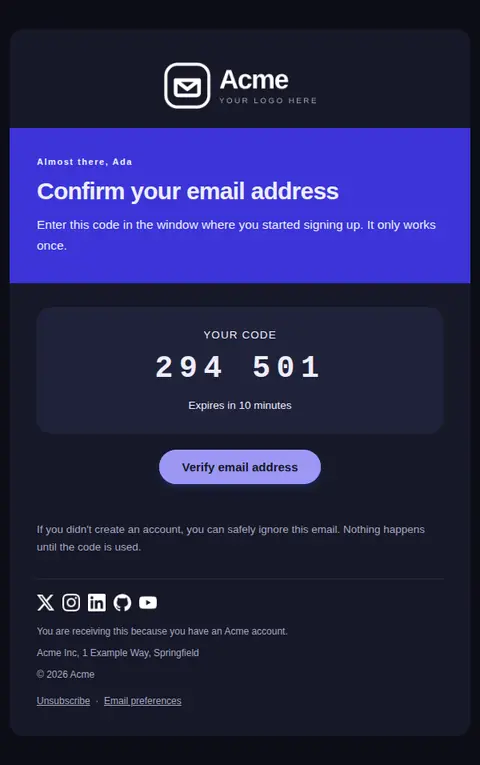</a> |

## Security

| Template | Light | Dark |
|---|---|---|
| **[API key created](gallery/api-key-created.md)** `api-key-created` plain · minimal · branded |  |  |
| **[New device sign-in](gallery/new-device-login.md)** `new-device-login` plain · minimal · branded | <a href="gallery/new-device-login.md">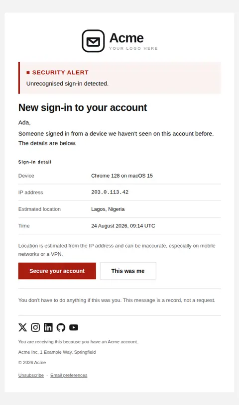</a> | <a href="gallery/new-device-login.md">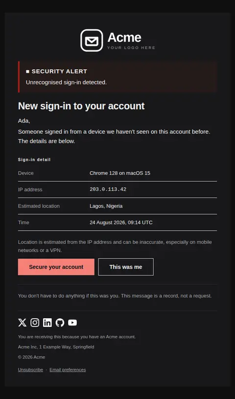</a> |
| **[Password found in a breach](gallery/password-breach.md)** `password-breach` plain · minimal · branded |  |  |
| **[Sign-in attempt blocked](gallery/suspicious-activity.md)** `suspicious-activity` plain · minimal · branded | <a href="gallery/suspicious-activity.md">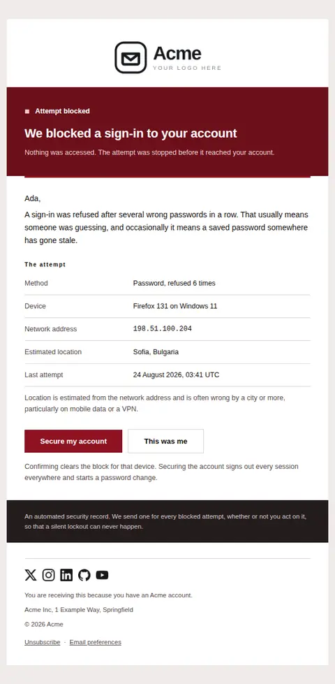</a> | <a href="gallery/suspicious-activity.md">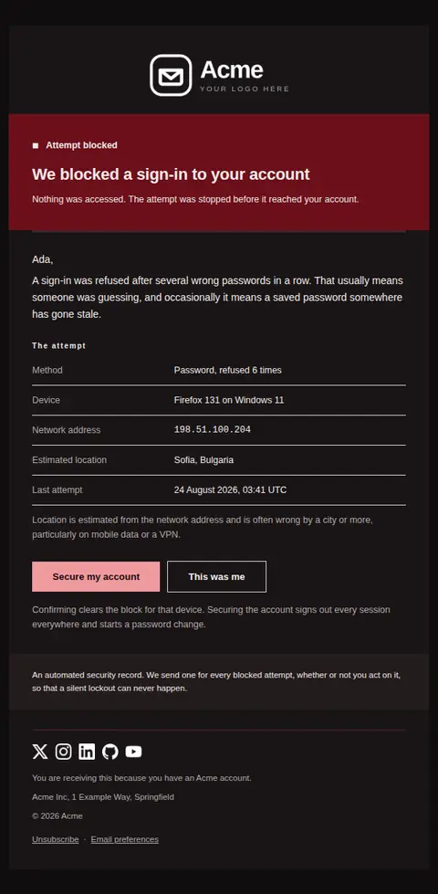</a> |
| **[Two-step verification changed](gallery/two-factor-enabled.md)** `two-factor-enabled` plain · minimal · branded | <a href="gallery/two-factor-enabled.md">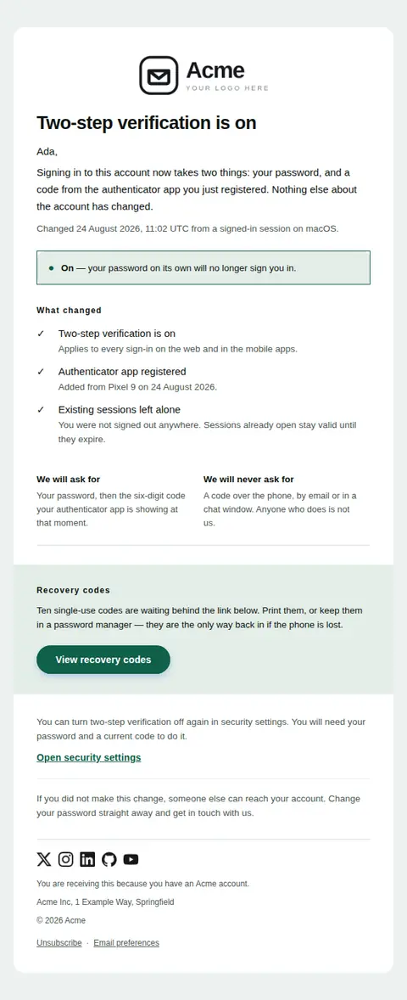</a> | <a href="gallery/two-factor-enabled.md">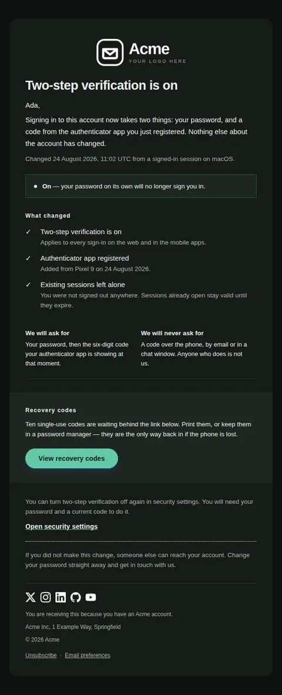</a> |

## Onboarding

| Template | Light | Dark |
|---|---|---|
| **[Account activated](gallery/account-activated.md)** `account-activated` plain · minimal · branded | <a href="gallery/account-activated.md">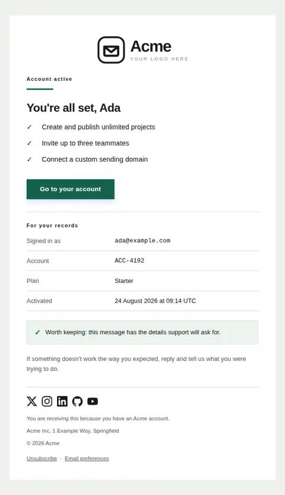</a> | <a href="gallery/account-activated.md">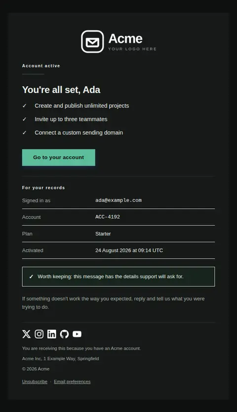</a> |
| **[First milestone reached](gallery/first-milestone.md)** `first-milestone` minimal · branded · editorial |  |  |
| **[Getting started checklist](gallery/getting-started.md)** `getting-started` plain · minimal · branded |  |  |
| **[Setup incomplete](gallery/setup-incomplete.md)** `setup-incomplete` plain · minimal |  |  |
| **[Trial ending soon](gallery/trial-ending.md)** `trial-ending` minimal · branded |  |  |
| **[Trial expired](gallery/trial-expired.md)** `trial-expired` plain · minimal · branded | <a href="gallery/trial-expired.md">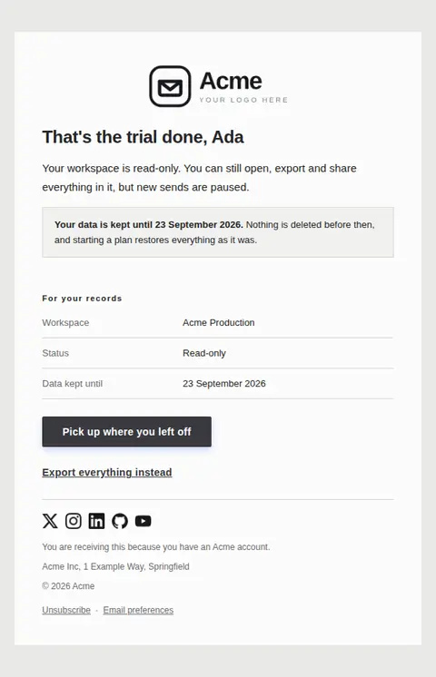</a> | <a href="gallery/trial-expired.md">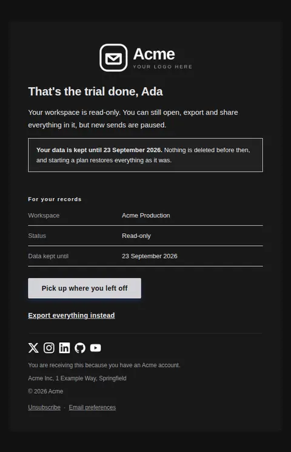</a> |
| **[Trial started](gallery/trial-started.md)** `trial-started` minimal · branded |  |  |
| **[Welcome](gallery/welcome.md)** `welcome` minimal · branded · editorial |  |  |

## Billing

| Template | Light | Dark |
|---|---|---|
| **[Card expiring soon](gallery/card-expiring.md)** `card-expiring` plain · minimal · branded | <a href="gallery/card-expiring.md">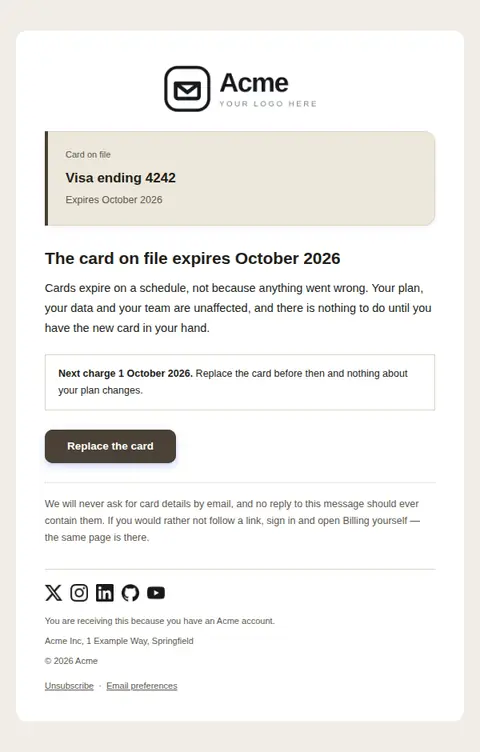</a> | <a href="gallery/card-expiring.md">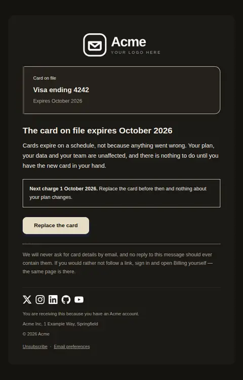</a> |
| **[Invoice](gallery/invoice.md)** `invoice` plain · minimal · branded |  |  |
| **[Payment failed](gallery/payment-failed.md)** `payment-failed` plain · minimal · branded |  |  |
| **[Payment receipt](gallery/receipt.md)** `receipt` plain · minimal · branded | <a href="gallery/receipt.md">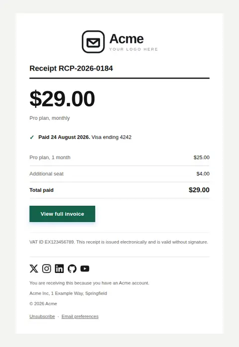</a> | <a href="gallery/receipt.md">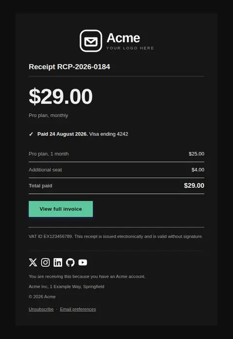</a> |
| **[Refund issued](gallery/refund-issued.md)** `refund-issued` plain · minimal · branded | <a href="gallery/refund-issued.md">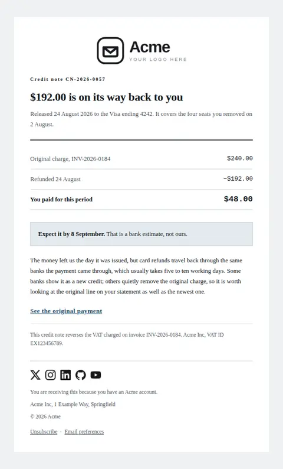</a> | <a href="gallery/refund-issued.md">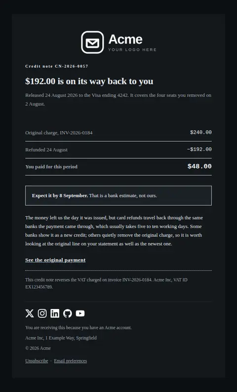</a> |
| **[Plan activated](gallery/subscription-activated.md)** `subscription-activated` minimal · branded |  |  |
| **[Subscription cancelled](gallery/subscription-cancelled.md)** `subscription-cancelled` plain · minimal · branded |  |  |
| **[Subscription renewing](gallery/subscription-renewing.md)** `subscription-renewing` plain · minimal · branded | <a href="gallery/subscription-renewing.md">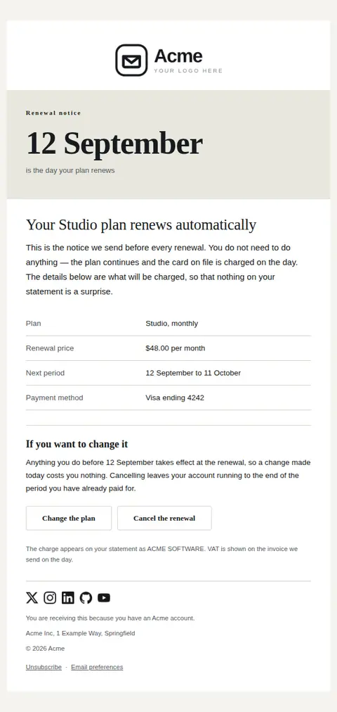</a> | <a href="gallery/subscription-renewing.md">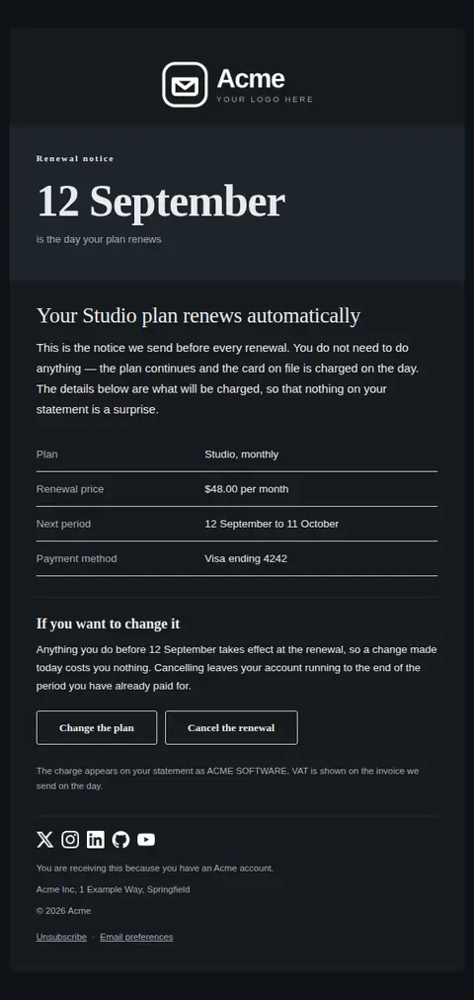</a> |
| **[Usage limit approaching](gallery/usage-limit-warning.md)** `usage-limit-warning` plain · minimal · branded |  |  |

## Collaboration

| Template | Light | Dark |
|---|---|---|
| **[Invitation accepted](gallery/invite-accepted.md)** `invite-accepted` plain · minimal · branded | <a href="gallery/invite-accepted.md">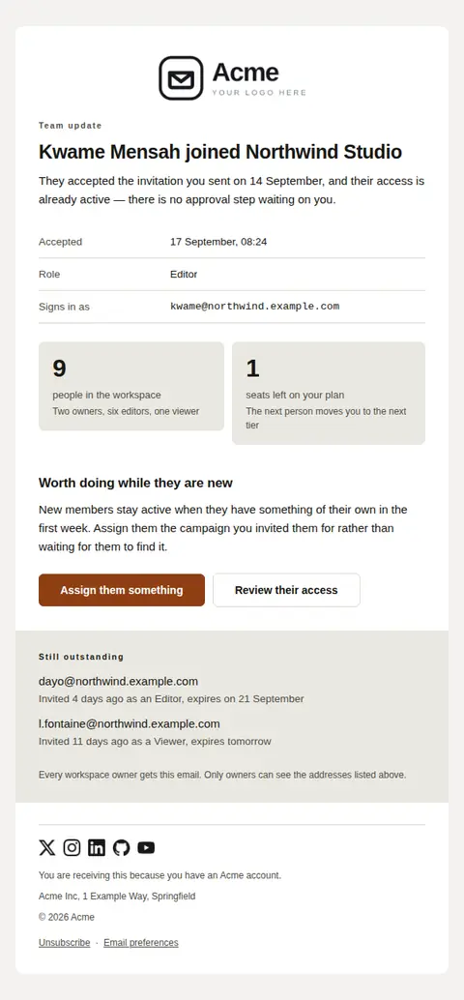</a> | <a href="gallery/invite-accepted.md">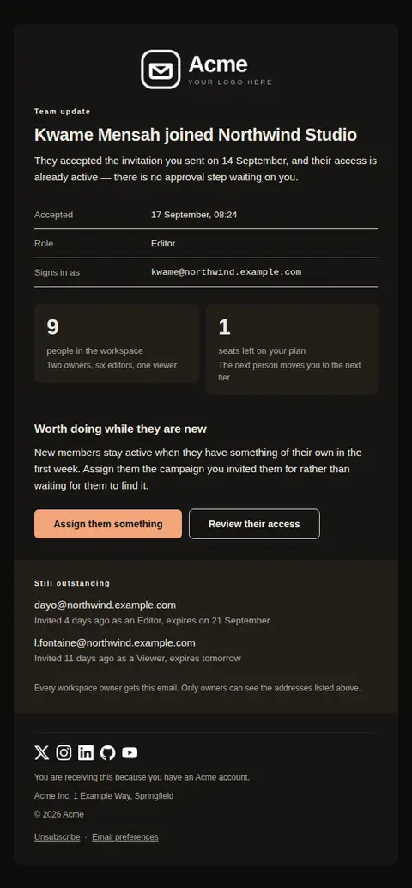</a> |
| **[Role changed in a workspace](gallery/role-changed.md)** `role-changed` plain · minimal · branded | <a href="gallery/role-changed.md">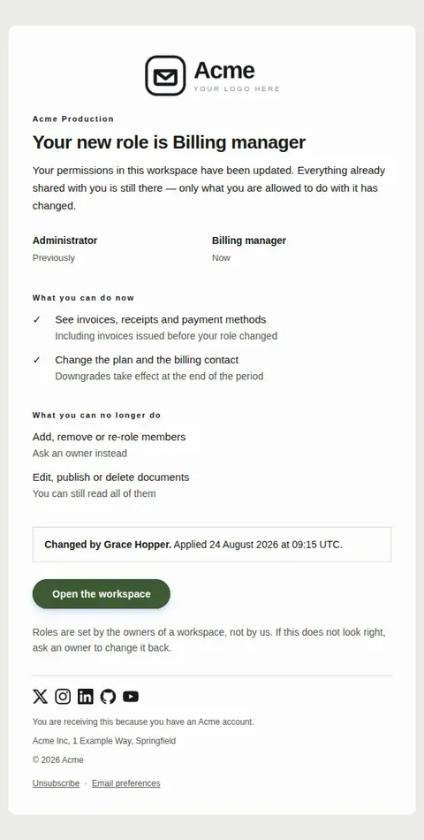</a> | <a href="gallery/role-changed.md">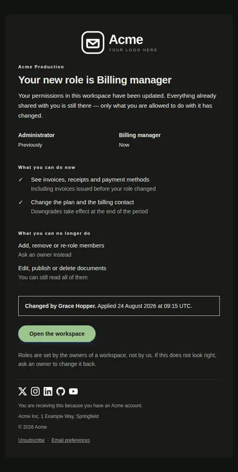</a> |
| **[Seat limit reached](gallery/seat-limit-reached.md)** `seat-limit-reached` plain · minimal · branded |  |  |
| **[Team invitation](gallery/team-invitation.md)** `team-invitation` minimal · branded · editorial |  |  |

## Notifications

| Template | Light | Dark |
|---|---|---|
| **[New reply in a thread](gallery/comment-reply.md)** `comment-reply` plain · minimal · branded |  |  |
| **[You were mentioned](gallery/mention.md)** `mention` plain · minimal · branded |  |  |
| **[Notification](gallery/notification.md)** `notification` plain · minimal · branded |  |  |
| **[A task was assigned to you](gallery/task-assigned.md)** `task-assigned` plain · minimal · branded | <a href="gallery/task-assigned.md">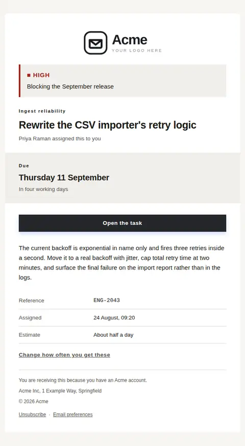</a> | <a href="gallery/task-assigned.md">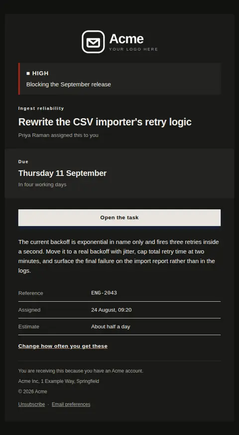</a> |
| **[Weekly digest](gallery/weekly-digest.md)** `weekly-digest` plain · minimal · branded |  |  |

## System

| Template | Light | Dark |
|---|---|---|
| **[Import complete](gallery/import-complete.md)** `import-complete` plain · minimal · branded |  |  |
| **[Incident notice](gallery/incident-notice.md)** `incident-notice` plain · minimal · branded |  |  |
| **[Incident resolved](gallery/incident-resolved.md)** `incident-resolved` plain · minimal · branded · editorial |  |  |
| **[Scheduled maintenance](gallery/maintenance-scheduled.md)** `maintenance-scheduled` plain · minimal · branded |  |  |
| **[Status update](gallery/status-update.md)** `status-update` plain · minimal · branded |  |  |

## Marketing

| Template | Light | Dark |
|---|---|---|
| **[Product tips and updates](gallery/product-tips.md)** `product-tips` minimal · branded · editorial |  |  |
| **[Promotional offer](gallery/promotion.md)** `promotion` minimal · branded · editorial |  | <a href="gallery/promotion.md">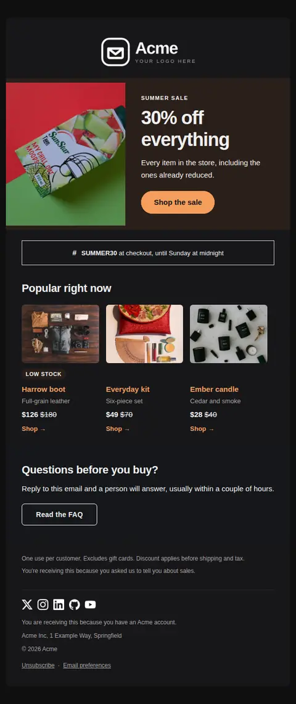</a> |
| **[What changed while you were away](gallery/re-engagement.md)** `re-engagement` plain · minimal · branded · editorial | <a href="gallery/re-engagement.md">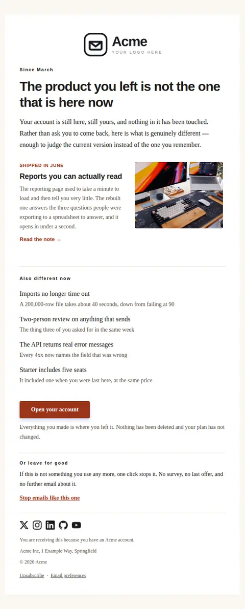</a> | <a href="gallery/re-engagement.md">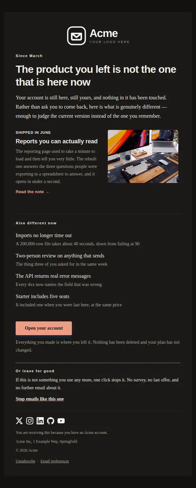</a> |

## Newsletter

| Template | Light | Dark |
|---|---|---|
| **[Newsletter](gallery/newsletter.md)** `newsletter` minimal · branded · editorial |  | <a href="gallery/newsletter.md">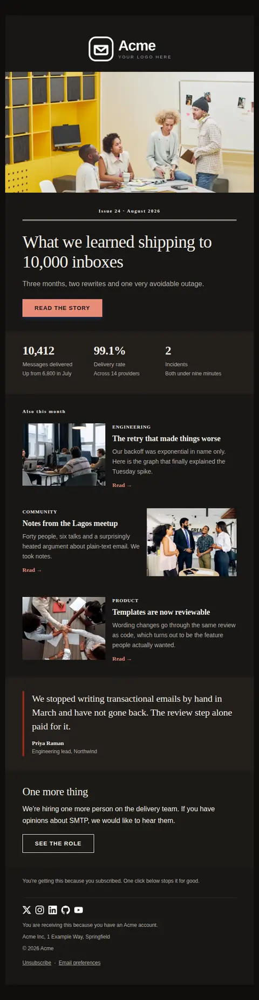</a> |

## Events

| Template | Light | Dark |
|---|---|---|
| **[Event invitation](gallery/event-invite.md)** `event-invite` minimal · branded · editorial |  |  |

---

Want to see these against your own data, at any width, in any theme? Install the package and open `/mailyte` — the same previews, live, with a 320px viewport switch and a send-a-test button.

Created by [Confidence Ugolo](https://www.linkedin.com/in/confidence-ugolo), founder of Mailyte, with [Joel Omojefe](https://www.linkedin.com/in/joel-omojefe). Mailyte is a product of [Techies Africa](https://techies.africa). MIT licensed.

[← Back to the README](../README.md)
