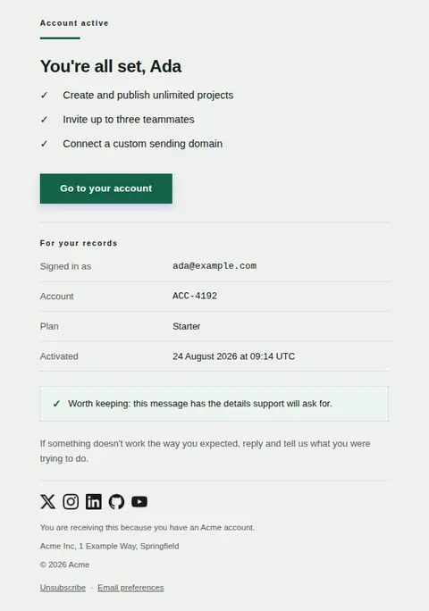
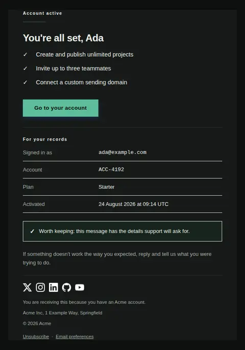
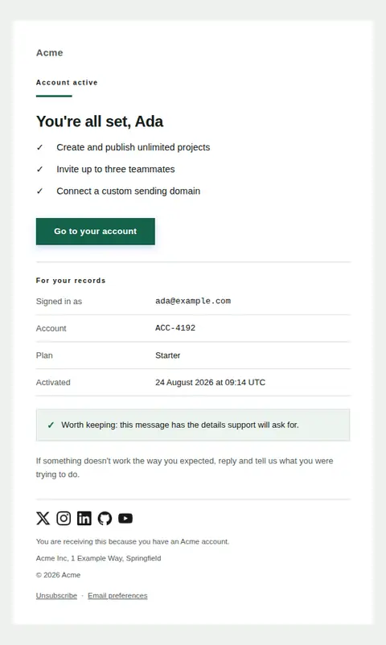
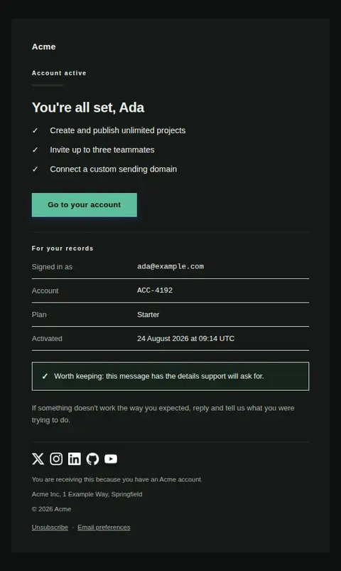

# Account activated — free Laravel email template

Confirms an account is fully active after verification or approval, and states exactly what is now available.

A free, responsive, dark-mode onboarding email template for Laravel and PHP, MIT licensed and ready to send. Part of [Mailyte Email Templates](../../README.md), the largest open-source catalog of designed transactional email for Laravel -- part of Mailyte, a product of [Techies Africa](https://techies.africa).

**`account-activated`** · **onboarding** · **transactional** · **friendly**

**Subject** `Your {{ product.name }} account is active`  
**Preheader** Everything is unlocked. Here is where to start and who to ask for help.

```bash
php artisan mailyte:list account-activated
```

```php
Mailyte::template('account-activated')->with([...])->send($user);
```

## Every layout, light and dark

Each shot is the real render at 600px, captured from the preview gallery.

| Layout | Light | Dark |
|---|---|---|
| **plain** | <a href="../previews/account-activated/plain-light.webp"></a> | <a href="../previews/account-activated/plain-dark.webp"></a> |
| **minimal** | <a href="../previews/account-activated/minimal-light.webp"></a> | <a href="../previews/account-activated/minimal-dark.webp"></a> |
| **branded** | <a href="../previews/account-activated/branded-light.webp"></a> | <a href="../previews/account-activated/branded-dark.webp"></a> |

## Data it expects

| Variable | Type | Required | What it is |
|---|---|---|---|
| `account_email` | email | yes | The address the account is tied to. Restating it surfaces a typo now rather than at the next sign-in. |
| `action_url` | url | yes | Where to go first. |
| `account_id` | string |  | Account or workspace reference, if you have one worth quoting to support. |
| `activated_at` | datetime |  | When activation completed, in the recipient's own timezone if you know it. |
| `button_label` | string |  | Primary button label. |
| `keep_note` | text |  | Why this email is worth keeping. A confirmation that says so gets filed instead of deleted. |
| `plan_name` | string |  | Plan the account starts on. |
| `support_note` | text |  | Where to get help, phrased as an invitation rather than a deflection. |
| `unlocked` | array |  | What is available now. Concrete capabilities, three or fewer. |
| `user.first_name` | string |  | Recipient's first name. |

## More onboarding email templates

[First milestone reached](first-milestone.md) · [Getting started checklist](getting-started.md) · [Setup incomplete](setup-incomplete.md) · [Trial ending soon](trial-ending.md) · [Trial expired](trial-expired.md) · [Trial started](trial-started.md) · [Welcome](welcome.md)

## Author

[Confidence Ugolo](https://www.linkedin.com/in/confidence-ugolo) · [Joel Omojefe](https://www.linkedin.com/in/joel-omojefe)

Part of Mailyte, a product of [Techies Africa](https://techies.africa). MIT licensed.

---

[← All 50 templates](../gallery.md) · [Package README](../../README.md) · [Sending](../sending.md) · [Theming](../theming.md) · [Deliverability](../deliverability.md)
