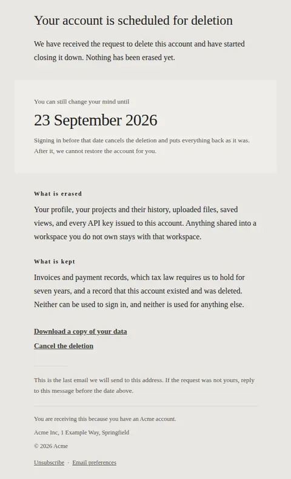
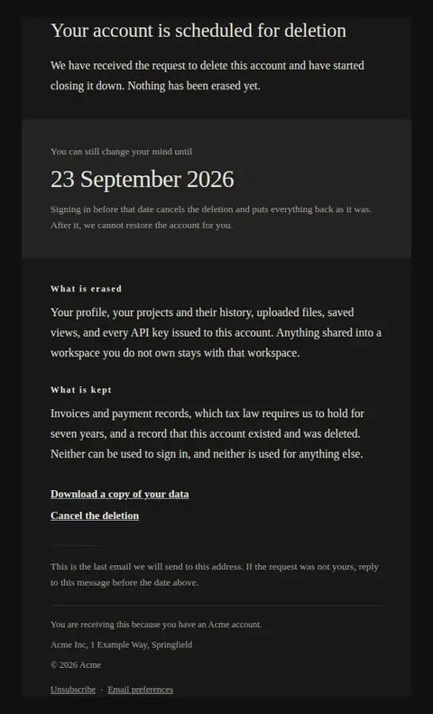
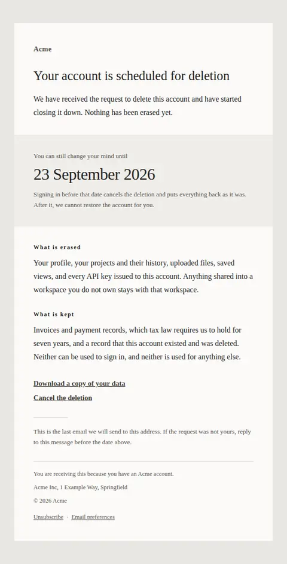
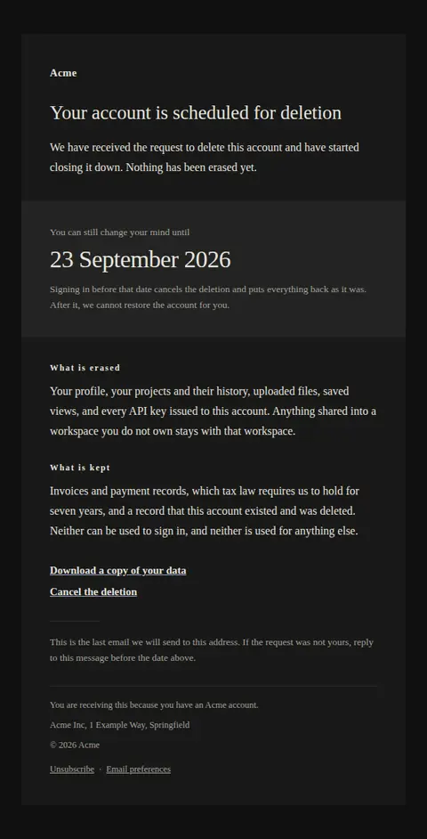
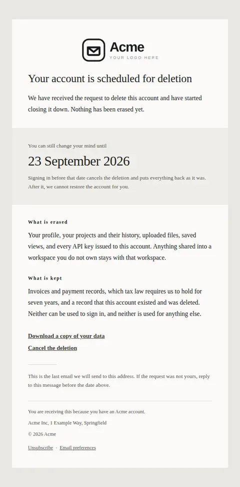
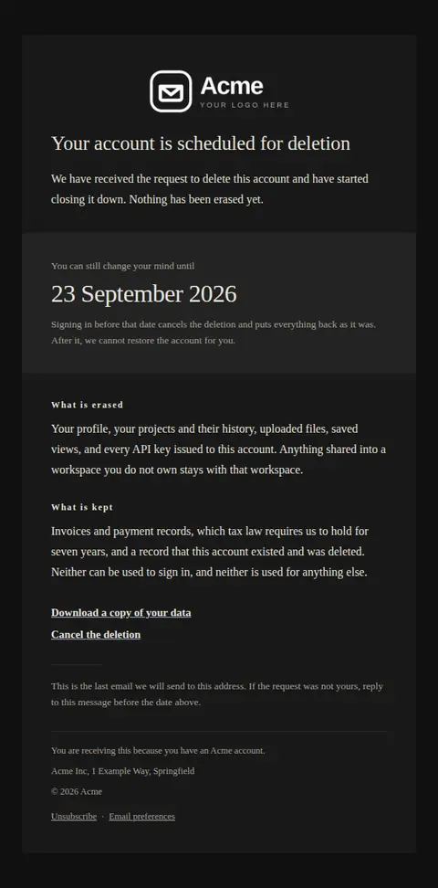

# Account scheduled for deletion — free Laravel email template

Sent when an account has been scheduled for deletion: the exact date recovery closes, what is erased, what is retained, and where to take a copy of the data first.

A free, responsive, dark-mode account email template for Laravel and PHP, MIT licensed and ready to send. Part of [Mailyte Email Templates](../../README.md), the largest open-source catalog of designed transactional email for Laravel -- part of Mailyte, a product of [Techies Africa](https://techies.africa).

**`account-deleted`** · **account** · **transactional**

**Subject** `Your {{ product.name }} account is scheduled for deletion`  
**Preheader** The date recovery closes, what is erased, and what is kept.

```bash
php artisan mailyte:list account-deleted
```

```php
Mailyte::template('account-deleted')->with([...])->send($user);
```

## Every layout, light and dark

Each shot is the real render at 600px, captured from the preview gallery.

| Layout | Light | Dark |
|---|---|---|
| **plain** | <a href="../previews/account-deleted/plain-light.webp"></a> | <a href="../previews/account-deleted/plain-dark.webp"></a> |
| **minimal** | <a href="../previews/account-deleted/minimal-light.webp"></a> | <a href="../previews/account-deleted/minimal-dark.webp"></a> |
| **branded** | <a href="../previews/account-deleted/branded-light.webp"></a> | <a href="../previews/account-deleted/branded-dark.webp"></a> |

## Data it expects

| Variable | Type | Required | What it is |
|---|---|---|---|
| `body` | text |  | The opening paragraph. State the request plainly and stop. There is no case to argue here, and an attempt to talk someone out of leaving is what makes this email resented. |
| `cancel_label` | string |  | Label on the link that stops the deletion. |
| `cancel_url` | url |  | Where the deletion is called off. Empty when the product has no cancellation path, in which case the link simply does not appear. |
| `closing_note` | text |  | The last line. A quiet route back to a human, and confirmation that this is the last message they will get. |
| `deleted_label` | string |  | Small heading over the erasure paragraph. |
| `deleted_text` | text |  | Everything that goes, in the concrete terms the person would use for their own work — not in the schema names your database uses. |
| `export_label` | string |  | Label on the export link. It is set as a plain underlined link rather than a button because this message should not be pushing anyone anywhere. |
| `export_url` | url |  | Where the export is prepared. Offer it while the window is open, not after — an export link that has already expired is worse than none. |
| `heading_text` | string |  | The headline. Scheduled, not done — a deletion email that reads as already-final stops people acting inside the window they still have. |
| `kept_label` | string |  | Small heading over the retention paragraph. |
| `kept_text` | text |  | What survives deletion and why. Invoices and audit records usually must be retained by law, and saying so before someone asks is the difference between a policy and a surprise. |
| `no_recovery_text` | string |  | Stands in for the date when a product deletes immediately. Say so in the same position and at the same size — the absence of a window is the most important fact there is. |
| `recovery_deadline` | date |  | The date recovery closes, set as the largest element in the message. A date rather than a countdown: this email gets kept and reread, and a countdown is wrong by the second reading. |
| `recovery_label` | string |  | The line introducing the deadline. Leave it empty when there is no window and the figure beneath speaks for itself. |
| `recovery_note` | text |  | How recovery actually works, or what replaces it. Say what the person has to do, since signing in is often both the cancellation and the recovery. |

## More account email templates

[Email address changed](email-changed.md) · [Password changed](password-changed.md) · [Reset your password](password-reset.md) · [Verify email address](verify-email.md) · [Verify email address](verify-email-code.md) · [Verify email address](verify-email-link.md) · [Verify email address](verify-email-typeset.md) · [Verify email address](verify-email-vivid.md)

## Author

[Confidence Ugolo](https://www.linkedin.com/in/confidence-ugolo) · [Joel Omojefe](https://www.linkedin.com/in/joel-omojefe)

Part of Mailyte, a product of [Techies Africa](https://techies.africa). MIT licensed.

---

[← All 50 templates](../gallery.md) · [Package README](../../README.md) · [Sending](../sending.md) · [Theming](../theming.md) · [Deliverability](../deliverability.md)
