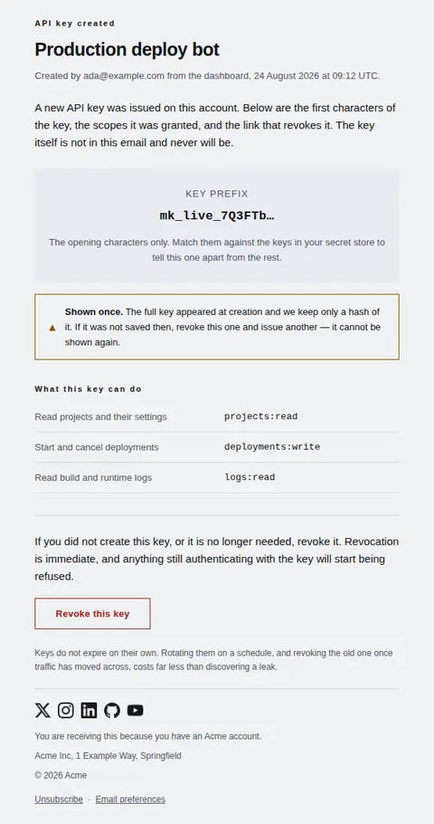
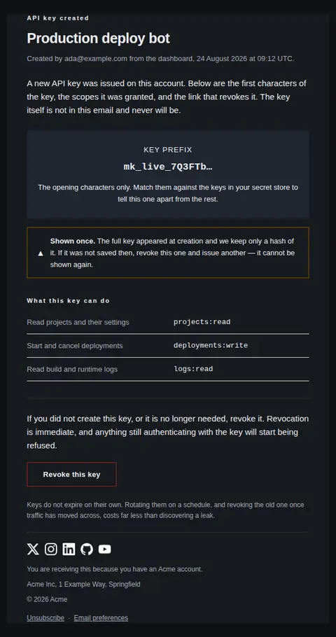
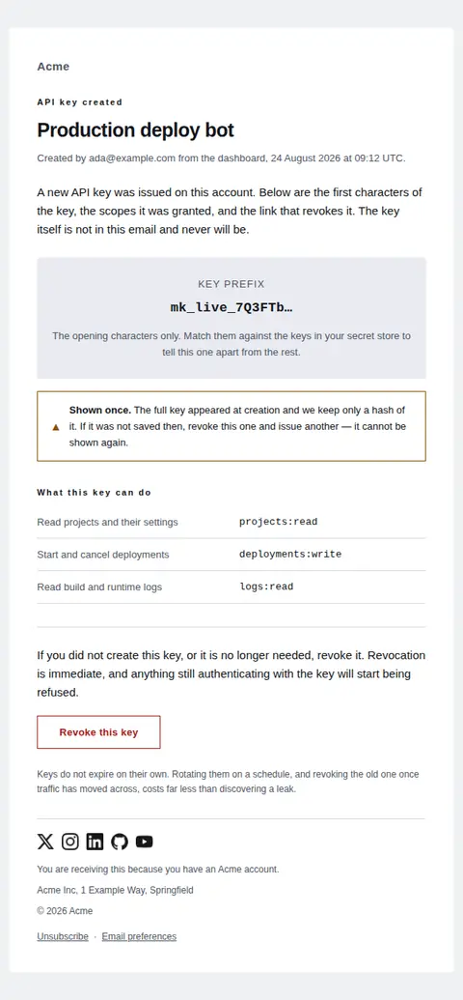
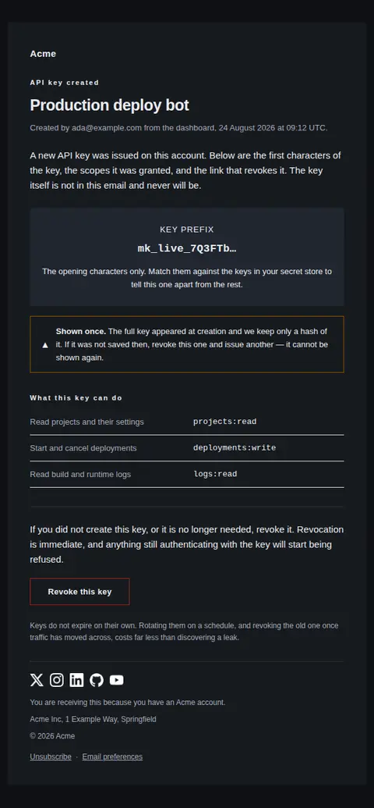
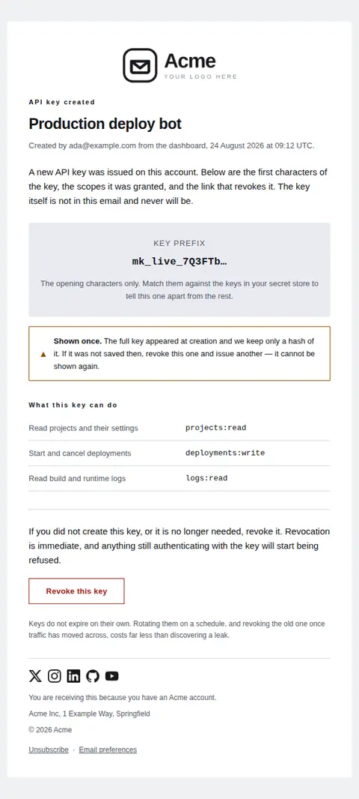
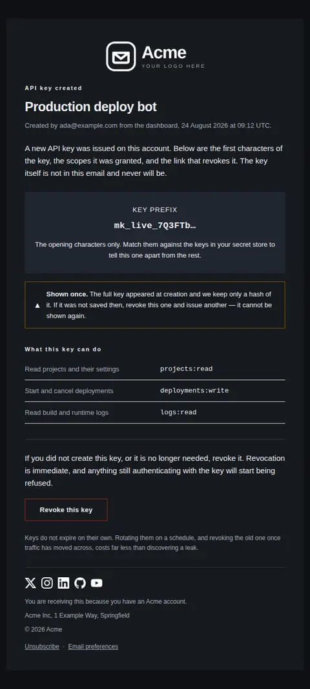

# API key created — free Laravel email template

Sent to the account owner when a developer credential is issued, so a key nobody authorised is noticed on the day it is made rather than at the next audit.

A free, responsive, dark-mode security email template for Laravel and PHP, MIT licensed and ready to send. Part of [Mailyte Email Templates](../../README.md), the largest open-source catalog of designed transactional email for Laravel -- part of Mailyte, a product of [Techies Africa](https://techies.africa).

**`api-key-created`** · **security** · **transactional**

**Subject** `A new API key was created on {{ product.name }}`  
**Preheader** Its prefix, the scopes it was granted, and the link that revokes it.

```bash
php artisan mailyte:list api-key-created
```

```php
Mailyte::template('api-key-created')->with([...])->send($user);
```

## Every layout, light and dark

Each shot is the real render at 600px, captured from the preview gallery.

| Layout | Light | Dark |
|---|---|---|
| **plain** | <a href="../previews/api-key-created/plain-light.webp"></a> | <a href="../previews/api-key-created/plain-dark.webp"></a> |
| **minimal** | <a href="../previews/api-key-created/minimal-light.webp"></a> | <a href="../previews/api-key-created/minimal-dark.webp"></a> |
| **branded** | <a href="../previews/api-key-created/branded-light.webp"></a> | <a href="../previews/api-key-created/branded-dark.webp"></a> |

## Data it expects

| Variable | Type | Required | What it is |
|---|---|---|---|
| `key_prefix` | string | yes | The leading, non-secret characters of the key and nothing more — enough to tell this credential from the others in a secret store, never enough to use. Truncate before the email is composed, not in the template: a full key that reaches this variable is a full key sitting in a mail spool. |
| `revoke_url` | url | yes | Deep link to this key in the credentials list, ready to revoke. Landing on the list with no key selected is how the wrong one gets deleted. |
| `body` | text |  | What the email contains and — just as importantly — what it does not. Saying up front that the secret is not in the message stops people hunting for it. |
| `eyebrow` | string |  | The document's own label, set above the headline. It tells a reader scanning a crowded inbox what class of thing this is before they read a word of the key's name. |
| `issued_line` | string |  | Who created the key, from where, and when. This single line is what turns the email from a notification into evidence. Leave it empty rather than guessing at any part of it. |
| `key_name` | string |  | The name the key was given, used as the headline. Naming the credential in the h1 is what makes this mail scannable in an audit trail — "Production deploy bot" is recognisable where "A new API key" is not. |
| `no_scopes_text` | text |  | Stands in when the key was issued with no grants at all. A key that can authenticate but do nothing is a real and confusing state, and it deserves a sentence rather than an empty table. |
| `once_strong` | string |  | The bold opener of the caution bar. Paired with a triangle mark and a border, so the warning survives greyscale, forced inversion and a colour-blind reader. |
| `once_text` | text |  | The fact developers most often learn the hard way: the secret is unrecoverable. Say it here, while there is still time to act on it. |
| `prefix_label` | string |  | Label above the prefix panel. Call it a prefix, not a key — the wording is what stops someone pasting it into a client and filing a bug. |
| `prefix_note` | text |  | Explains what the reader is looking at and what to do with it, so the panel is not mistaken for a credential they were meant to copy. |
| `revoke_label` | string |  | Label for the revoke action. Outlined rather than filled: revoking is destructive, and a filled button invites the accidental click. |
| `revoke_text` | text |  | What revoking does and what it costs. People hesitate over a revoke button because nobody tells them whether anything else breaks. |
| `rotation_note` | text |  | The closing line of hygiene advice. Optional in spirit but worth keeping — this is the one email a key's owner reliably reads. |
| `scopes` | array |  | One row per granted scope, as `label` / `value`. Put the capability in plain English in `label` and the exact scope string in `value` with `mono` set — the reader who is auditing wants the sentence, the reader who is debugging wants the string, and both are on the row. Send the granted scopes only; a list of everything the API offers tells nobody anything. |
| `scopes_title` | string |  | Heading above the grants table. |

## More security email templates

[New device sign-in](new-device-login.md) · [Password found in a breach](password-breach.md) · [Sign-in attempt blocked](suspicious-activity.md) · [Two-step verification changed](two-factor-enabled.md)

## Author

[Confidence Ugolo](https://www.linkedin.com/in/confidence-ugolo) · [Joel Omojefe](https://www.linkedin.com/in/joel-omojefe)

Part of Mailyte, a product of [Techies Africa](https://techies.africa). MIT licensed.

---

[← All 50 templates](../gallery.md) · [Package README](../../README.md) · [Sending](../sending.md) · [Theming](../theming.md) · [Deliverability](../deliverability.md)
