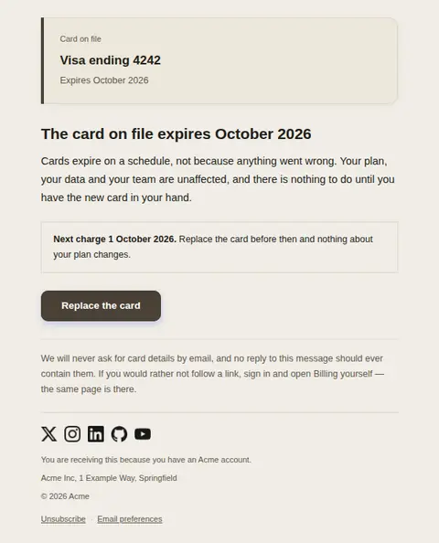
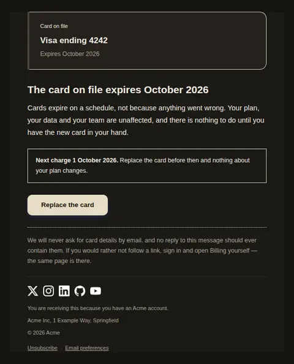
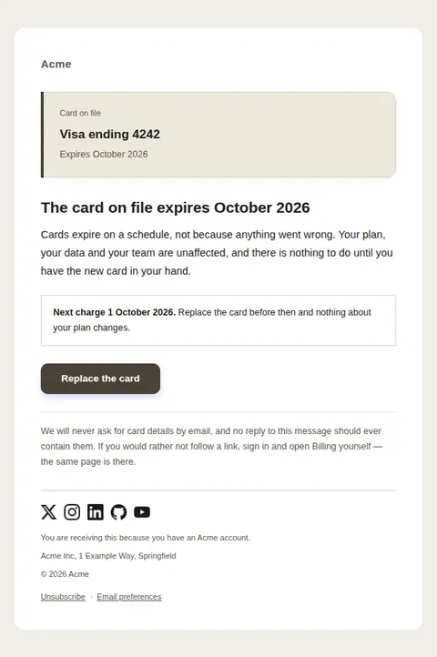
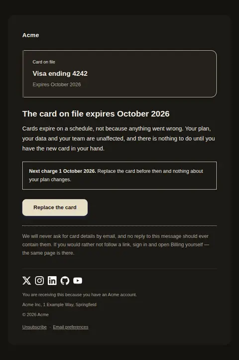

# Card expiring soon — free Laravel email template

Sent weeks before the card on file expires, while everything is still working, so the customer can replace it without a failed charge.

A free, responsive, dark-mode billing email template for Laravel and PHP, MIT licensed and ready to send. Part of [Mailyte Email Templates](../../README.md), the largest open-source catalog of designed transactional email for Laravel -- part of Mailyte, a product of [Techies Africa](https://techies.africa).

**`card-expiring`** · **billing** · **notification**

**Subject** `Your card ending {{ card_last4 }} expires soon`  
**Preheader** Nothing has failed. Replacing it now keeps the next charge from bouncing.

```bash
php artisan mailyte:list card-expiring
```

```php
Mailyte::template('card-expiring')->with([...])->send($user);
```

## Every layout, light and dark

Each shot is the real render at 600px, captured from the preview gallery.

| Layout | Light | Dark |
|---|---|---|
| **plain** | <a href="../previews/card-expiring/plain-light.webp"></a> | <a href="../previews/card-expiring/plain-dark.webp"></a> |
| **minimal** | <a href="../previews/card-expiring/minimal-light.webp"></a> | <a href="../previews/card-expiring/minimal-dark.webp"></a> |
| **branded** | <a href="../previews/card-expiring/branded-light.webp"></a> | <a href="../previews/card-expiring/branded-dark.webp"></a> |

## Data it expects

| Variable | Type | Required | What it is |
|---|---|---|---|
| `card_last4` | string | yes | The last four digits, which is how a person identifies a card and how they tell a real notice from a phishing one. Never send more of the number than this. |
| `expires_on` | string | yes | The expiry printed on the card itself, written the way the card writes it. It appears in the heading as well as the panel, so it is the one date the reader cannot miss. |
| `update_url` | url | yes | The billing page where a card is replaced. One action only — a second link would invite the reader to weigh options they do not have. |
| `body` | text |  | The calm explanation under the heading. It exists so the tone of this email is editable — the failure email is elsewhere, and this one must not borrow its voice. |
| `button_label` | string |  | Label for the single action. Say what happens, not "click here". |
| `card_brand` | string |  | Brand shown on the panel so the customer recognises which of their cards this is. Omit it when the processor did not report one — the panel reads correctly without it. |
| `next_charge_on` | date |  | The first charge that would be attempted with the dead card. It turns an abstract expiry into a deadline; leave it empty on accounts that are not on a schedule. |
| `security_note` | text |  | The anti-phishing footer. Card-expiry mail is impersonated constantly, so the honest version says what it will never ask for and offers a route that does not involve trusting a link. |

## More billing email templates

[Invoice](invoice.md) · [Payment failed](payment-failed.md) · [Payment receipt](receipt.md) · [Refund issued](refund-issued.md) · [Plan activated](subscription-activated.md) · [Subscription cancelled](subscription-cancelled.md) · [Subscription renewing](subscription-renewing.md) · [Usage limit approaching](usage-limit-warning.md)

## Author

[Confidence Ugolo](https://www.linkedin.com/in/confidence-ugolo) · [Joel Omojefe](https://www.linkedin.com/in/joel-omojefe)

Part of Mailyte, a product of [Techies Africa](https://techies.africa). MIT licensed.

---

[← All 50 templates](../gallery.md) · [Package README](../../README.md) · [Sending](../sending.md) · [Theming](../theming.md) · [Deliverability](../deliverability.md)
