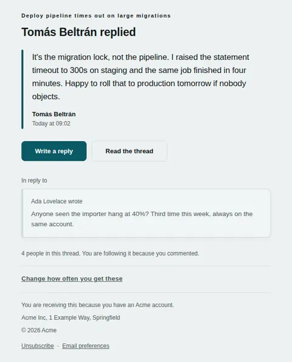
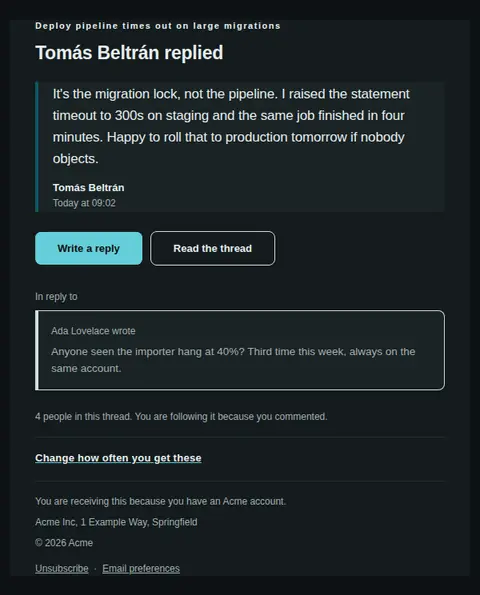
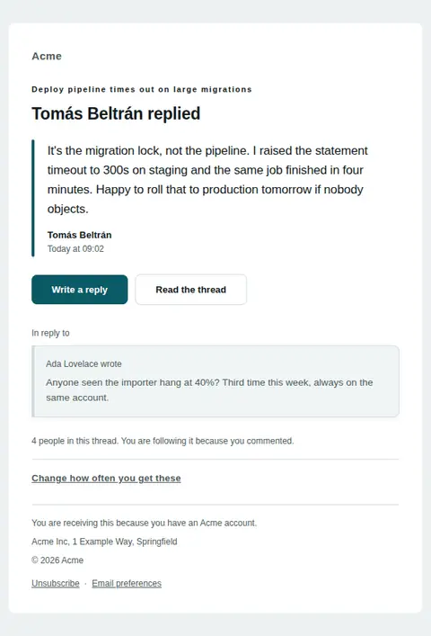
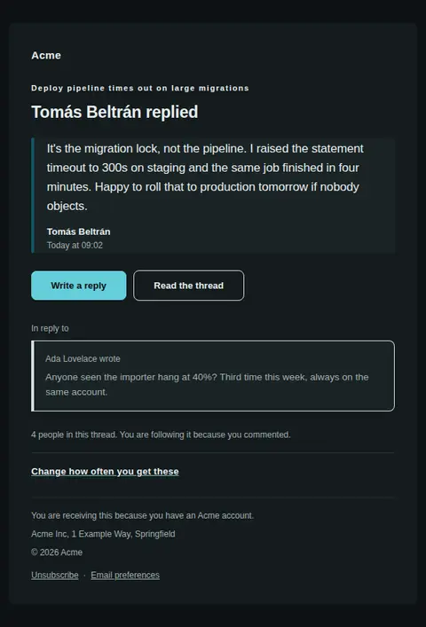
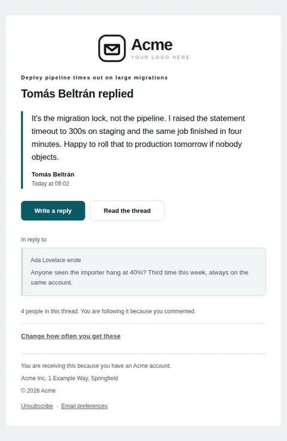
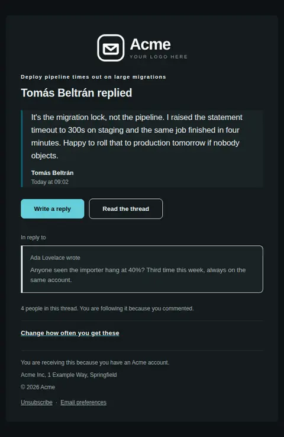

# New reply in a thread — free Laravel email template

Delivers a reply in a discussion, with the comment it answers carried underneath it so the whole exchange reads in the inbox.

A free, responsive, dark-mode notifications email template for Laravel and PHP, MIT licensed and ready to send. Part of [Mailyte Email Templates](../../README.md), the largest open-source catalog of designed transactional email for Laravel -- part of Mailyte, a product of [Techies Africa](https://techies.africa).

**`comment-reply`** · **notifications** · **notification**

**Subject** `New reply from {{ reply_author }}`  
**Preheader** The reply and the comment it answers are both here, so the thread reads without a login.

```bash
php artisan mailyte:list comment-reply
```

```php
Mailyte::template('comment-reply')->with([...])->send($user);
```

## Every layout, light and dark

Each shot is the real render at 600px, captured from the preview gallery.

| Layout | Light | Dark |
|---|---|---|
| **plain** | <a href="../previews/comment-reply/plain-light.webp"></a> | <a href="../previews/comment-reply/plain-dark.webp"></a> |
| **minimal** | <a href="../previews/comment-reply/minimal-light.webp"></a> | <a href="../previews/comment-reply/minimal-dark.webp"></a> |
| **branded** | <a href="../previews/comment-reply/branded-light.webp"></a> | <a href="../previews/comment-reply/branded-dark.webp"></a> |

## Data it expects

| Variable | Type | Required | What it is |
|---|---|---|---|
| `reply_author` | string | yes | Who wrote the new reply. |
| `reply_text` | text | yes | The reply in full. Truncating it defeats the point of the email — the reader would have to open the app, which is the trip this message exists to save. |
| `reply_url` | url | yes | Deep link that opens the composer on this thread, not the thread's top. |
| `thread_title` | string | yes | What the discussion is called. Set as the eyebrow so a reader with four of these in their inbox can tell them apart before opening any of them. |
| `notification_settings_label` | string |  | Wording of that link. Offer less noise, not a settings screen. |
| `notification_settings_url` | url |  | Where thread notifications get batched or switched off. A busy thread can send a dozen of these in an afternoon, so the escape has to be in every one of them. |
| `parent_author` | string |  | Who wrote the comment being answered. Often the recipient, which is exactly why it has to be named rather than assumed. |
| `parent_label` | string |  | The line that introduces the quoted parent. Two words, lower case, doing the job a threading indent does on screen. |
| `parent_text` | text |  | The comment the reply answers. Leave it empty when the reply opens a thread and there is nothing to quote; the whole quoted block then disappears rather than showing an empty box. |
| `reply_label` | string |  | Label on the action that continues the conversation. This is the one the sender wants pressed, so it carries the filled button. |
| `reply_time` | string |  | When the reply was posted, in the recipient's timezone if you know it. Attached to the quotation, because it dates the words rather than the delivery. |
| `thread_label` | string |  | Label on the quieter action, for people who want to read the rest before answering. |
| `thread_meta` | string |  | One closing line of provenance — how many people are in the thread, and why the recipient is one of them. It answers "why am I getting this" before the reader has to ask it. |
| `thread_url` | url |  | The whole discussion, for the replies that did not make it into this email. |

## More notifications email templates

[You were mentioned](mention.md) · [Notification](notification.md) · [A task was assigned to you](task-assigned.md) · [Weekly digest](weekly-digest.md)

## Author

[Confidence Ugolo](https://www.linkedin.com/in/confidence-ugolo) · [Joel Omojefe](https://www.linkedin.com/in/joel-omojefe)

Part of Mailyte, a product of [Techies Africa](https://techies.africa). MIT licensed.

---

[← All 50 templates](../gallery.md) · [Package README](../../README.md) · [Sending](../sending.md) · [Theming](../theming.md) · [Deliverability](../deliverability.md)
