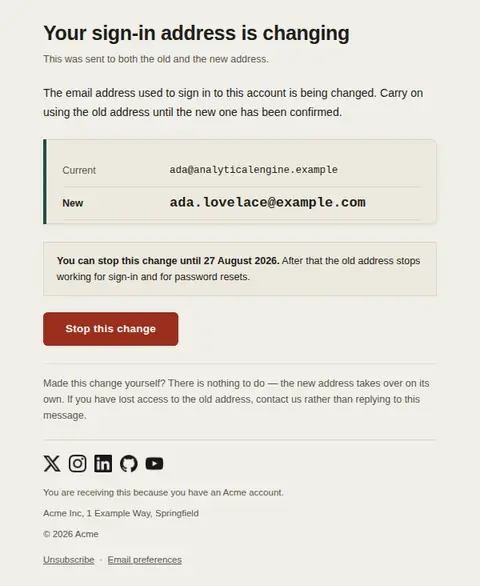
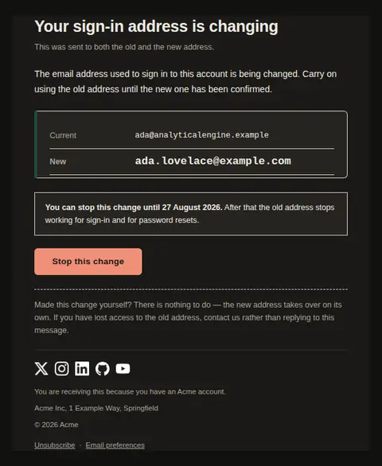
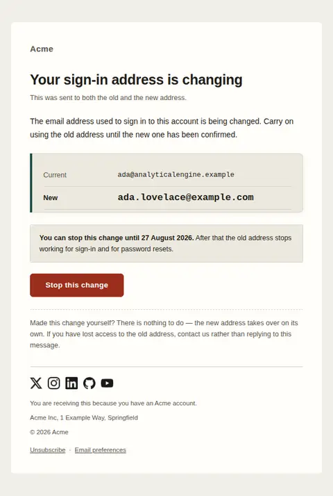
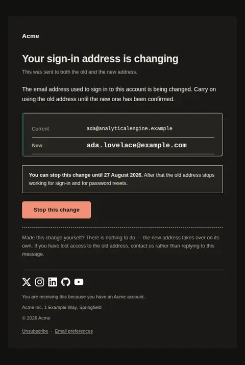
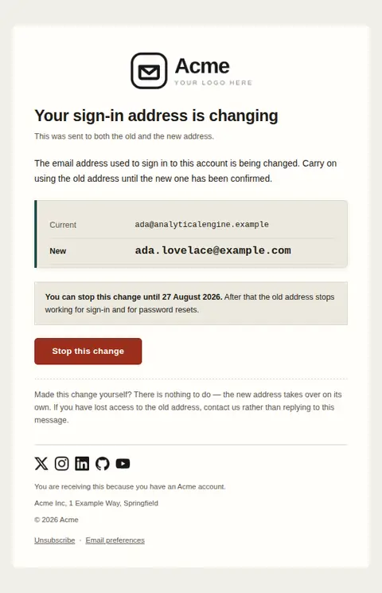
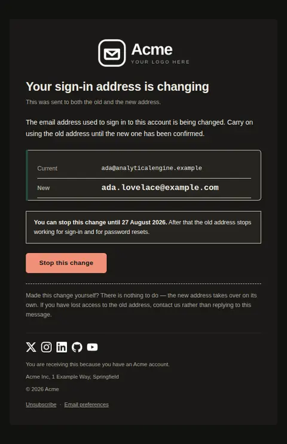

# Email address changed — free Laravel email template

Sent to both the old and the new address when the sign-in email on an account changes, with the two addresses compared side by side and a window in which to stop it.

A free, responsive, dark-mode account email template for Laravel and PHP, MIT licensed and ready to send. Part of [Mailyte Email Templates](../../README.md), the largest open-source catalog of designed transactional email for Laravel -- part of Mailyte, a product of [Techies Africa](https://techies.africa).

**`email-changed`** · **account** · **transactional**

**Subject** `Your {{ product.name }} sign-in address is changing`  
**Preheader** Check the new address is one you control before it takes over.

```bash
php artisan mailyte:list email-changed
```

```php
Mailyte::template('email-changed')->with([...])->send($user);
```

## Every layout, light and dark

Each shot is the real render at 600px, captured from the preview gallery.

| Layout | Light | Dark |
|---|---|---|
| **plain** | <a href="../previews/email-changed/plain-light.webp"></a> | <a href="../previews/email-changed/plain-dark.webp"></a> |
| **minimal** | <a href="../previews/email-changed/minimal-light.webp"></a> | <a href="../previews/email-changed/minimal-dark.webp"></a> |
| **branded** | <a href="../previews/email-changed/branded-light.webp"></a> | <a href="../previews/email-changed/branded-dark.webp"></a> |

## Data it expects

| Variable | Type | Required | What it is |
|---|---|---|---|
| `new_email` | email | yes | The address taking over. It is the emphasised row: a recipient who does not recognise it should notice within a second of opening the message. |
| `old_email` | email | yes | The address being replaced, set in the mono face so an unfamiliar character in a lookalike domain is visible. |
| `body` | text |  | What is happening and what to use in the meantime. People try the new address immediately and lock themselves out, so say which one still works. |
| `cancel_deadline` | date |  | The last moment the change can be reversed. Leave it empty when your product applies the change immediately, and the deadline bar disappears rather than printing a hollow promise. |
| `cancel_label` | string |  | Label on the one action. It is a refusal, so word it as one. |
| `cancel_url` | url |  | Where the change is reversed. Should work from the old address without a password — someone whose account was taken over cannot sign in to cancel anything. |
| `current_label` | string |  | Row label for the outgoing address. One word — the labels sit in a 30% column that still has to work at 320px. |
| `deadline_note` | string |  | What happens once the window closes. The consequence, not the mechanism. |
| `dual_delivery_note` | string |  | States that both addresses received this. Without it the copy landing in the old inbox looks like a misdirected email and gets deleted, which is the one inbox that most needs to see it. |
| `heading_text` | string |  | The headline. Say that the address is changing rather than that it has changed — the whole design rests on there still being time to intervene. |
| `new_label` | string |  | Row label for the incoming address. |
| `no_action_note` | text |  | The closing line for the majority who made this change themselves, and the route for the person who no longer controls the old mailbox. |
| `stop_by_label` | string |  | Opening words of the deadline bar, joined to the date. Kept separate from the date so a translation can put the verb where its grammar needs it. |

## More account email templates

[Account scheduled for deletion](account-deleted.md) · [Password changed](password-changed.md) · [Reset your password](password-reset.md) · [Verify email address](verify-email.md) · [Verify email address](verify-email-code.md) · [Verify email address](verify-email-link.md) · [Verify email address](verify-email-typeset.md) · [Verify email address](verify-email-vivid.md)

## Author

[Confidence Ugolo](https://www.linkedin.com/in/confidence-ugolo) · [Joel Omojefe](https://www.linkedin.com/in/joel-omojefe)

Part of Mailyte, a product of [Techies Africa](https://techies.africa). MIT licensed.

---

[← All 50 templates](../gallery.md) · [Package README](../../README.md) · [Sending](../sending.md) · [Theming](../theming.md) · [Deliverability](../deliverability.md)
