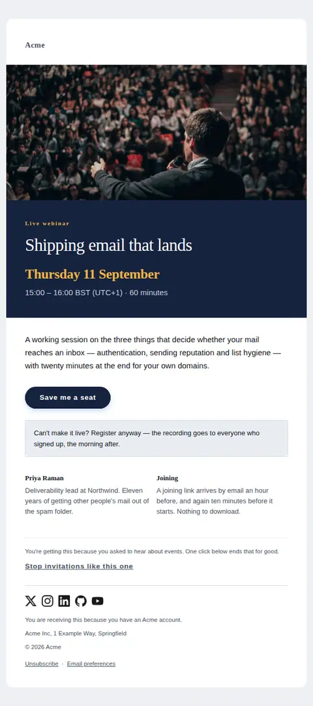
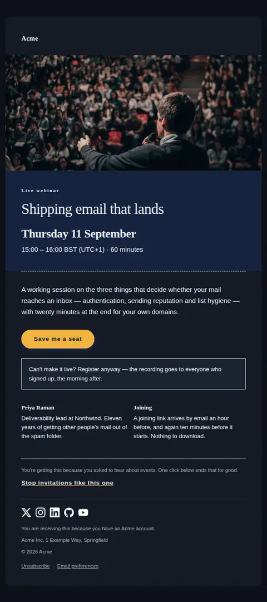
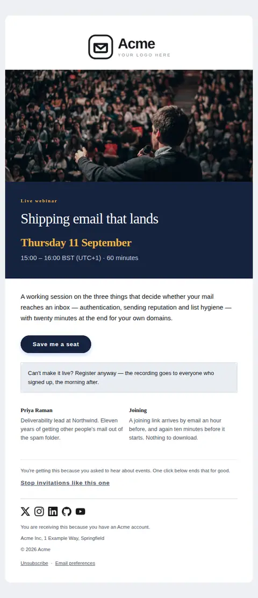
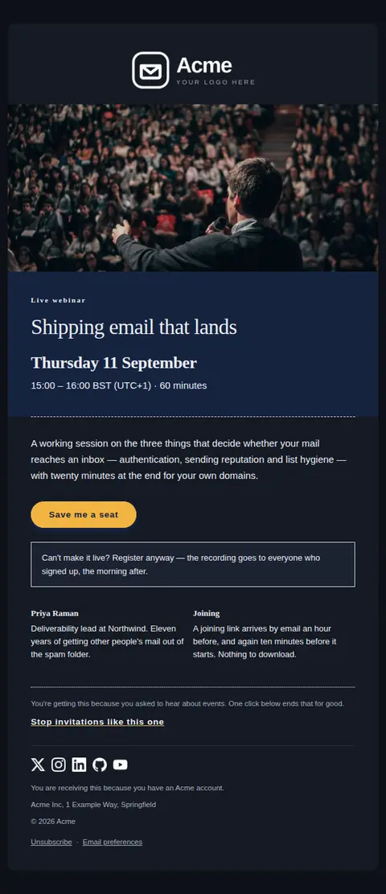
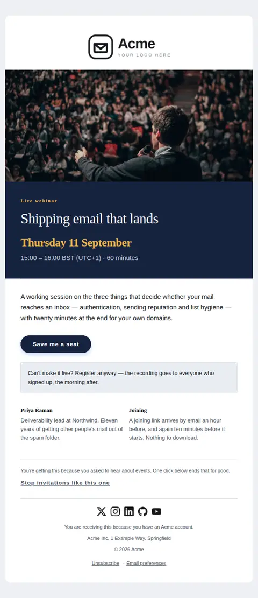
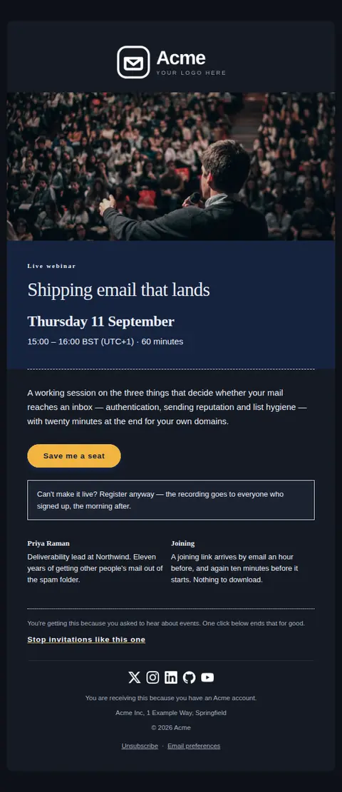

# Event invitation — free Laravel email template

Invites someone to a webinar or live session: when it is, in their timezone, how long it runs, who is speaking, and what happens if they cannot attend.

A free, responsive, dark-mode events email template for Laravel and PHP, MIT licensed and ready to send. Part of [Mailyte Email Templates](../../README.md), the largest open-source catalog of designed transactional email for Laravel -- part of Mailyte, a product of [Techies Africa](https://techies.africa).

**`event-invite`** · **events** · **marketing** · **friendly**

**Subject** `You're invited: {{ event_title }}`  
**Preheader** Live, with time for questions, and everything needed to join in one place.

```bash
php artisan mailyte:list event-invite
```

```php
Mailyte::template('event-invite')->with([...])->send($user);
```

## Every layout, light and dark

Each shot is the real render at 600px, captured from the preview gallery.

| Layout | Light | Dark |
|---|---|---|
| **minimal** | <a href="../previews/event-invite/minimal-light.webp"></a> | <a href="../previews/event-invite/minimal-dark.webp"></a> |
| **branded** | <a href="../previews/event-invite/branded-light.webp"></a> | <a href="../previews/event-invite/branded-dark.webp"></a> |
| **editorial** | <a href="../previews/event-invite/editorial-light.webp"></a> | <a href="../previews/event-invite/editorial-dark.webp"></a> |

## Data it expects

| Variable | Type | Required | What it is |
|---|---|---|---|
| `date_line` | string | yes | The date, written out and set as the largest figure on the ticket face. Spelling the weekday out is what stops a reader mentally filing it as "some time next month". |
| `event_title` | string | yes | What the session is about. It carries the subject line, so it has to promise something specific enough to book an hour against. |
| `rsvp_url` | url | yes | Registration link. Deep-link it to the event so nobody lands on a list of events and has to find this one again. |
| `time_line` | string | yes | Start and end time with the timezone named, ideally the reader's own. A time without a zone costs you the attendees on the other side of an ocean. |
| `duration_label` | string |  | How long it runs, stated separately from the clock times because that is the number people check against their calendar. |
| `event_description` | text |  | What will actually happen in the room. Two or three sentences: the shape of the session, and what someone walks away able to do. |
| `event_kind` | string |  | What sort of thing this is, in two words, before the title has to explain itself. "Live webinar" and "Office hours" set very different expectations of how much attention is being asked for. |
| `hero_alt` | string |  | What the photograph shows, for the readers and clients that will never load it. |
| `hero_image` | url |  | A wide photograph of the event, or of the last one. Optional and never shipped as a default: the invitation has to read the same with images blocked, which is how most people will first see it. |
| `joining_text` | text |  | How they actually get in on the day, and what they need beforehand. Answering this in the invitation is what stops the "where's the link?" mail an hour before. |
| `joining_title` | string |  | Heading over the joining instructions. |
| `permission_note` | text |  | Why this invitation reached them. Naming the reason reduces spam complaints more reliably than any amount of subject-line craft. |
| `replay_text` | text |  | The objection-handler, placed directly under the button because "I'm busy that afternoon" is the reason most people close the email. Promising the recording converts the ones who cannot come live. |
| `rsvp_label` | string |  | Label on the only button. Ask for the seat rather than the click. |
| `speaker_bio` | string |  | One line on why this person is worth an hour — the role and the specific experience, not the job title alone. |
| `speaker_name` | string |  | Who is running the session. A named person turns a webinar from a broadcast into an appointment; leave it empty for a panel or an internal session and the cell disappears. |

## Credits

- Man speaking in front of a crowd by Miguel Henriques via Unsplash — [source](https://unsplash.com/photos/man-speaking-in-front-of-crowd-RfiBK6Y_upQ) (Unsplash License, sample data only)

## Author

[Confidence Ugolo](https://www.linkedin.com/in/confidence-ugolo) · [Joel Omojefe](https://www.linkedin.com/in/joel-omojefe)

Part of Mailyte, a product of [Techies Africa](https://techies.africa). MIT licensed.

---

[← All 50 templates](../gallery.md) · [Package README](../../README.md) · [Sending](../sending.md) · [Theming](../theming.md) · [Deliverability](../deliverability.md)
