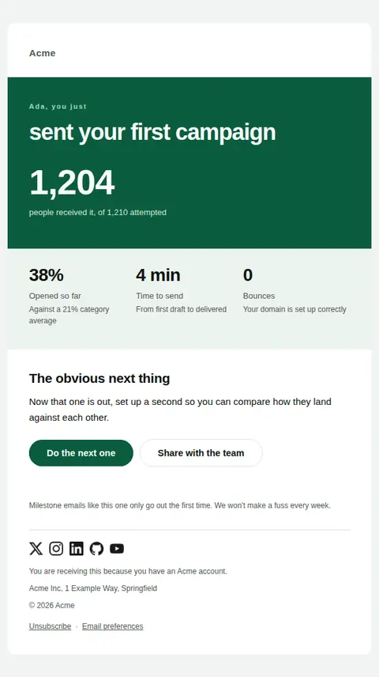
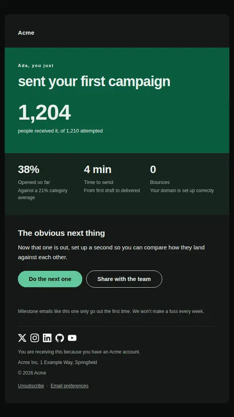
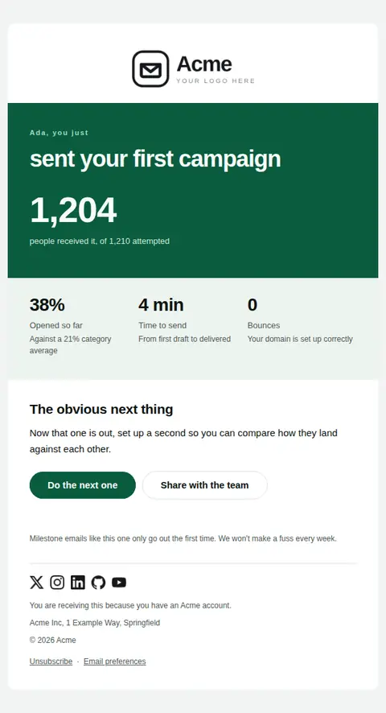
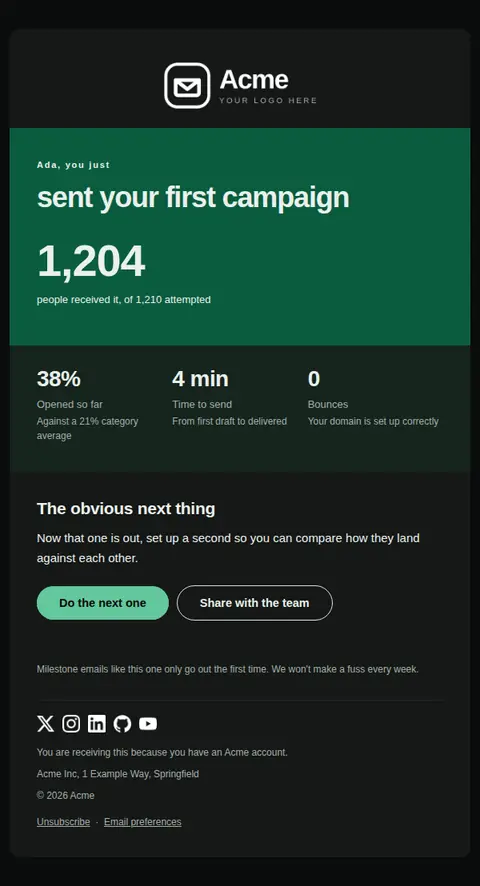
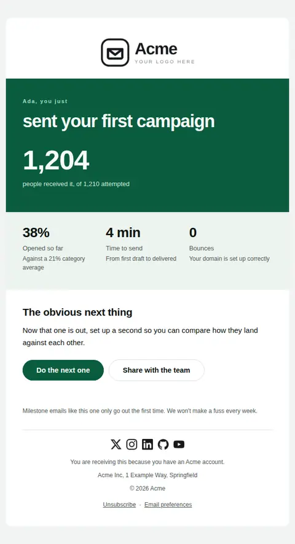
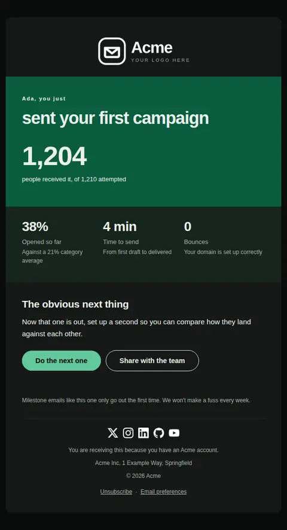

# First milestone reached — free Laravel email template

Marks the moment an account does the thing the product exists for, and turns that moment into the next one.

A free, responsive, dark-mode onboarding email template for Laravel and PHP, MIT licensed and ready to send. Part of [Mailyte Email Templates](../../README.md), the largest open-source catalog of designed transactional email for Laravel -- part of Mailyte, a product of [Techies Africa](https://techies.africa).

**`first-milestone`** · **onboarding** · **notification** · **celebratory**

**Subject** `You just {{ milestone_verb }}`  
**Preheader** Here is what it added up to, and the obvious next thing to try.

```bash
php artisan mailyte:list first-milestone
```

```php
Mailyte::template('first-milestone')->with([...])->send($user);
```

## Every layout, light and dark

Each shot is the real render at 600px, captured from the preview gallery.

| Layout | Light | Dark |
|---|---|---|
| **minimal** | <a href="../previews/first-milestone/minimal-light.webp"></a> | <a href="../previews/first-milestone/minimal-dark.webp"></a> |
| **branded** | <a href="../previews/first-milestone/branded-light.webp"></a> | <a href="../previews/first-milestone/branded-dark.webp"></a> |
| **editorial** | <a href="../previews/first-milestone/editorial-light.webp"></a> | <a href="../previews/first-milestone/editorial-dark.webp"></a> |

## Data it expects

| Variable | Type | Required | What it is |
|---|---|---|---|
| `action_url` | url | yes | Where the next step lives. |
| `milestone_verb` | string | yes | What they did, past tense, phrased the way they would say it. Set at 36px, so keep it to a handful of words. |
| `button_label` | string |  | Primary button label. |
| `closing` | text |  | Sign-off under the final rule. |
| `headline_stat` | string |  | The single number that makes the moment concrete, shown at display size on the opening band. Leave empty and the band carries the headline alone. |
| `headline_stat_label` | string |  | What that number counts. |
| `next_step_heading` | string |  | Heading above the follow-on suggestion. |
| `next_step_text` | text |  | One suggestion that builds on what they just did. |
| `share_label` | string |  | Label for the secondary action. |
| `share_url` | url |  | Optional secondary action, usually sharing the result with a teammate. |
| `stat_rows` | array |  | Supporting figures as `value` / `label` / optional `caption`. Two or three; this is a moment, not a report. |
| `user.first_name` | string |  | Recipient's first name. |

## Credits

- Coworkers with their hands together by Thirdman via Pexels — [source](https://www.pexels.com/photo/coworkers-with-their-hands-together-5256819/) (Pexels License, sample data only)

## More onboarding email templates

[Account activated](account-activated.md) · [Getting started checklist](getting-started.md) · [Setup incomplete](setup-incomplete.md) · [Trial ending soon](trial-ending.md) · [Trial expired](trial-expired.md) · [Trial started](trial-started.md) · [Welcome](welcome.md)

## Author

[Confidence Ugolo](https://www.linkedin.com/in/confidence-ugolo) · [Joel Omojefe](https://www.linkedin.com/in/joel-omojefe)

Part of Mailyte, a product of [Techies Africa](https://techies.africa). MIT licensed.

---

[← All 50 templates](../gallery.md) · [Package README](../../README.md) · [Sending](../sending.md) · [Theming](../theming.md) · [Deliverability](../deliverability.md)
