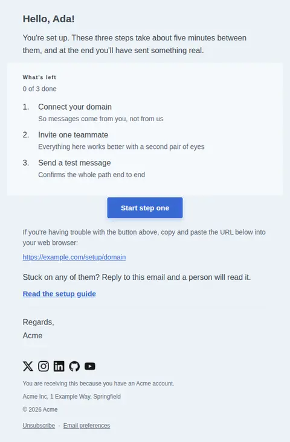
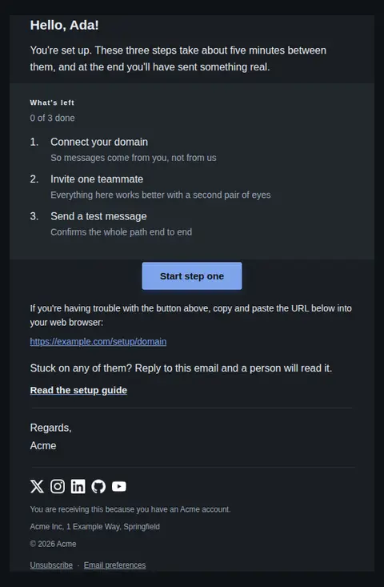
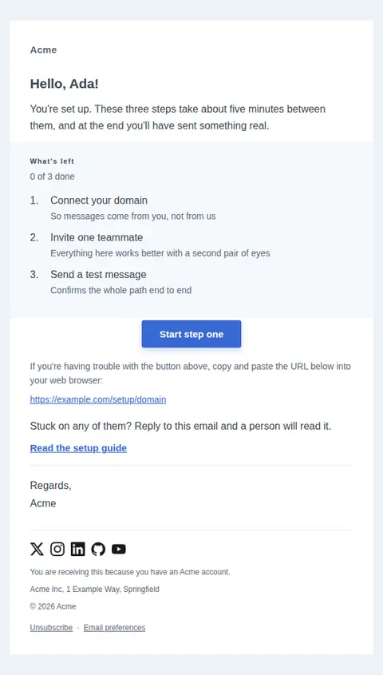
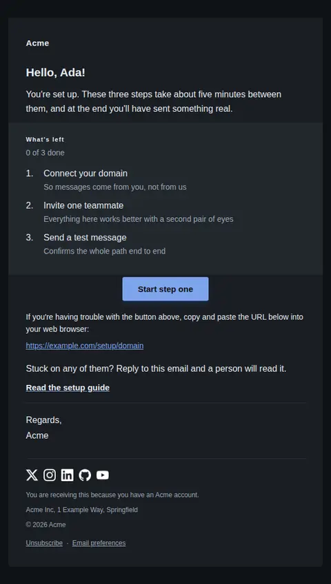
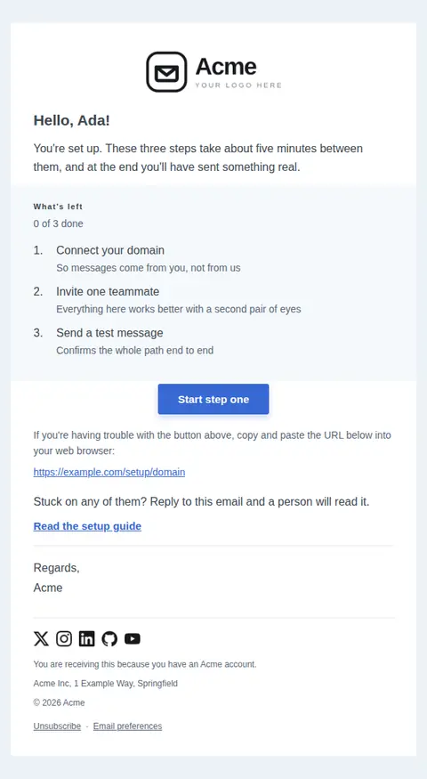
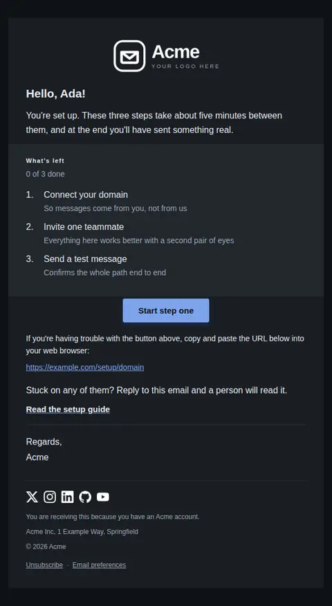

# Getting started checklist — free Laravel email template

A short, ordered checklist that walks a new account to its first real result, in the plain framework-notification style.

A free, responsive, dark-mode onboarding email template for Laravel and PHP, MIT licensed and ready to send. Part of [Mailyte Email Templates](../../README.md), the largest open-source catalog of designed transactional email for Laravel -- part of Mailyte, a product of [Techies Africa](https://techies.africa).

**`getting-started`** · **onboarding** · **transactional** · **friendly**

**Subject** `Three steps to your first {{ product.name }} result`  
**Preheader** Each one takes a couple of minutes, and you can stop after the first if you like.

```bash
php artisan mailyte:list getting-started
```

```php
Mailyte::template('getting-started')->with([...])->send($user);
```

## Every layout, light and dark

Each shot is the real render at 600px, captured from the preview gallery.

| Layout | Light | Dark |
|---|---|---|
| **plain** | <a href="../previews/getting-started/plain-light.webp"></a> | <a href="../previews/getting-started/plain-dark.webp"></a> |
| **minimal** | <a href="../previews/getting-started/minimal-light.webp"></a> | <a href="../previews/getting-started/minimal-dark.webp"></a> |
| **branded** | <a href="../previews/getting-started/branded-light.webp"></a> | <a href="../previews/getting-started/branded-dark.webp"></a> |

## Data it expects

| Variable | Type | Required | What it is |
|---|---|---|---|
| `action_url` | url | yes | Where the primary button goes — straight into the next step, not a generic dashboard. |
| `button_label` | string |  | Primary button label. |
| `completed_count` | number |  | How many steps are already done. Shown as progress so the email is honest about where they actually are. |
| `docs_url` | url |  | Optional link to written instructions, for people who would rather not reply. |
| `fallback_note` | text |  | The trouble-clicking line that precedes the raw URL. Familiar to the point of invisibility, and genuinely useful when a button is stripped. |
| `help_text` | text |  | Offer of help, placed after the action where someone stuck would look for it. |
| `intro` | text |  | Opening paragraph. Say what the checklist is worth, not that it exists. |
| `signoff` | string |  | Sign-off line above the sender name. |
| `steps` | array |  | Ordered steps, each with a `text` label and an optional `detail` line. |
| `steps_heading` | string |  | Label introducing the list, so the steps arrive with a name rather than appearing out of nowhere. |
| `total_count` | number |  | How many steps there are in total. |
| `user.first_name` | string |  | Recipient's first name. Used in the greeting line. |

## More onboarding email templates

[Account activated](account-activated.md) · [First milestone reached](first-milestone.md) · [Setup incomplete](setup-incomplete.md) · [Trial ending soon](trial-ending.md) · [Trial expired](trial-expired.md) · [Trial started](trial-started.md) · [Welcome](welcome.md)

## Author

[Confidence Ugolo](https://www.linkedin.com/in/confidence-ugolo) · [Joel Omojefe](https://www.linkedin.com/in/joel-omojefe)

Part of Mailyte, a product of [Techies Africa](https://techies.africa). MIT licensed.

---

[← All 50 templates](../gallery.md) · [Package README](../../README.md) · [Sending](../sending.md) · [Theming](../theming.md) · [Deliverability](../deliverability.md)
