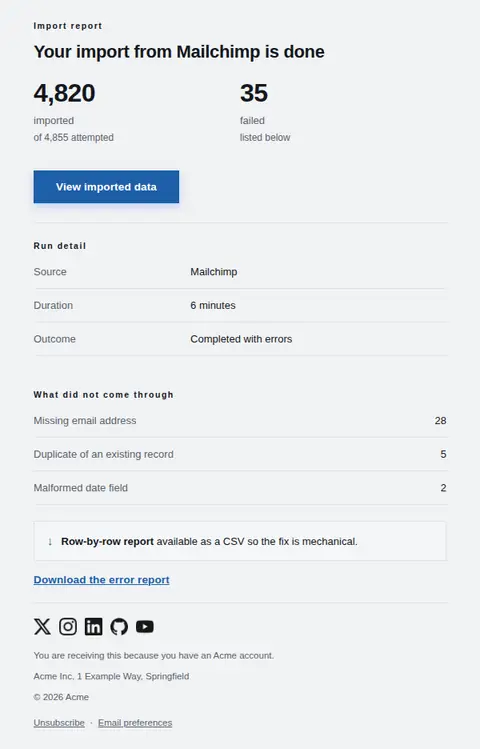
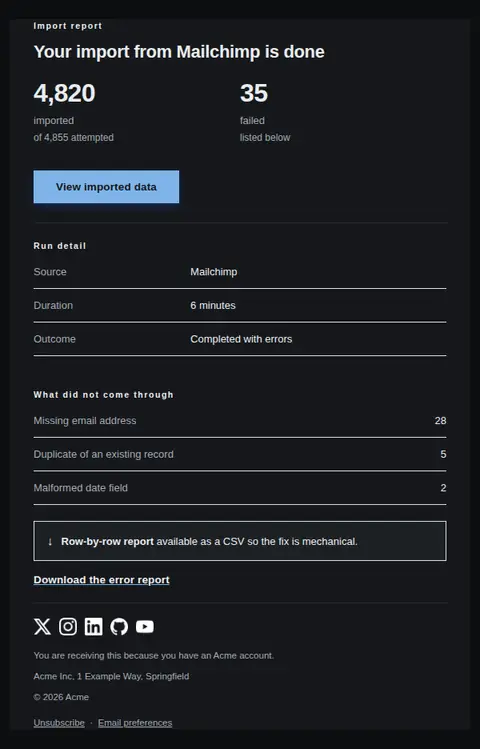
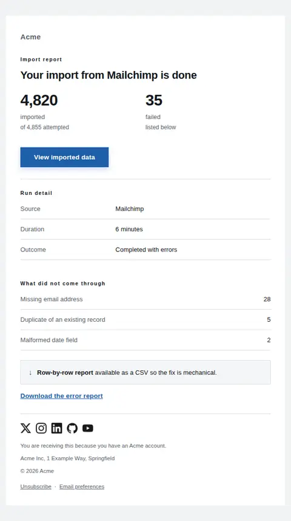
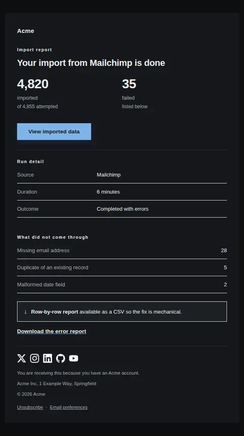
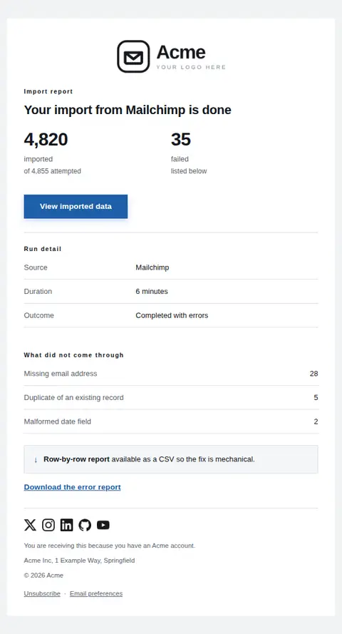
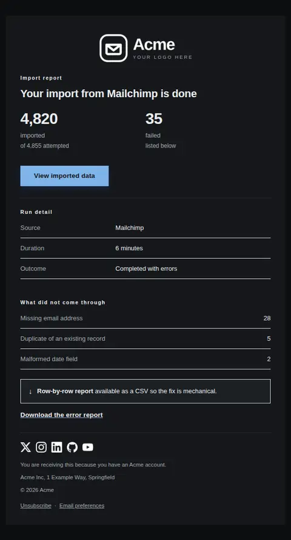

# Import complete — free Laravel email template

Tells someone their data import finished, what came through, and what did not, with the failures named rather than buried.

A free, responsive, dark-mode system email template for Laravel and PHP, MIT licensed and ready to send. Part of [Mailyte Email Templates](../../README.md), the largest open-source catalog of designed transactional email for Laravel -- part of Mailyte, a product of [Techies Africa](https://techies.africa).

**`import-complete`** · **system** · **transactional**

**Subject** `Import finished: {{ imported_count }} of {{ total_count }} records`  
**Preheader** Everything that came through is live. Anything that didn't is listed with a reason.

```bash
php artisan mailyte:list import-complete
```

```php
Mailyte::template('import-complete')->with([...])->send($user);
```

## Every layout, light and dark

Each shot is the real render at 600px, captured from the preview gallery.

| Layout | Light | Dark |
|---|---|---|
| **plain** | <a href="../previews/import-complete/plain-light.webp"></a> | <a href="../previews/import-complete/plain-dark.webp"></a> |
| **minimal** | <a href="../previews/import-complete/minimal-light.webp"></a> | <a href="../previews/import-complete/minimal-dark.webp"></a> |
| **branded** | <a href="../previews/import-complete/branded-light.webp"></a> | <a href="../previews/import-complete/branded-dark.webp"></a> |

## Data it expects

| Variable | Type | Required | What it is |
|---|---|---|---|
| `action_url` | url | yes | Where the imported data now lives. |
| `imported_count` | number | yes | Records that landed successfully. |
| `source_name` | string | yes | What they imported from. |
| `total_count` | number | yes | Records attempted. |
| `button_label` | string |  | Primary button label. |
| `duration` | string |  | How long it took. |
| `error_report_url` | url |  | Downloadable report of the failed rows, so the fix is mechanical rather than detective work. |
| `failed_count` | number |  | Records that failed. Zero is a perfectly good value and the template adapts to it. |
| `failures` | array |  | Why records failed, grouped by reason as `label`/`value` pairs rather than listed one by one. A list of 35 rows is not a report. |

## More system email templates

[Incident notice](incident-notice.md) · [Incident resolved](incident-resolved.md) · [Scheduled maintenance](maintenance-scheduled.md) · [Status update](status-update.md)

## Author

[Confidence Ugolo](https://www.linkedin.com/in/confidence-ugolo) · [Joel Omojefe](https://www.linkedin.com/in/joel-omojefe)

Part of Mailyte, a product of [Techies Africa](https://techies.africa). MIT licensed.

---

[← All 50 templates](../gallery.md) · [Package README](../../README.md) · [Sending](../sending.md) · [Theming](../theming.md) · [Deliverability](../deliverability.md)
