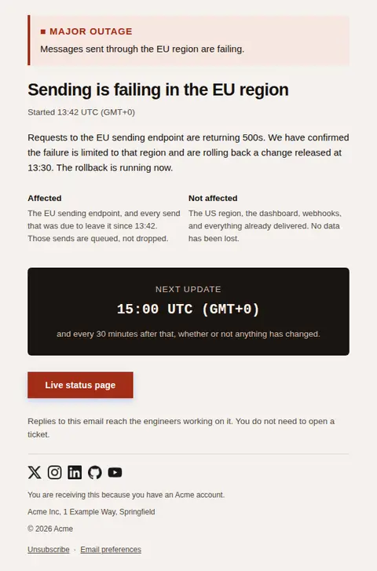
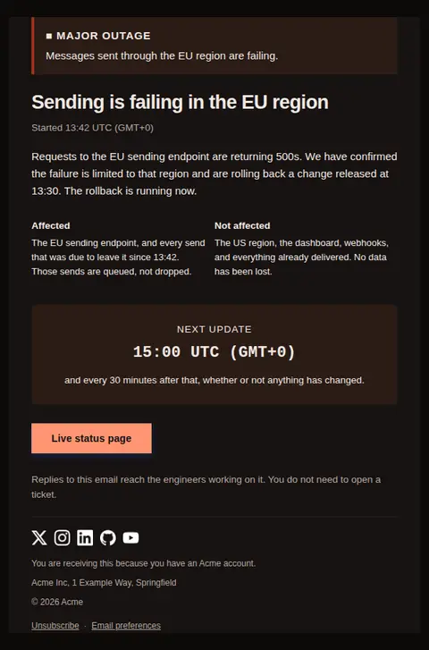
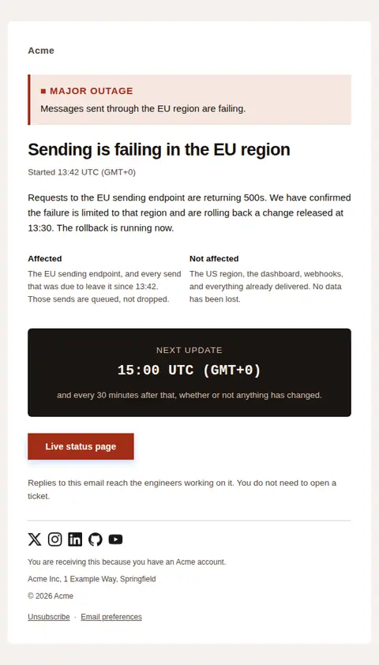
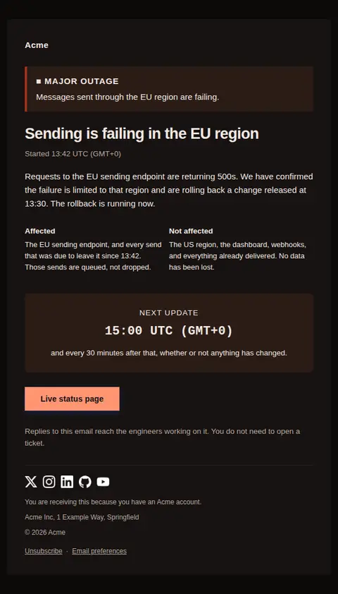
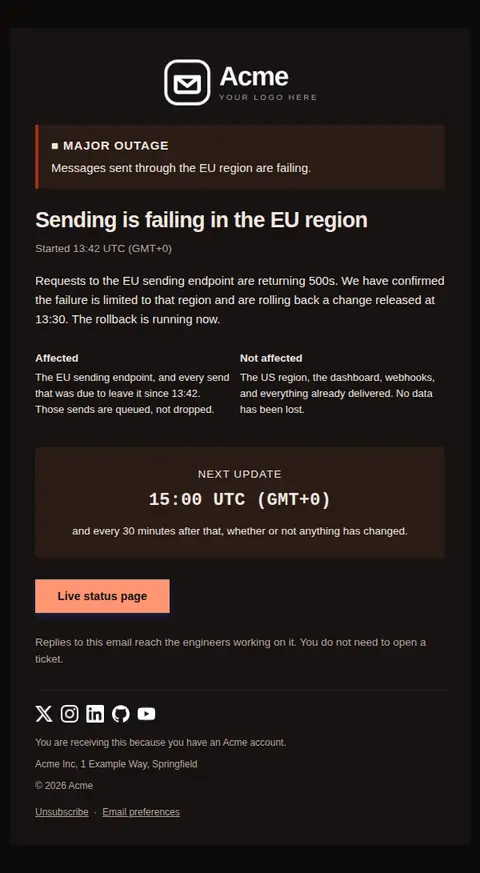

# Incident notice — free Laravel email template

Sent while something is broken: the severity, what is affected, what is not, and the time the next update will arrive.

A free, responsive, dark-mode system email template for Laravel and PHP, MIT licensed and ready to send. Part of [Mailyte Email Templates](../../README.md), the largest open-source catalog of designed transactional email for Laravel -- part of Mailyte, a product of [Techies Africa](https://techies.africa).

**`incident-notice`** · **system** · **notification** · **urgent**

**Subject** `{{ severity_label }} — {{ impact_headline }}`  
**Preheader** What is affected, what is not, and the time the next update lands.

```bash
php artisan mailyte:list incident-notice
```

```php
Mailyte::template('incident-notice')->with([...])->send($user);
```

## Every layout, light and dark

Each shot is the real render at 600px, captured from the preview gallery.

| Layout | Light | Dark |
|---|---|---|
| **plain** | <a href="../previews/incident-notice/plain-light.webp"></a> | <a href="../previews/incident-notice/plain-dark.webp"></a> |
| **minimal** | <a href="../previews/incident-notice/minimal-light.webp"></a> | <a href="../previews/incident-notice/minimal-dark.webp"></a> |
| **branded** | <a href="../previews/incident-notice/branded-light.webp"></a> | <a href="../previews/incident-notice/branded-dark.webp"></a> |

## Data it expects

| Variable | Type | Required | What it is |
|---|---|---|---|
| `affected_text` | text | yes | What is broken, in one short paragraph. Specific enough that a reader can tell whether it touches them. |
| `impact_headline` | string | yes | The headline, and the rest of the subject line. Name the symptom, not the suspected cause — the cause changes during an incident and the symptom does not. |
| `impact_line` | string | yes | The banner sentence: what a customer cannot do right now. Written from their side of the API, not ours. |
| `next_update_at` | string | yes | The clock time of the next update — the single most important line in this email. A promised time you keep is what makes the next incident email get opened. |
| `severity_label` | string | yes | Your own severity vocabulary, so the reader can match this against your status page and your contract. Leads the subject line. |
| `started_at` | string | yes | When impact began, not when you noticed. The gap between the two is the number a customer will reconstruct anyway, so state it yourself. |
| `status_url` | url | yes | The live status page, which is where a reader should go rather than into your support queue. |
| `summary` | text | yes | What is known, in two or three sentences. No hedging and no 'some users may have experienced' — say what is failing and what you are doing. If the cause is unknown, say that it is unknown. |
| `timezone` | string | yes | The timezone both times on this page are given in, with its offset. An incident email is read in every timezone you sell into, so this is never implicit. |
| `unaffected_text` | text | yes | What is still working. Naming this is what stops a regional fault being read as a total outage, and it is the half of the email most senders leave out. |
| `affected_heading` | string |  | Heading over the affected column. |
| `closing` | text |  | The closing line. Say who is reachable and how — during an incident this line is doing customer support on its own. |
| `next_update_label` | string |  | Label above the next-update time. |
| `next_update_note` | string |  | The cadence under the time, so the reader knows whether to sit and watch or to go away and come back. |
| `severity_level` | string |  | Drives the banner's weight, glyph and colour. Use `danger` for an outage, `warning` for degraded service. Severity is carried by the word as well as the colour, so it survives a client that repaints it. |
| `started_label` | string |  | Lead-in for the start time. |
| `status_label` | string |  | Label for the status page action. |
| `unaffected_heading` | string |  | Heading over the unaffected column. |

## More system email templates

[Import complete](import-complete.md) · [Incident resolved](incident-resolved.md) · [Scheduled maintenance](maintenance-scheduled.md) · [Status update](status-update.md)

## Author

[Confidence Ugolo](https://www.linkedin.com/in/confidence-ugolo) · [Joel Omojefe](https://www.linkedin.com/in/joel-omojefe)

Part of Mailyte, a product of [Techies Africa](https://techies.africa). MIT licensed.

---

[← All 50 templates](../gallery.md) · [Package README](../../README.md) · [Sending](../sending.md) · [Theming](../theming.md) · [Deliverability](../deliverability.md)
