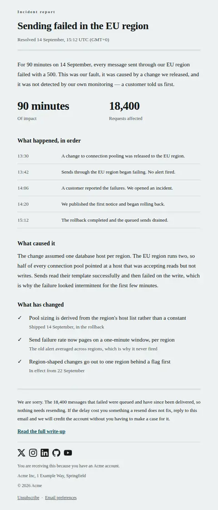
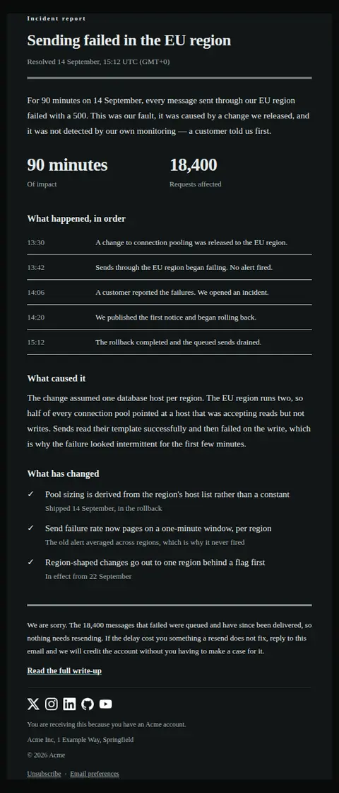
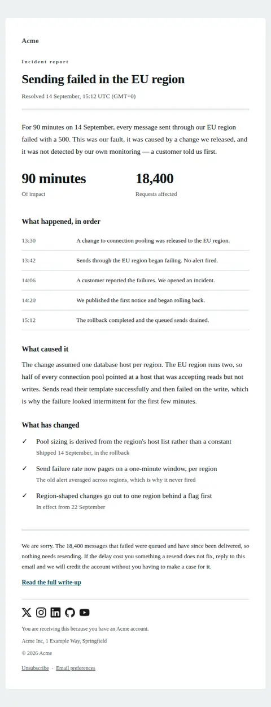
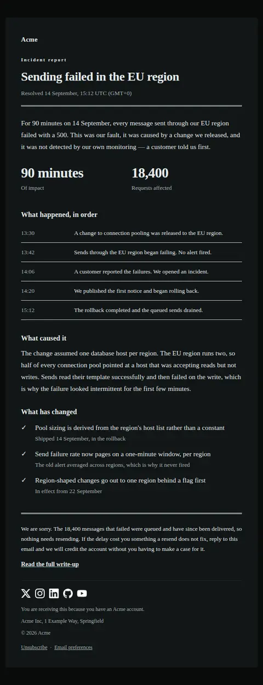
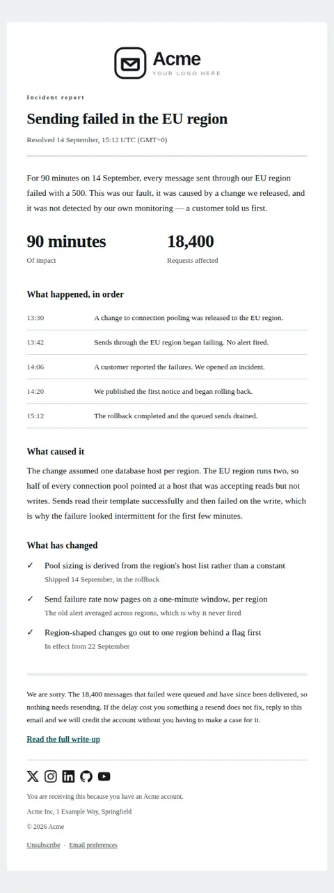
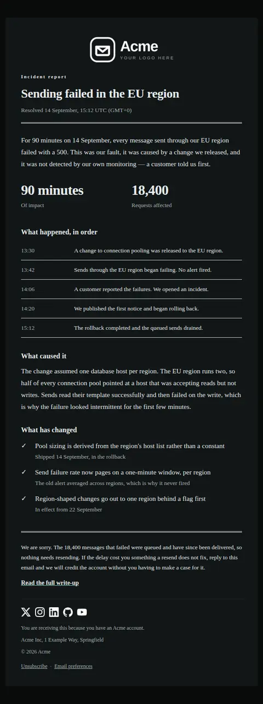
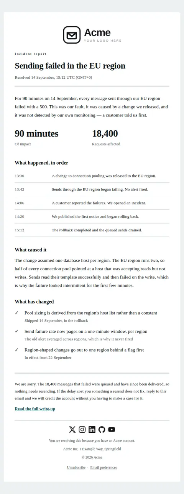
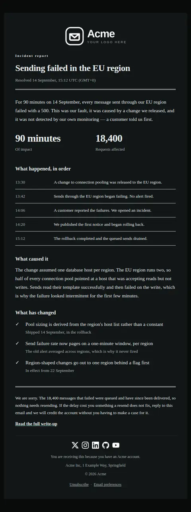

# Incident resolved — free Laravel email template

The follow-up to an incident notice: it is fixed, this is what caused it, and this is what has changed so that it does not recur.

A free, responsive, dark-mode system email template for Laravel and PHP, MIT licensed and ready to send. Part of [Mailyte Email Templates](../../README.md), the largest open-source catalog of designed transactional email for Laravel -- part of Mailyte, a product of [Techies Africa](https://techies.africa).

**`incident-resolved`** · **system** · **notification** · **apologetic**

**Subject** `Resolved: {{ impact_headline }}`  
**Preheader** The timeline, the cause named plainly, and what has changed so it does not recur.

```bash
php artisan mailyte:list incident-resolved
```

```php
Mailyte::template('incident-resolved')->with([...])->send($user);
```

## Every layout, light and dark

Each shot is the real render at 600px, captured from the preview gallery.

| Layout | Light | Dark |
|---|---|---|
| **plain** | <a href="../previews/incident-resolved/plain-light.webp"></a> | <a href="../previews/incident-resolved/plain-dark.webp"></a> |
| **minimal** | <a href="../previews/incident-resolved/minimal-light.webp"></a> | <a href="../previews/incident-resolved/minimal-dark.webp"></a> |
| **branded** | <a href="../previews/incident-resolved/branded-light.webp"></a> | <a href="../previews/incident-resolved/branded-dark.webp"></a> |
| **editorial** | <a href="../previews/incident-resolved/editorial-light.webp"></a> | <a href="../previews/incident-resolved/editorial-dark.webp"></a> |

## Data it expects

| Variable | Type | Required | What it is |
|---|---|---|---|
| `impact_headline` | string | yes | The same symptom named in the incident notice, so the two emails are obviously one thread. Do not soften it now that it is over. |
| `opening` | text | yes | What happened and who it hit, stated without euphemism. No 'some users may have experienced' — if sending failed for ninety minutes, write that sending failed for ninety minutes. |
| `resolved_at` | string | yes | When impact actually ended for customers, not when the ticket was closed. |
| `timezone` | string | yes | The timezone every time on this page is stated in, with its offset. The timeline is unreadable without it. |
| `cause_heading` | string |  | Heading over the cause. |
| `cause_pending_text` | text |  | Used when the cause is not established yet. Saying so plainly is more trustworthy than a guess that has to be corrected in a week, which is why this is a separate field rather than a hedge inside the one above. |
| `cause_text` | text |  | The actual cause, in language a customer can follow. Name the mechanism rather than an abstraction: 'the pool was sized for one region and we ran two' beats 'an unexpected configuration issue'. |
| `closing` | text |  | The closing paragraph. An apology in your own words, and what a customer who lost something should do about it — a credit they must ask for is a credit you did not really offer. |
| `duration_label` | string |  | What the first figure counts. |
| `duration_value` | string |  | How long customers were affected, set at display size because it is the number that will be quoted back to you. Leave empty if it cannot be stated honestly yet. |
| `eyebrow` | string |  | Small label above the headline, classifying the document. This email is a record as much as a message, and the label is what makes it filable. |
| `remedies` | array |  | The specific changes made, as `text` and optional `detail` saying whether each is already done or dated. 'We will improve our processes' is not one of these; a shipped guard rail with a date is. |
| `remedy_heading` | string |  | Heading over the changes. |
| `report_label` | string |  | Label for the link to the full write-up. |
| `report_url` | url |  | The full public postmortem, for readers who want the engineering detail this email deliberately leaves out. |
| `resolved_label` | string |  | Lead-in for the resolution time. |
| `scope_label` | string |  | What the second figure counts. |
| `scope_value` | string |  | The size of the blast radius as a figure — failed requests, affected accounts, delayed messages. Pair it with the duration so the impact is bounded in both directions. |
| `timeline` | array |  | The incident as `label` (the time) and `value` (what happened at it). Include the gap between the fault starting and you noticing it — leaving that row out is the tell that a postmortem is public relations. |
| `timeline_heading` | string |  | Heading over the timeline. |

## More system email templates

[Import complete](import-complete.md) · [Incident notice](incident-notice.md) · [Scheduled maintenance](maintenance-scheduled.md) · [Status update](status-update.md)

## Author

[Confidence Ugolo](https://www.linkedin.com/in/confidence-ugolo) · [Joel Omojefe](https://www.linkedin.com/in/joel-omojefe)

Part of Mailyte, a product of [Techies Africa](https://techies.africa). MIT licensed.

---

[← All 50 templates](../gallery.md) · [Package README](../../README.md) · [Sending](../sending.md) · [Theming](../theming.md) · [Deliverability](../deliverability.md)
