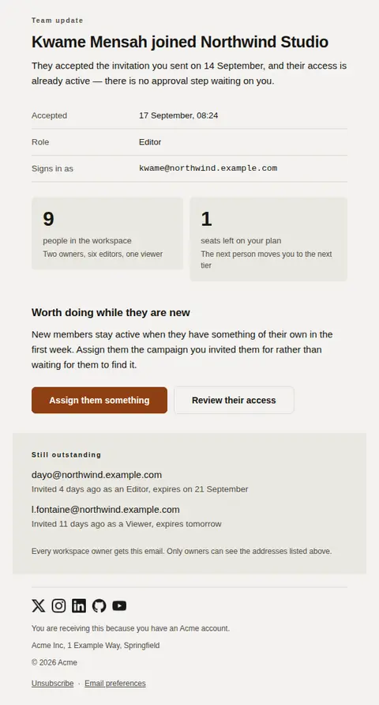
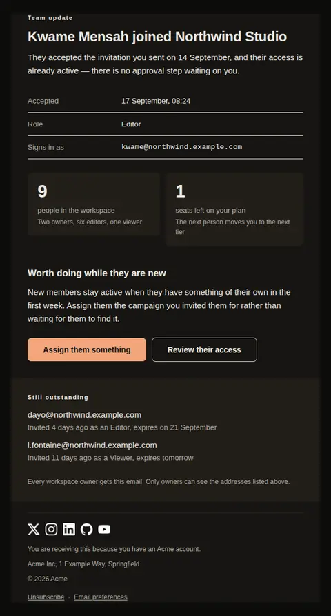
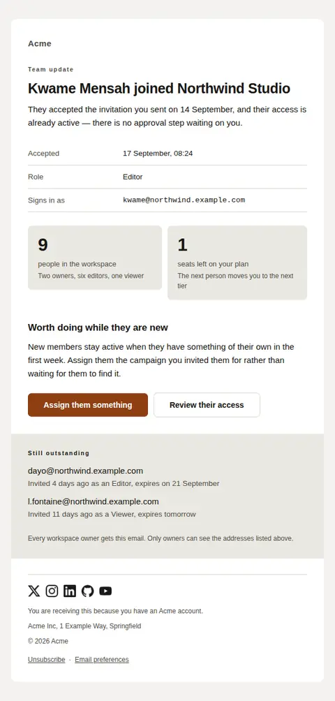
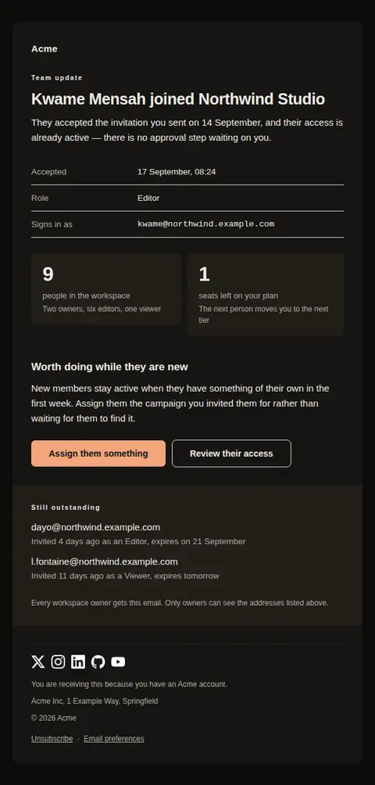

# Invitation accepted — free Laravel email template

Tells the person who sent an invitation that it worked: who joined, what they can reach, what to do with them, and which invitations are still outstanding.

A free, responsive, dark-mode collaboration email template for Laravel and PHP, MIT licensed and ready to send. Part of [Mailyte Email Templates](../../README.md), the largest open-source catalog of designed transactional email for Laravel -- part of Mailyte, a product of [Techies Africa](https://techies.africa).

**`invite-accepted`** · **collaboration** · **notification**

**Subject** `{{ member_name }} joined {{ workspace_name }}`  
**Preheader** What they can already reach, and which invitations are still outstanding.

```bash
php artisan mailyte:list invite-accepted
```

```php
Mailyte::template('invite-accepted')->with([...])->send($user);
```

## Every layout, light and dark

Each shot is the real render at 600px, captured from the preview gallery.

| Layout | Light | Dark |
|---|---|---|
| **plain** | <a href="../previews/invite-accepted/plain-light.webp"></a> | <a href="../previews/invite-accepted/plain-dark.webp"></a> |
| **minimal** | <a href="../previews/invite-accepted/minimal-light.webp"></a> | <a href="../previews/invite-accepted/minimal-dark.webp"></a> |
| **branded** | <a href="../previews/invite-accepted/branded-light.webp"></a> | <a href="../previews/invite-accepted/branded-dark.webp"></a> |

## Data it expects

| Variable | Type | Required | What it is |
|---|---|---|---|
| `intro` | text | yes | One sentence saying that access is already live, so the reader does not go looking for an approval step that does not exist. |
| `joined_at` | string | yes | When they accepted. Useful mostly when it is much later than the invitation, which is the case worth noticing. |
| `member_count` | string | yes | How many people are now in the workspace, counting the new arrival. |
| `member_email` | email | yes | The address they accepted with, set in the mono face. It is often not the address the invitation was sent to, and that difference is worth seeing. |
| `member_name` | string | yes | Who accepted, by name. It leads the subject line because that is the only fact the recipient needs from the inbox list. |
| `next_text` | text | yes | What the sender should actually do now. Without this the email is an announcement nobody acts on — a new member with nothing assigned is the most common way an invitation still fails. |
| `primary_url` | url | yes | Where the sender goes to give the new member work, rather than a generic dashboard link. |
| `role_name` | string | yes | The role they came in on. Shown so the sender can catch a wrong role on the day it is granted rather than at the next access review. |
| `workspace_name` | string | yes | Which workspace they joined. Anyone who administers more than one needs this in the subject line to know which inbox rule applies. |
| `closing` | text |  | The closing line. Say who gets these emails, because the answer is usually 'every owner' and that is worth knowing before someone replies to all of them. |
| `email_label` | string |  | Label for the address row. |
| `eyebrow` | string |  | Small label above the headline, so a workspace owner who gets several of these a week can classify them at a glance. |
| `joined_label` | string |  | Label for the acceptance row. |
| `members_caption` | string |  | A short line under the member count — who is included in it, or what changed. It also keeps the two boxed figures the same height, which an unbalanced pair does not. |
| `members_label` | string |  | What the member count counts. |
| `next_heading` | string |  | Heading over the follow-on actions. |
| `pending` | array |  | Invitations sent and not yet accepted, as `text` (the address) and `detail` (how long it has been waiting, and when it expires). This is the part that gets a stalled rollout finished. |
| `pending_heading` | string |  | Heading over the closing ledger of unaccepted invitations. |
| `primary_label` | string |  | Label for the main action. |
| `role_label` | string |  | Label for the role row. |
| `seats_caption` | string |  | The consequence of running out, stated once and quietly. This is the only commercial line in the email and it should stay that way. |
| `seats_label` | string |  | What the seat figure counts. |
| `seats_value` | string |  | Seats still available on the plan. Leave empty on plans that do not meter seats rather than showing an unbounded figure. |
| `secondary_label` | string |  | Label for the lighter second action. |
| `secondary_url` | url |  | A second, lighter action — usually the permissions screen. Leave empty and the email carries one action instead of two. |

## More collaboration email templates

[Role changed in a workspace](role-changed.md) · [Seat limit reached](seat-limit-reached.md) · [Team invitation](team-invitation.md)

## Author

[Confidence Ugolo](https://www.linkedin.com/in/confidence-ugolo) · [Joel Omojefe](https://www.linkedin.com/in/joel-omojefe)

Part of Mailyte, a product of [Techies Africa](https://techies.africa). MIT licensed.

---

[← All 50 templates](../gallery.md) · [Package README](../../README.md) · [Sending](../sending.md) · [Theming](../theming.md) · [Deliverability](../deliverability.md)
