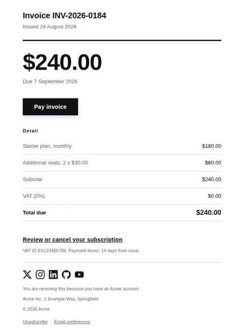
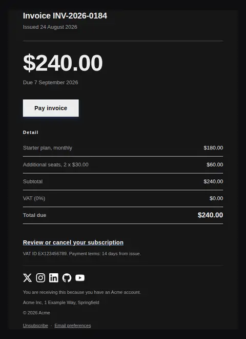
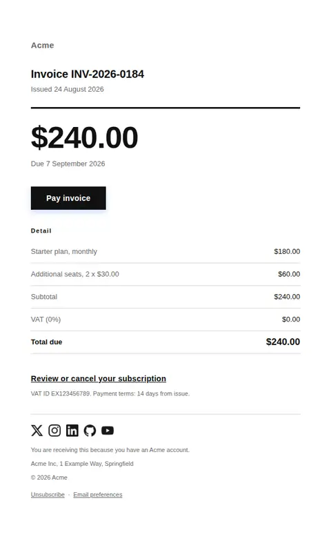
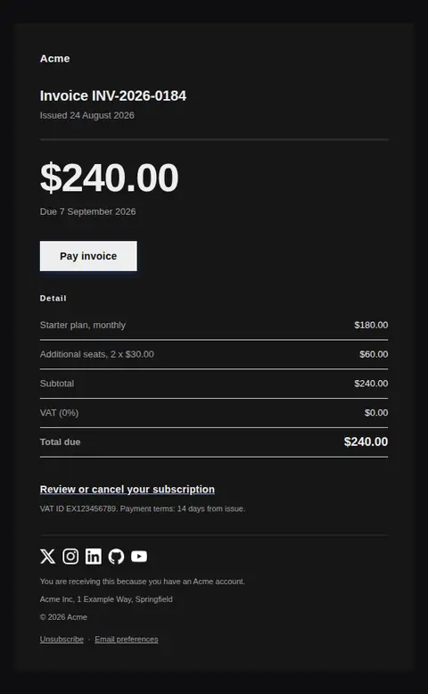
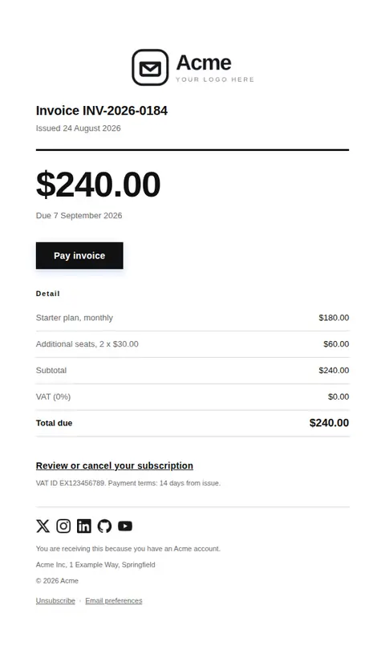
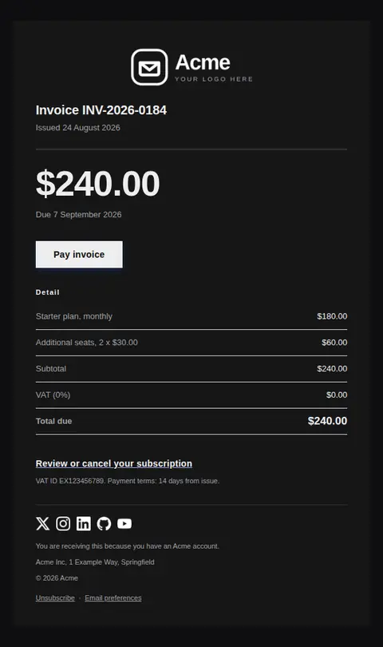

# Invoice — free Laravel email template

A payable invoice: what is owed, when it is due, and a single way to pay it.

A free, responsive, dark-mode billing email template for Laravel and PHP, MIT licensed and ready to send. Part of [Mailyte Email Templates](../../README.md), the largest open-source catalog of designed transactional email for Laravel -- part of Mailyte, a product of [Techies Africa](https://techies.africa).

**`invoice`** · **billing** · **transactional**

**Subject** `Invoice {{ invoice.number }} from {{ company.name }}`  
**Preheader** {{ invoice.total }} due {{ invoice.due_date }}. Pay online or download a copy.

```bash
php artisan mailyte:list invoice
```

```php
Mailyte::template('invoice')->with([...])->send($user);
```

## Every layout, light and dark

Each shot is the real render at 600px, captured from the preview gallery.

| Layout | Light | Dark |
|---|---|---|
| **plain** | <a href="../previews/invoice/plain-light.webp"></a> | <a href="../previews/invoice/plain-dark.webp"></a> |
| **minimal** | <a href="../previews/invoice/minimal-light.webp"></a> | <a href="../previews/invoice/minimal-dark.webp"></a> |
| **branded** | <a href="../previews/invoice/branded-light.webp"></a> | <a href="../previews/invoice/branded-dark.webp"></a> |

## Data it expects

| Variable | Type | Required | What it is |
|---|---|---|---|
| `invoice.due_date` | date | yes | Due date. |
| `invoice.number` | string | yes | Invoice reference. |
| `invoice.total` | money | yes | Formatted total, set at 40px as the largest element on the page. Format at the call site — decimal separators are not universal. |
| `pay_url` | url | yes | Hosted payment page. Never a permanent link — hosted invoice URLs expire. |
| `body` | text |  | One line of context above the figures. Optional; a clean invoice needs no preamble. |
| `button_label` | string |  | Payment button label. |
| `footer_legal` | text |  | Tax and legal footer. Varies by jurisdiction, so it is a token rather than baked into the markup. |
| `heading_text` | string |  | Document title, set small and tight like a document heading rather than a marketing headline. |
| `invoice.date` | date |  | Issue date. |
| `line_items` | array |  | Line items as `label`/`value` pairs. Quantity and unit price belong in the label, since two columns survive 320px without a media query. |
| `manage_subscription_url` | url |  | Cancellation link. Required by Stripe for FTC and California compliance on subscription billing mail. |
| `totals` | array |  | Subtotal, tax and total. The last row is emphasised automatically, so put the total last. |

## More billing email templates

[Card expiring soon](card-expiring.md) · [Payment failed](payment-failed.md) · [Payment receipt](receipt.md) · [Refund issued](refund-issued.md) · [Plan activated](subscription-activated.md) · [Subscription cancelled](subscription-cancelled.md) · [Subscription renewing](subscription-renewing.md) · [Usage limit approaching](usage-limit-warning.md)

## Author

[Confidence Ugolo](https://www.linkedin.com/in/confidence-ugolo) · [Joel Omojefe](https://www.linkedin.com/in/joel-omojefe)

Part of Mailyte, a product of [Techies Africa](https://techies.africa). MIT licensed.

---

[← All 50 templates](../gallery.md) · [Package README](../../README.md) · [Sending](../sending.md) · [Theming](../theming.md) · [Deliverability](../deliverability.md)
