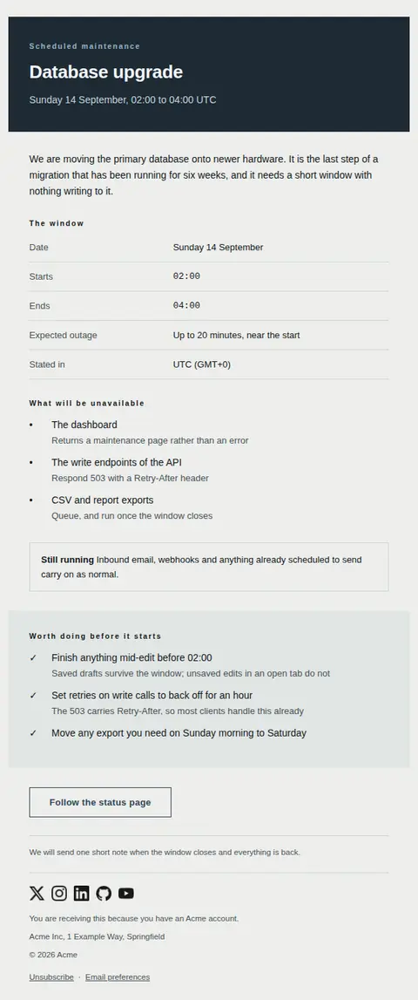
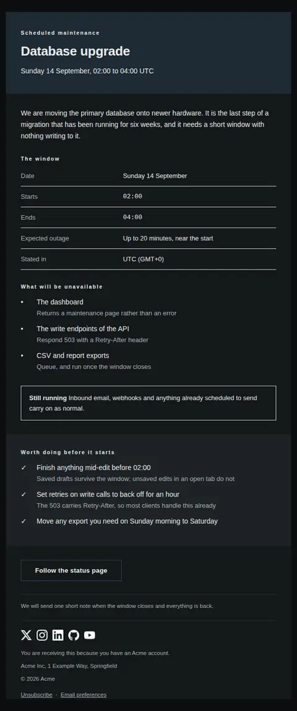
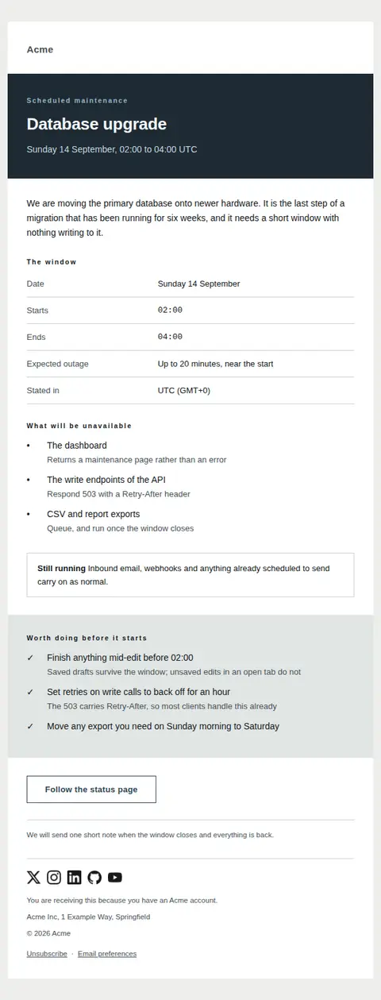
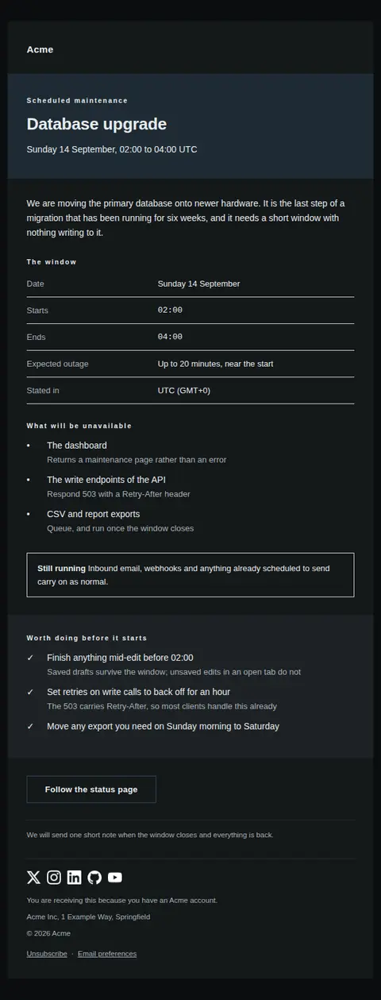
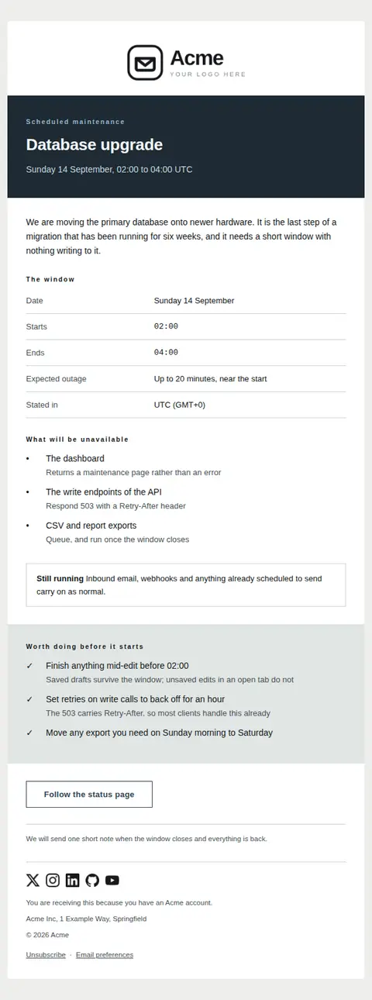
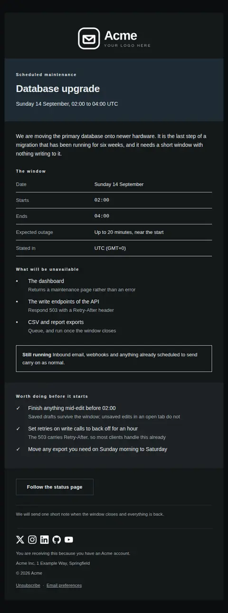

# Scheduled maintenance — free Laravel email template

Announces planned downtime ahead of time: the window with its timezone, what will be unavailable, and what is worth doing before it starts.

A free, responsive, dark-mode system email template for Laravel and PHP, MIT licensed and ready to send. Part of [Mailyte Email Templates](../../README.md), the largest open-source catalog of designed transactional email for Laravel -- part of Mailyte, a product of [Techies Africa](https://techies.africa).

**`maintenance-scheduled`** · **system** · **notification**

**Subject** `Scheduled maintenance on {{ window_date }}`  
**Preheader** The window, the timezone it is stated in, and what is worth doing before it starts.

```bash
php artisan mailyte:list maintenance-scheduled
```

```php
Mailyte::template('maintenance-scheduled')->with([...])->send($user);
```

## Every layout, light and dark

Each shot is the real render at 600px, captured from the preview gallery.

| Layout | Light | Dark |
|---|---|---|
| **plain** | <a href="../previews/maintenance-scheduled/plain-light.webp"></a> | <a href="../previews/maintenance-scheduled/plain-dark.webp"></a> |
| **minimal** | <a href="../previews/maintenance-scheduled/minimal-light.webp"></a> | <a href="../previews/maintenance-scheduled/minimal-dark.webp"></a> |
| **branded** | <a href="../previews/maintenance-scheduled/branded-light.webp"></a> | <a href="../previews/maintenance-scheduled/branded-dark.webp"></a> |

## Data it expects

| Variable | Type | Required | What it is |
|---|---|---|---|
| `headline` | string | yes | What is being worked on, in plain words. Name the system rather than the ticket — 'Database upgrade' beats 'Change window CHG-2211'. |
| `intro` | text | yes | Why the window exists and what it buys. Planned work is easier to accept when the reason is stated once, plainly, without apology. |
| `timezone` | string | yes | The timezone the two times above are given in, with its offset. Never leave this implicit: a maintenance email is read in every timezone you have customers in. |
| `window_date` | string | yes | The day the window falls on. It carries the subject line and the first row of the table, because the date is what decides whether the reader needs to act at all. |
| `window_end` | string | yes | The clock time the window closes. State a planned end even if the work may finish sooner — an open-ended window is unplannable. |
| `window_start` | string | yes | The clock time the window opens, on the date above. Set in the mono face so start and end line up under each other and can be compared at a glance. |
| `window_summary` | string | yes | The whole window on one line, timezone included, for the reader who gets no further than the masthead. |
| `affected` | array |  | Each service that goes down, as `text` (the service) and `detail` (what a request to it does meanwhile — a 503, a queue, a silent retry). The detail is the part that saves a support ticket. |
| `affected_heading` | string |  | Heading over the list of things that stop working. |
| `closing` | text |  | The closing line. Say whether another email is coming when the work is done — most people want the all-clear more than the warning. |
| `date_label` | string |  | Label for the date row. |
| `duration` | string |  | How much of the window is actual downtime, which is often much less than the window itself. Leave empty if the whole window is unavailable. |
| `duration_label` | string |  | Label for the duration row. |
| `end_label` | string |  | Label for the end row. |
| `eyebrow` | string |  | Small label above the headline. It exists so the reader can classify the email before reading a word of it. |
| `prepare` | array |  | What a customer should do beforehand, as `text` and optional `detail`. Keep it to things that genuinely help; a list of busywork trains people to ignore the next one. |
| `prepare_heading` | string |  | Heading over the preparation band. |
| `start_label` | string |  | Label for the start row. |
| `status_label` | string |  | Label for the status page action. |
| `status_url` | url |  | The status page, so the reader has somewhere to look during the window instead of writing to support. |
| `timezone_label` | string |  | Label for the timezone row. |
| `unaffected_label` | string |  | Lead-in for the line about what keeps running. |
| `unaffected_text` | text |  | What is not affected. Saying this explicitly stops readers assuming the whole product is down for two hours. |
| `window_heading` | string |  | Heading over the window table. |

## More system email templates

[Import complete](import-complete.md) · [Incident notice](incident-notice.md) · [Incident resolved](incident-resolved.md) · [Status update](status-update.md)

## Author

[Confidence Ugolo](https://www.linkedin.com/in/confidence-ugolo) · [Joel Omojefe](https://www.linkedin.com/in/joel-omojefe)

Part of Mailyte, a product of [Techies Africa](https://techies.africa). MIT licensed.

---

[← All 50 templates](../gallery.md) · [Package README](../../README.md) · [Sending](../sending.md) · [Theming](../theming.md) · [Deliverability](../deliverability.md)
