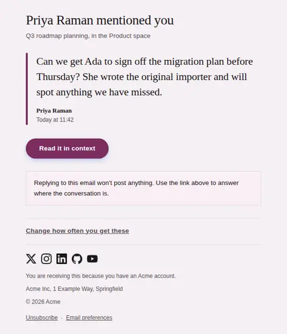
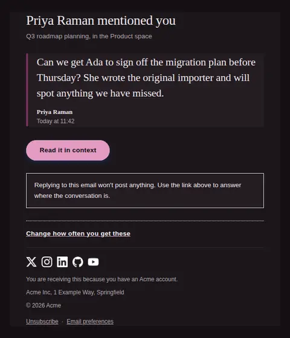
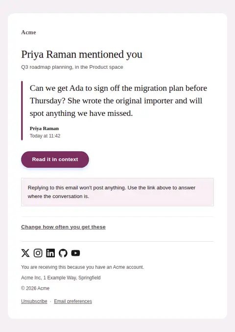
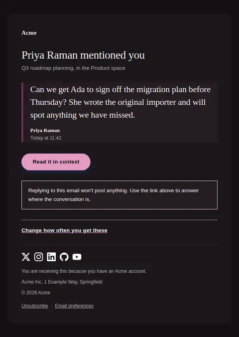
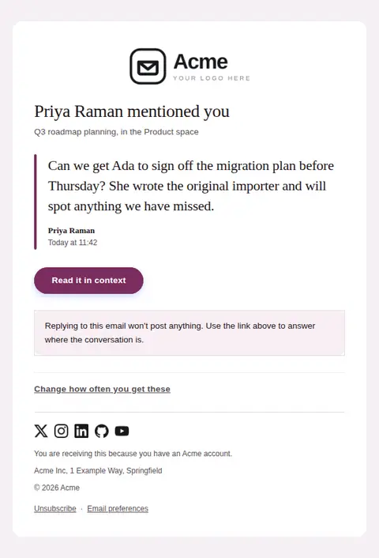
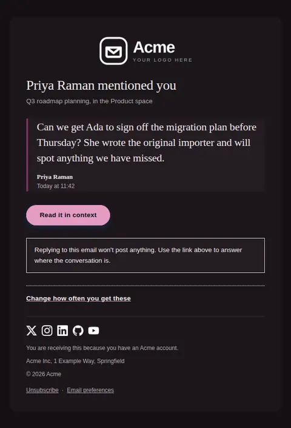

# You were mentioned — free Laravel email template

Tells someone their name came up in a comment or document, and carries the sentence it came up in so the mention can be judged without opening anything.

A free, responsive, dark-mode notifications email template for Laravel and PHP, MIT licensed and ready to send. Part of [Mailyte Email Templates](../../README.md), the largest open-source catalog of designed transactional email for Laravel -- part of Mailyte, a product of [Techies Africa](https://techies.africa).

**`mention`** · **notifications** · **notification**

**Subject** `{{ author_name }} mentioned you`  
**Preheader** {{ mention_text }}

```bash
php artisan mailyte:list mention
```

```php
Mailyte::template('mention')->with([...])->send($user);
```

## Every layout, light and dark

Each shot is the real render at 600px, captured from the preview gallery.

| Layout | Light | Dark |
|---|---|---|
| **plain** | <a href="../previews/mention/plain-light.webp"></a> | <a href="../previews/mention/plain-dark.webp"></a> |
| **minimal** | <a href="../previews/mention/minimal-light.webp"></a> | <a href="../previews/mention/minimal-dark.webp"></a> |
| **branded** | <a href="../previews/mention/branded-light.webp"></a> | <a href="../previews/mention/branded-dark.webp"></a> |

## Data it expects

| Variable | Type | Required | What it is |
|---|---|---|---|
| `action_url` | url | yes | Deep link to the comment itself, anchored so the reader lands on the quoted line rather than the top of a long document. |
| `author_name` | string | yes | Who wrote the mention. A mention from a stranger and a mention from your manager are different emails, and only the name tells them apart. |
| `mention_text` | text | yes | The sentence the recipient's name appeared in, verbatim. This is the entire value of the message and it doubles as the preheader, so send the real words rather than a summary. |
| `action_label` | string |  | Label on the only button. It should promise the thread, not the product. |
| `context_note` | text |  | The one thing a mention email always has to say: what happens if they hit reply. Most people will try it. |
| `mention_location` | string |  | Where it was said, in the reader's own vocabulary — a document title, a channel, a card. Without it a quotation is just a fragment. |
| `mention_time` | string |  | When it was written, in the recipient's timezone if you know it. Attached to the quotation rather than the headline, because it dates the words and not the email. |
| `notification_settings_label` | string |  | Wording of that link. Name the frequency, not the settings screen. |
| `notification_settings_url` | url |  | Where mention alerts get turned down or batched. Mentions are the notification people mute first, so make muting easy rather than making it a search. |

## More notifications email templates

[New reply in a thread](comment-reply.md) · [Notification](notification.md) · [A task was assigned to you](task-assigned.md) · [Weekly digest](weekly-digest.md)

## Author

[Confidence Ugolo](https://www.linkedin.com/in/confidence-ugolo) · [Joel Omojefe](https://www.linkedin.com/in/joel-omojefe)

Part of Mailyte, a product of [Techies Africa](https://techies.africa). MIT licensed.

---

[← All 50 templates](../gallery.md) · [Package README](../../README.md) · [Sending](../sending.md) · [Theming](../theming.md) · [Deliverability](../deliverability.md)
