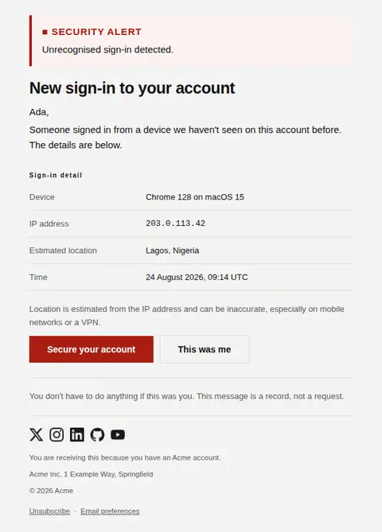
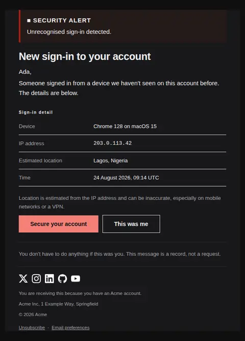
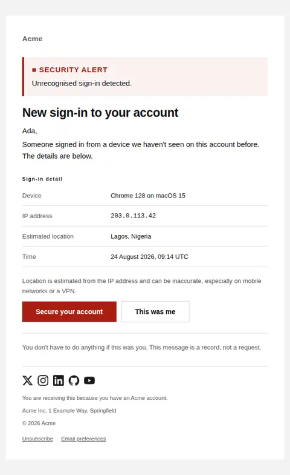
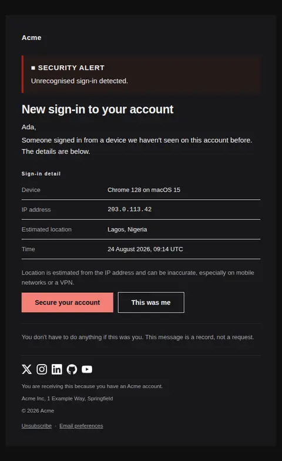

# New device sign-in — free Laravel email template

Security alert sent when an account is accessed from an unrecognised device or location.

A free, responsive, dark-mode security email template for Laravel and PHP, MIT licensed and ready to send. Part of [Mailyte Email Templates](../../README.md), the largest open-source catalog of designed transactional email for Laravel -- part of Mailyte, a product of [Techies Africa](https://techies.africa).

**`new-device-login`** · **security** · **transactional** · **urgent**

**Subject** `New sign-in to your {{ product.name }} account`  
**Preheader** If this was you, nothing to do. If it wasn't, secure the account now.

```bash
php artisan mailyte:list new-device-login
```

```php
Mailyte::template('new-device-login')->with([...])->send($user);
```

## Every layout, light and dark

Each shot is the real render at 600px, captured from the preview gallery.

| Layout | Light | Dark |
|---|---|---|
| **plain** | <a href="../previews/new-device-login/plain-light.webp"></a> | <a href="../previews/new-device-login/plain-dark.webp"></a> |
| **minimal** | <a href="../previews/new-device-login/minimal-light.webp"></a> | <a href="../previews/new-device-login/minimal-dark.webp"></a> |
| **branded** | <a href="../previews/new-device-login/branded-light.webp"></a> | <a href="../previews/new-device-login/branded-dark.webp"></a> |

## Data it expects

| Variable | Type | Required | What it is |
|---|---|---|---|
| `action_url` | url | yes | Where to secure the account. This is the urgent path and gets the filled button. |
| `body` | text |  | Opening paragraph explaining what triggered the alert. |
| `button_label` | string |  | Label for the urgent action. |
| `confirm_label` | string |  | Label for the reassuring action. |
| `confirm_url` | url |  | Optional "this was me" acknowledgement, which stops the alert repeating and is worth offering. |
| `details` | array |  | Sign-in metadata as `label` / `value`. Set `mono` on values a person may need to read character by character, such as an IP address. |
| `heading_text` | string |  | Main headline. |
| `location_caveat` | text |  | Why the location may look wrong. Omitting this generates support tickets — IP geolocation is routinely off by a city. |
| `security_note` | text |  | What happens if they do nothing. Reassurance belongs after the action, not before it. |
| `user.first_name` | string |  | Recipient's first name. |

## More security email templates

[API key created](api-key-created.md) · [Password found in a breach](password-breach.md) · [Sign-in attempt blocked](suspicious-activity.md) · [Two-step verification changed](two-factor-enabled.md)

## Author

[Confidence Ugolo](https://www.linkedin.com/in/confidence-ugolo) · [Joel Omojefe](https://www.linkedin.com/in/joel-omojefe)

Part of Mailyte, a product of [Techies Africa](https://techies.africa). MIT licensed.

---

[← All 50 templates](../gallery.md) · [Package README](../../README.md) · [Sending](../sending.md) · [Theming](../theming.md) · [Deliverability](../deliverability.md)
