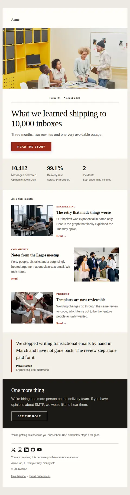
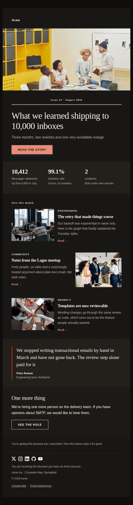
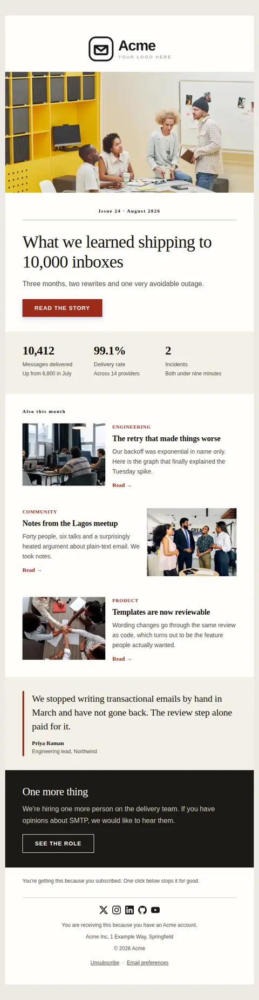
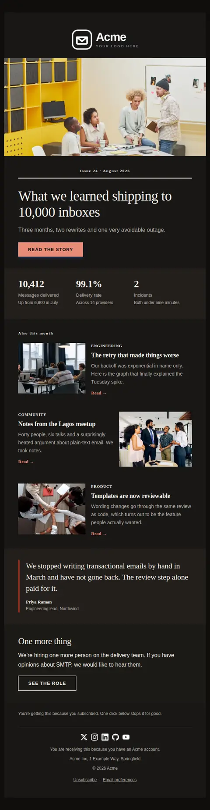

# Newsletter — free Laravel email template

A multi-section issue: a cover story, a few shorter items, and one number worth remembering. Built for a regular sending rhythm.

A free, responsive, dark-mode newsletter email template for Laravel and PHP, MIT licensed and ready to send. Part of [Mailyte Email Templates](../../README.md), the largest open-source catalog of designed transactional email for Laravel -- part of Mailyte, a product of [Techies Africa](https://techies.africa).

**`newsletter`** · **newsletter** · **marketing**

**Subject** `{{ issue_title }}`  
**Preheader** Plus three shorter reads and the one number we keep coming back to.

```bash
php artisan mailyte:list newsletter
```

```php
Mailyte::template('newsletter')->with([...])->send($user);
```

## Every layout, light and dark

Each shot is the real render at 600px, captured from the preview gallery.

| Layout | Light | Dark |
|---|---|---|
| **minimal** | <a href="../previews/newsletter/minimal-light.webp"></a> | <a href="../previews/newsletter/minimal-dark.webp"></a> |
| **branded** | <a href="../previews/newsletter/branded-light.webp"></a> | <a href="../previews/newsletter/branded-dark.webp"></a> |
| **editorial** | <a href="../previews/newsletter/editorial-light.webp"></a> | <a href="../previews/newsletter/editorial-dark.webp"></a> |

## Data it expects

| Variable | Type | Required | What it is |
|---|---|---|---|
| `cover_url` | url | yes | Where the cover story lives. |
| `issue_title` | string | yes | Cover headline, set at 40px serif. This is the subject line by default, so write it once and well. |
| `closing_cta` | string |  | Label for the closing link. |
| `closing_text` | text |  | The sign-off. A newsletter that ends mid-list feels unfinished. |
| `closing_title` | string |  | Heading for the closing band. |
| `closing_url` | url |  | Optional link in the closing band. |
| `cover_cta` | string |  | Cover call to action. |
| `cover_image` | url |  | Cover photograph, run full width. Wide crops read better than tall ones at 620px. |
| `footer_note` | text |  | Why they are receiving this. Reduces spam reports more reliably than any subject-line trick. |
| `issue_date` | string |  | Date line beside the issue number. |
| `issue_number` | string |  | Issue label, e.g. "Issue 24". Set in caps above the masthead rule. |
| `issue_standfirst` | text |  | The sentence under the cover headline that earns the click. |
| `items` | array |  | Shorter items, each with `image`, `eyebrow`, `title`, `text` and `url`. Rows alternate sides automatically. Three is a comfortable issue; five is a chore. |
| `quote_author` | string |  | Who said it. |
| `quote_role` | string |  | Their role and company. |
| `quote_text` | text |  | A pull quote from the issue, or from a reader. Optional, and the design is fine without it. |
| `stat_items` | array |  | Two or three figures from the period, each with `value`, `label` and an optional `caption` giving the comparison that makes the number mean something. |

## Credits

- Office team having a meeting in the room by Moe Magners via Pexels — [source](https://www.pexels.com/photo/office-team-having-a-meeting-in-the-room-7495287/) (Pexels License, sample data only)
- Men sitting at the desks in an office and using computers by Cottonbro via Pexels — [source](https://www.pexels.com/photo/men-sitting-at-the-desks-in-an-office-and-using-computers-6804068/) (Pexels License, sample data only)
- Casual office meeting in Lagos, Nigeria by Ninthgrid via Pexels — [source](https://www.pexels.com/photo/casual-office-meeting-in-lagos-nigeria-30688593/) (Pexels License, sample data only)
- Coworkers with their hands together by Thirdman via Pexels — [source](https://www.pexels.com/photo/coworkers-with-their-hands-together-5256819/) (Pexels License, sample data only)

## Author

[Confidence Ugolo](https://www.linkedin.com/in/confidence-ugolo) · [Joel Omojefe](https://www.linkedin.com/in/joel-omojefe)

Part of Mailyte, a product of [Techies Africa](https://techies.africa). MIT licensed.

---

[← All 50 templates](../gallery.md) · [Package README](../../README.md) · [Sending](../sending.md) · [Theming](../theming.md) · [Deliverability](../deliverability.md)
