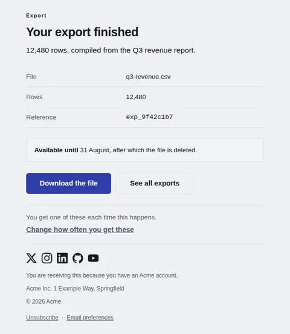
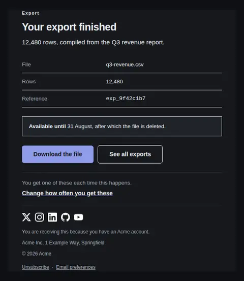
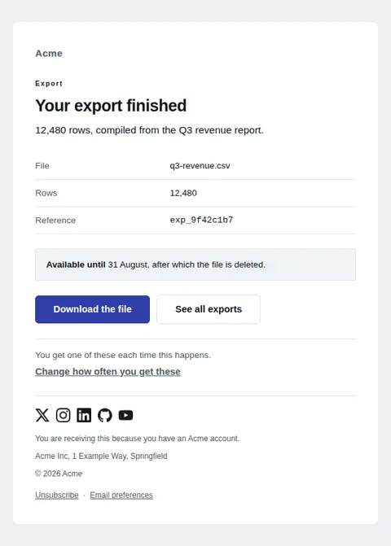
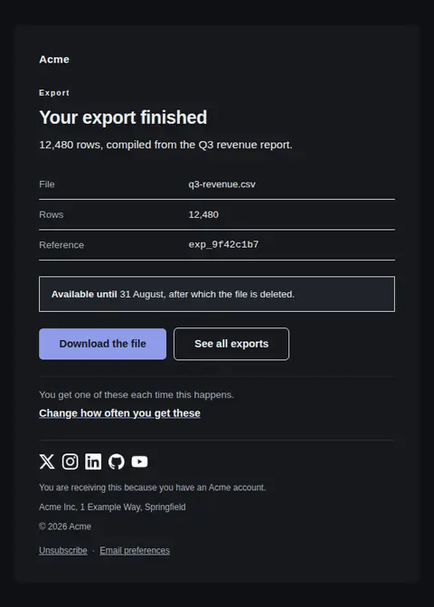
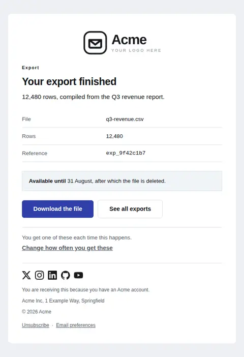
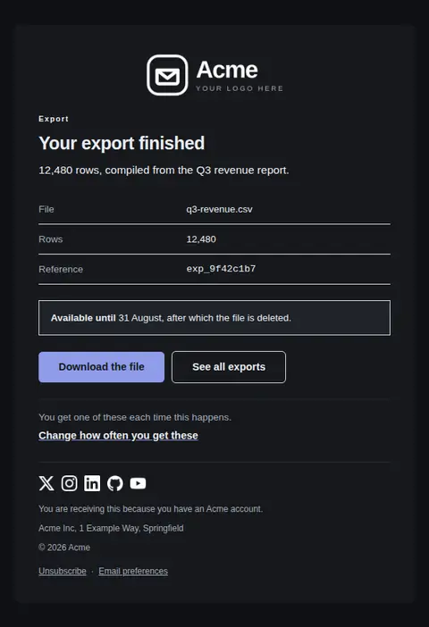

# Notification — free Laravel email template

The generic single-event notification: what happened, the facts worth keeping, and one action. Scales from four elements to a full record depending on what the sender supplies.

A free, responsive, dark-mode notifications email template for Laravel and PHP, MIT licensed and ready to send. Part of [Mailyte Email Templates](../../README.md), the largest open-source catalog of designed transactional email for Laravel -- part of Mailyte, a product of [Techies Africa](https://techies.africa).

**`notification`** · **notifications** · **notification**

**Subject** `{{ event_line }}`  
**Preheader** Everything worth saying is in the first line, and the link goes straight to the thing itself.

```bash
php artisan mailyte:list notification
```

```php
Mailyte::template('notification')->with([...])->send($user);
```

## Every layout, light and dark

Each shot is the real render at 600px, captured from the preview gallery.

| Layout | Light | Dark |
|---|---|---|
| **plain** | <a href="../previews/notification/plain-light.webp"></a> | <a href="../previews/notification/plain-dark.webp"></a> |
| **minimal** | <a href="../previews/notification/minimal-light.webp"></a> | <a href="../previews/notification/minimal-dark.webp"></a> |
| **branded** | <a href="../previews/notification/branded-light.webp"></a> | <a href="../previews/notification/branded-dark.webp"></a> |

## Data it expects

| Variable | Type | Required | What it is |
|---|---|---|---|
| `action_url` | url | yes | Where the action goes — straight to the thing, never a generic dashboard. |
| `event_line` | string | yes | What happened, as a complete statement rather than a topic. This is the subject line by default, so write it once and well. |
| `action_label` | string |  | The one action. Name the outcome, not the mechanism. |
| `context_label` | string |  | Small label naming the area this concerns, e.g. "Export" or "Billing". Lets someone triage the message before reading it. Omit for the barest version. |
| `deadline_label` | string |  | Bold lead-in on the deadline bar. |
| `deadline_text` | string |  | When the thing expires. A notification with an expiry has exactly one job beyond the action: make the expiry impossible to miss. |
| `details` | array |  | Facts worth keeping or forwarding, as `label`/`value` pairs. Set `mono` on references someone may need to read character by character. Omit entirely for a bare notice. |
| `event_detail` | text |  | One sentence of context under the headline. What it means, or what happens next. |
| `notification_settings_label` | string |  | Label for the frequency control. |
| `notification_settings_url` | url |  | Where notification frequency is changed. Offering it is what keeps a notification a notification rather than an imposition. |
| `secondary_label` | string |  | Label for an optional second action of lesser weight. |
| `secondary_url` | url |  | Optional second action. Leave empty and the primary stands alone, which is usually right. |
| `settings_prompt` | text |  | Line above the frequency control, so the link is not left to speak for itself. |

## More notifications email templates

[New reply in a thread](comment-reply.md) · [You were mentioned](mention.md) · [A task was assigned to you](task-assigned.md) · [Weekly digest](weekly-digest.md)

## Author

[Confidence Ugolo](https://www.linkedin.com/in/confidence-ugolo) · [Joel Omojefe](https://www.linkedin.com/in/joel-omojefe)

Part of Mailyte, a product of [Techies Africa](https://techies.africa). MIT licensed.

---

[← All 50 templates](../gallery.md) · [Package README](../../README.md) · [Sending](../sending.md) · [Theming](../theming.md) · [Deliverability](../deliverability.md)
