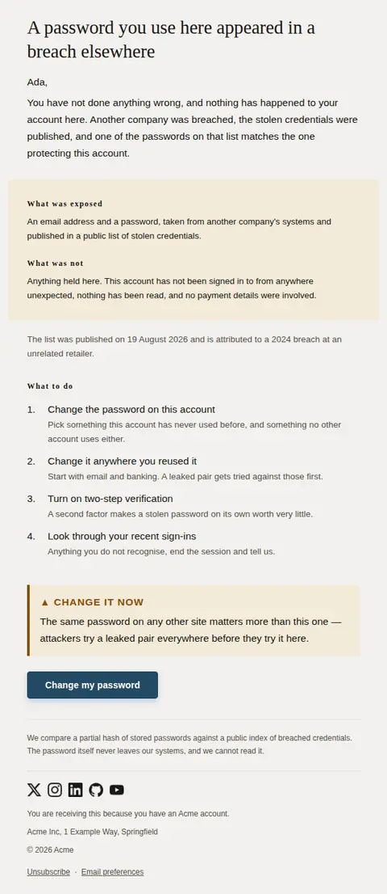
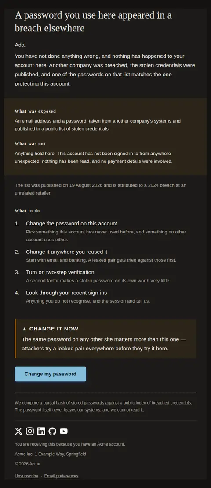
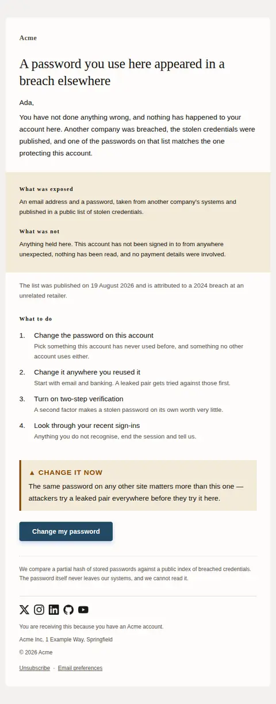
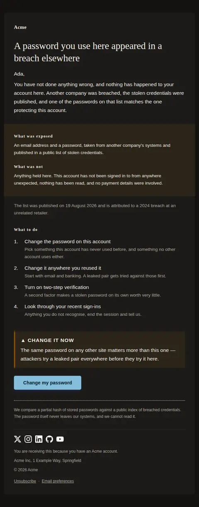
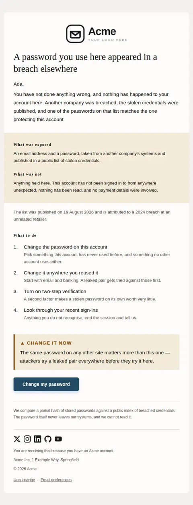
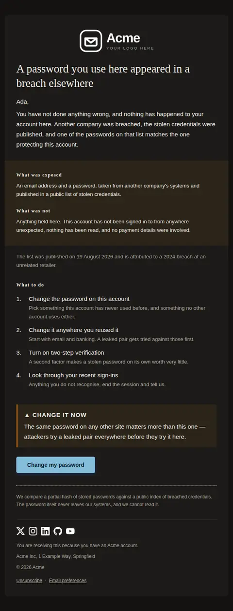

# Password found in a breach — free Laravel email template

Sent when a password protecting this account is found in a published third-party breach list, so it can be changed before anyone tries it here.

A free, responsive, dark-mode security email template for Laravel and PHP, MIT licensed and ready to send. Part of [Mailyte Email Templates](../../README.md), the largest open-source catalog of designed transactional email for Laravel -- part of Mailyte, a product of [Techies Africa](https://techies.africa).

**`password-breach`** · **security** · **transactional**

**Subject** `Your {{ product.name }} password appeared in a breach elsewhere`  
**Preheader** It came from another company's breach, not from us — but the password still has to change.

```bash
php artisan mailyte:list password-breach
```

```php
Mailyte::template('password-breach')->with([...])->send($user);
```

## Every layout, light and dark

Each shot is the real render at 600px, captured from the preview gallery.

| Layout | Light | Dark |
|---|---|---|
| **plain** | <a href="../previews/password-breach/plain-light.webp"></a> | <a href="../previews/password-breach/plain-dark.webp"></a> |
| **minimal** | <a href="../previews/password-breach/minimal-light.webp"></a> | <a href="../previews/password-breach/minimal-dark.webp"></a> |
| **branded** | <a href="../previews/password-breach/branded-light.webp"></a> | <a href="../previews/password-breach/branded-dark.webp"></a> |

## Data it expects

| Variable | Type | Required | What it is |
|---|---|---|---|
| `change_url` | url | yes | Where the password is changed. Send them to a page they have to authenticate on — a breach notice that opens straight into an editable password field is the exact shape of the phishing mail this warns about. |
| `action_label` | string |  | The instruction in two or three words, set beside a triangle mark and a border weight so it reads as an instruction on a greyscale screen too. |
| `action_text` | text |  | The one sentence that does the most good. Reuse elsewhere is where the actual danger lives, and this is the line that says so. |
| `body` | text |  | The explanation, and the place the email earns its trust. State plainly that they are not at fault and that nothing has happened on this account, because the reader's first assumption will be the opposite of both. |
| `button_label` | string |  | Label for the single action. The advisory is amber; the remedy is deliberately not, so the thing to click never looks like the thing to fear. |
| `exposed_text` | text |  | What was in the published data. Be specific and be narrow — vagueness here is what makes people assume the worst and start closing accounts. |
| `exposed_title` | string |  | Label for the first half of the panel: what the breach actually contained. |
| `heading_text` | string |  | The headline. Put the breach somewhere else in the sentence — the reader has to understand within one line that this happened to another company, not to you and not to them. |
| `privacy_note` | text |  | How you found out, in one sentence. Readers who understand that the password never left your servers stop asking whether this email is itself the attack. |
| `safe_text` | text |  | The reassurance, stated only as far as it is true. If you have not checked for unfamiliar sign-ins, do not claim there were none. |
| `safe_title` | string |  | Label for the second half: what was not touched. Half a breach notice should be about the things that are still fine. |
| `source_line` | string |  | Where the list came from and when, if you can say. Naming the source is what separates a real advisory from the phishing mail that imitates one. Leave it empty rather than describe a breach you cannot attribute. |
| `steps` | array |  | Remediation as ordered steps, each `text` with an optional `detail`. Numbered rather than bulleted because the order matters: changing the password here first, while the old one is still leaked elsewhere, achieves the least. |
| `steps_title` | string |  | Heading above the numbered steps. |
| `user.first_name` | string |  | Names the person on their own line. Never glued to the opening sentence — a breach notice that reads "Hi Ada, Your password" looks generated, and a generated breach notice looks like phishing. |

## More security email templates

[API key created](api-key-created.md) · [New device sign-in](new-device-login.md) · [Sign-in attempt blocked](suspicious-activity.md) · [Two-step verification changed](two-factor-enabled.md)

## Author

[Confidence Ugolo](https://www.linkedin.com/in/confidence-ugolo) · [Joel Omojefe](https://www.linkedin.com/in/joel-omojefe)

Part of Mailyte, a product of [Techies Africa](https://techies.africa). MIT licensed.

---

[← All 50 templates](../gallery.md) · [Package README](../../README.md) · [Sending](../sending.md) · [Theming](../theming.md) · [Deliverability](../deliverability.md)
