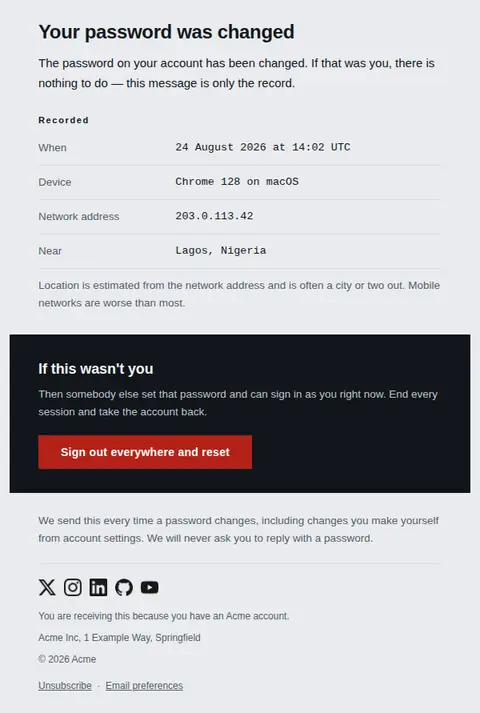
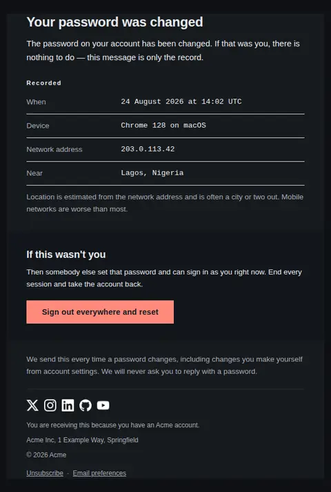
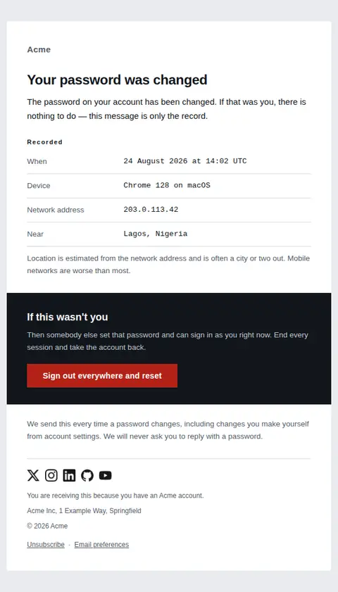
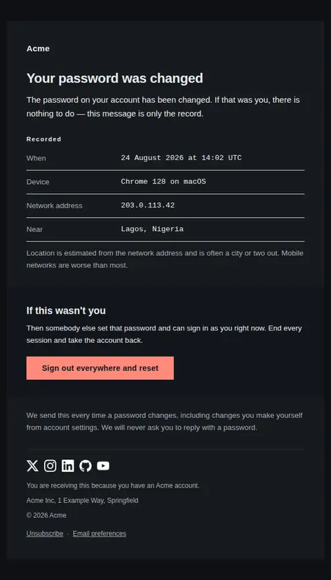

# Password changed — free Laravel email template

Sent after a password is successfully changed: the change recorded with its metadata, and a way to undo it if the person who made it was not the account holder.

A free, responsive, dark-mode account email template for Laravel and PHP, MIT licensed and ready to send. Part of [Mailyte Email Templates](../../README.md), the largest open-source catalog of designed transactional email for Laravel -- part of Mailyte, a product of [Techies Africa](https://techies.africa).

**`password-changed`** · **account** · **transactional**

**Subject** `Your {{ product.name }} password was changed`  
**Preheader** A record of the change, and what to do if it wasn't you.

```bash
php artisan mailyte:list password-changed
```

```php
Mailyte::template('password-changed')->with([...])->send($user);
```

## Every layout, light and dark

Each shot is the real render at 600px, captured from the preview gallery.

| Layout | Light | Dark |
|---|---|---|
| **plain** | <a href="../previews/password-changed/plain-light.webp"></a> | <a href="../previews/password-changed/plain-dark.webp"></a> |
| **minimal** | <a href="../previews/password-changed/minimal-light.webp"></a> | <a href="../previews/password-changed/minimal-dark.webp"></a> |
| **branded** | <a href="../previews/password-changed/branded-light.webp"></a> | <a href="../previews/password-changed/branded-dark.webp"></a> |

## Data it expects

| Variable | Type | Required | What it is |
|---|---|---|---|
| `alarm_body` | text |  | What is actually at stake and what to do about it. Say it plainly: whoever changed the password can currently read everything in the account. |
| `alarm_title` | string |  | Heading of the closing band. Address the one reader it is for. |
| `body` | text |  | The opening sentence. Give the recipient permission to stop reading if it was them, so the band at the foot is aimed only at the person it is for. |
| `changed_at` | datetime |  | When the change went through, formatted at the call site and ideally with the time zone spelled out — a bare clock time is unverifiable to someone travelling. |
| `closing_note` | text |  | Why this email exists at all. Saying that it is sent on every change stops the next one being mistaken for a phishing attempt. |
| `device` | string |  | Browser and operating system as your session store recorded them. Recognition is the whole point, so use what the person would recognise, not the raw user agent. |
| `heading_text` | string |  | The headline. State the completed fact — a recipient who did not make this change needs to know that in the preview pane, not three lines in. |
| `ip_address` | string |  | The address the change came from. Meaningless to most readers and decisive to the few who check it, which is why it is present but set quietly. |
| `location` | string |  | Approximate place derived from the address. Omit it rather than guess: a wrong city turns a reassuring email into an alarming one. |
| `metadata_caveat` | text |  | The honest footnote under the record. Geolocation is routinely a city or two out, and a reader who knows that will not panic at an unfamiliar name. |
| `record_label` | string |  | Small heading over the metadata. It is a label, not a sentence, so keep it to one or two words. |
| `revoke_label` | string |  | Label on the recovery action. Name both halves — signing out and resetting — because doing only one of them leaves the intruder in. |
| `revoke_url` | url |  | Where the account recovery flow starts. Leave it empty if your product has no self-service recovery, and point the band's copy at support instead. |

## More account email templates

[Account scheduled for deletion](account-deleted.md) · [Email address changed](email-changed.md) · [Reset your password](password-reset.md) · [Verify email address](verify-email.md) · [Verify email address](verify-email-code.md) · [Verify email address](verify-email-link.md) · [Verify email address](verify-email-typeset.md) · [Verify email address](verify-email-vivid.md)

## Author

[Confidence Ugolo](https://www.linkedin.com/in/confidence-ugolo) · [Joel Omojefe](https://www.linkedin.com/in/joel-omojefe)

Part of Mailyte, a product of [Techies Africa](https://techies.africa). MIT licensed.

---

[← All 50 templates](../gallery.md) · [Package README](../../README.md) · [Sending](../sending.md) · [Theming](../theming.md) · [Deliverability](../deliverability.md)
