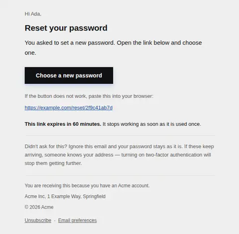
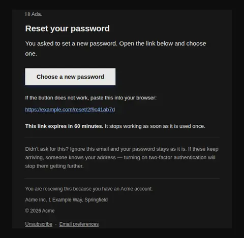
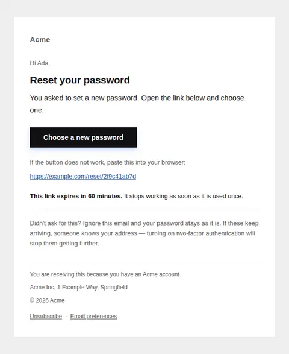
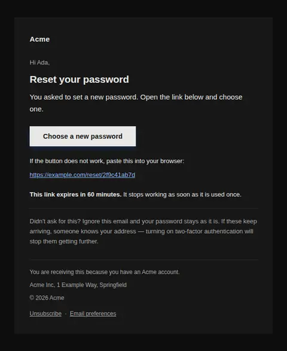
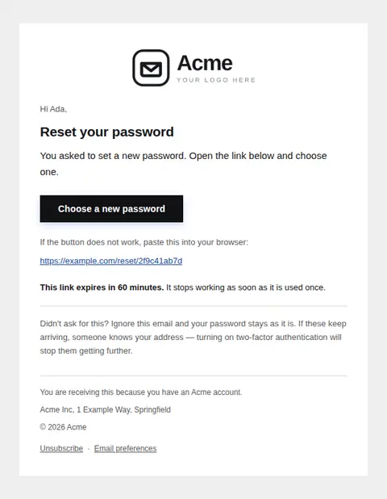
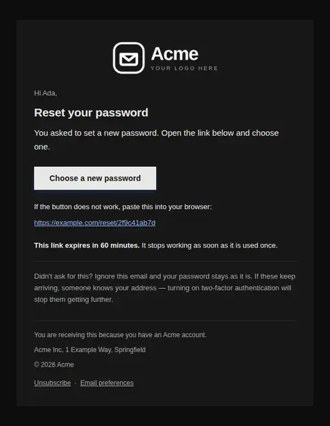

# Reset your password — free Laravel email template

Sent the moment someone asks to reset a password: one time-boxed link, the raw URL underneath it, and nothing else competing for the click.

A free, responsive, dark-mode account email template for Laravel and PHP, MIT licensed and ready to send. Part of [Mailyte Email Templates](../../README.md), the largest open-source catalog of designed transactional email for Laravel -- part of Mailyte, a product of [Techies Africa](https://techies.africa).

**`password-reset`** · **account** · **transactional**

**Subject** `Reset your {{ product.name }} password`  
**Preheader** Good for {{ expires_in }} and one use. Ignore it and nothing changes.

```bash
php artisan mailyte:list password-reset
```

```php
Mailyte::template('password-reset')->with([...])->send($user);
```

## Every layout, light and dark

Each shot is the real render at 600px, captured from the preview gallery.

| Layout | Light | Dark |
|---|---|---|
| **plain** | <a href="../previews/password-reset/plain-light.webp"></a> | <a href="../previews/password-reset/plain-dark.webp"></a> |
| **minimal** | <a href="../previews/password-reset/minimal-light.webp"></a> | <a href="../previews/password-reset/minimal-dark.webp"></a> |
| **branded** | <a href="../previews/password-reset/branded-light.webp"></a> | <a href="../previews/password-reset/branded-dark.webp"></a> |

## Data it expects

| Variable | Type | Required | What it is |
|---|---|---|---|
| `reset_url` | url | yes | The one-time reset link. It carries the token, so it is also printed in full underneath the button for clients that strip or rewrite it. |
| `body` | text |  | The single explanatory sentence. Say what was asked for, so a recipient who did not ask knows immediately that something is off. |
| `button_label` | string |  | Label on the only action in the message. Name the outcome, not the mechanism. |
| `expires_in` | string |  | How long the link stays valid, stated as a duration because the recipient is reading this within minutes of asking for it. |
| `expiry_note` | text |  | What happens after a single use. Worth saying: people forward these to a second device and then wonder why the link is dead. |
| `fallback_note` | string |  | Introduces the printed URL. Security gateways routinely rewrite or break buttons, and a reset with no visible link is a dead end. |
| `heading_text` | string |  | The headline. Keep it to the instruction itself: this email is scanned, not read. |
| `not_you_note` | text |  | The line for the recipient who did not ask. It has to reassure and advise in the same breath, because a stream of unrequested resets is itself a signal. |
| `user.first_name` | string |  | Recipient's first name. Absent for accounts that never collected one, which is common on password reset — the design drops the greeting rather than guessing. |

## More account email templates

[Account scheduled for deletion](account-deleted.md) · [Email address changed](email-changed.md) · [Password changed](password-changed.md) · [Verify email address](verify-email.md) · [Verify email address](verify-email-code.md) · [Verify email address](verify-email-link.md) · [Verify email address](verify-email-typeset.md) · [Verify email address](verify-email-vivid.md)

## Author

[Confidence Ugolo](https://www.linkedin.com/in/confidence-ugolo) · [Joel Omojefe](https://www.linkedin.com/in/joel-omojefe)

Part of Mailyte, a product of [Techies Africa](https://techies.africa). MIT licensed.

---

[← All 50 templates](../gallery.md) · [Package README](../../README.md) · [Sending](../sending.md) · [Theming](../theming.md) · [Deliverability](../deliverability.md)
