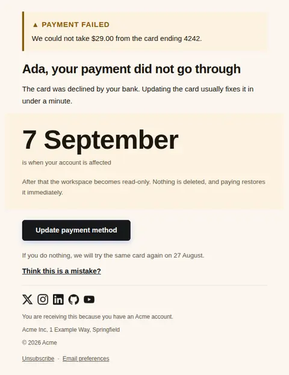
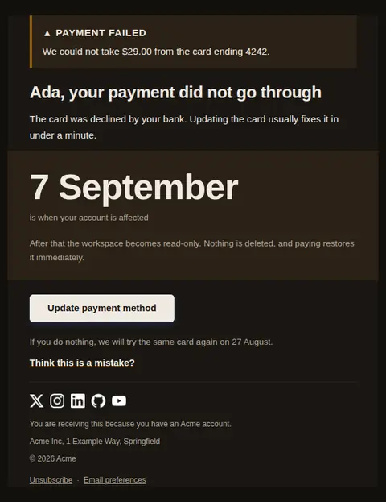
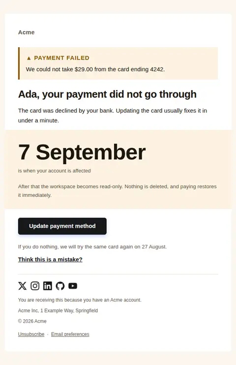
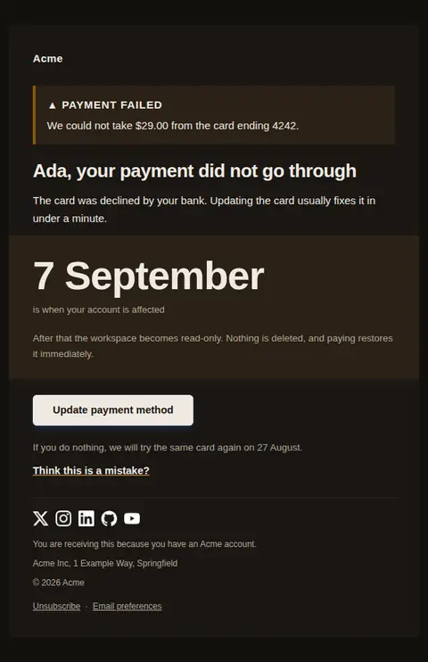
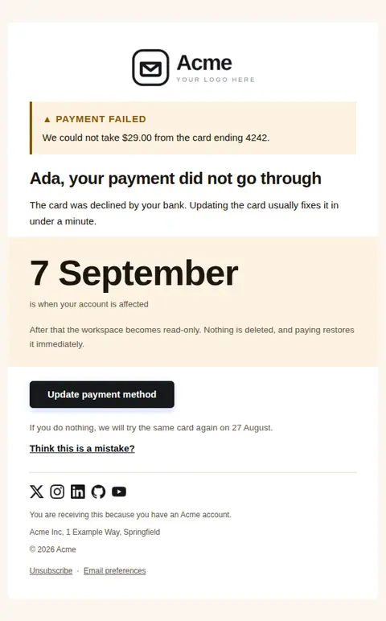
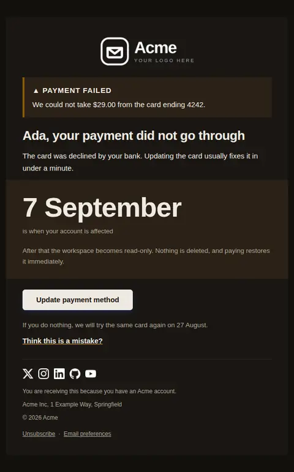

# Payment failed — free Laravel email template

A charge did not go through: what failed, what happens next, and the deadline before service is affected.

A free, responsive, dark-mode billing email template for Laravel and PHP, MIT licensed and ready to send. Part of [Mailyte Email Templates](../../README.md), the largest open-source catalog of designed transactional email for Laravel -- part of Mailyte, a product of [Techies Africa](https://techies.africa).

**`payment-failed`** · **billing** · **transactional** · **urgent**

**Subject** `We couldn't take your payment for {{ product.name }}`  
**Preheader** Your account keeps working until {{ grace_ends_at }}. Updating the card takes a minute.

```bash
php artisan mailyte:list payment-failed
```

```php
Mailyte::template('payment-failed')->with([...])->send($user);
```

## Every layout, light and dark

Each shot is the real render at 600px, captured from the preview gallery.

| Layout | Light | Dark |
|---|---|---|
| **plain** | <a href="../previews/payment-failed/plain-light.webp"></a> | <a href="../previews/payment-failed/plain-dark.webp"></a> |
| **minimal** | <a href="../previews/payment-failed/minimal-light.webp"></a> | <a href="../previews/payment-failed/minimal-dark.webp"></a> |
| **branded** | <a href="../previews/payment-failed/branded-light.webp"></a> | <a href="../previews/payment-failed/branded-dark.webp"></a> |

## Data it expects

| Variable | Type | Required | What it is |
|---|---|---|---|
| `action_url` | url | yes | Where to update the payment method. |
| `amount` | money | yes | The amount that failed. |
| `grace_ends_at` | date | yes | When service is actually affected. This is the fact the email exists to communicate. |
| `button_label` | string |  | Primary button label. |
| `card_last4` | string |  | Last four digits of the card that failed, so they know which one to fix. |
| `consequence` | text |  | What happens at that deadline, stated plainly. |
| `failure_reason` | string |  | What the processor said, translated into something a person can act on. "Insufficient funds" is useful; "do_not_honor" is not. |
| `help_url` | url |  | Optional link for people whose card is fine and who think this is a mistake. |
| `retry_at` | date |  | When the charge will be attempted again, if it will be. |
| `user.first_name` | string |  | Recipient's first name. |

## More billing email templates

[Card expiring soon](card-expiring.md) · [Invoice](invoice.md) · [Payment receipt](receipt.md) · [Refund issued](refund-issued.md) · [Plan activated](subscription-activated.md) · [Subscription cancelled](subscription-cancelled.md) · [Subscription renewing](subscription-renewing.md) · [Usage limit approaching](usage-limit-warning.md)

## Author

[Confidence Ugolo](https://www.linkedin.com/in/confidence-ugolo) · [Joel Omojefe](https://www.linkedin.com/in/joel-omojefe)

Part of Mailyte, a product of [Techies Africa](https://techies.africa). MIT licensed.

---

[← All 50 templates](../gallery.md) · [Package README](../../README.md) · [Sending](../sending.md) · [Theming](../theming.md) · [Deliverability](../deliverability.md)
