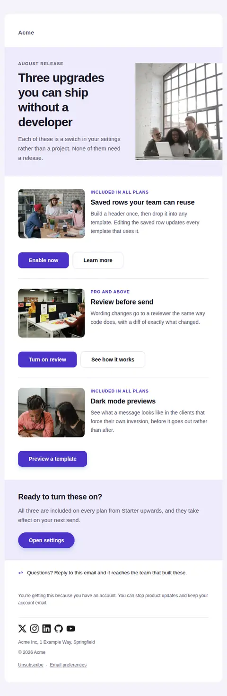
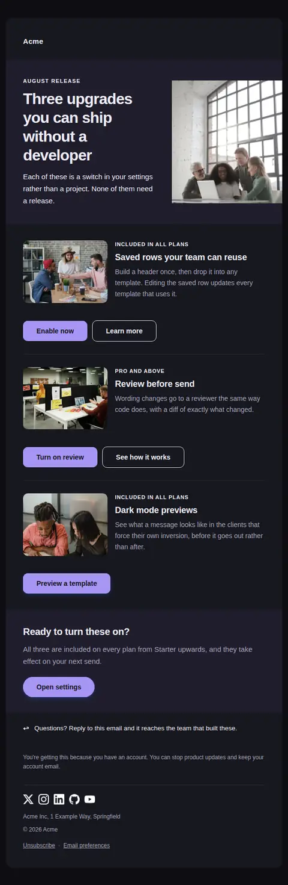
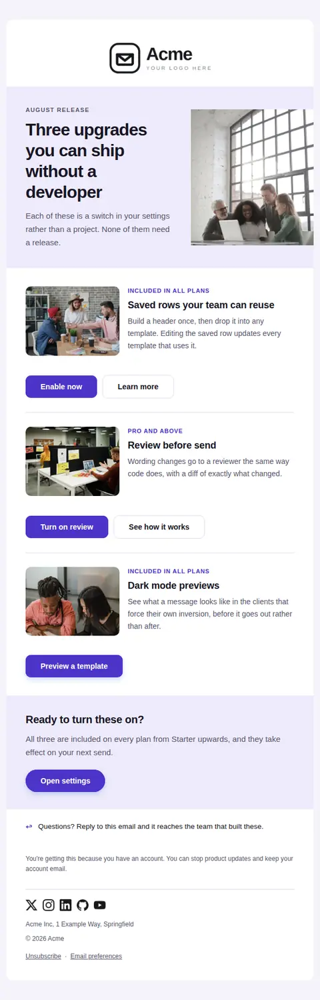
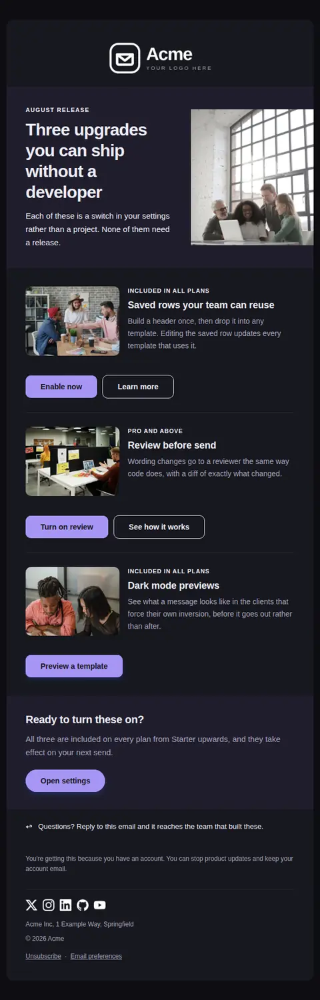
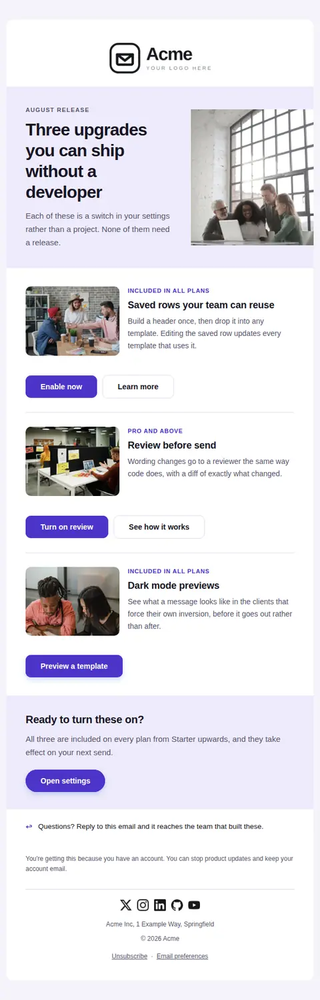
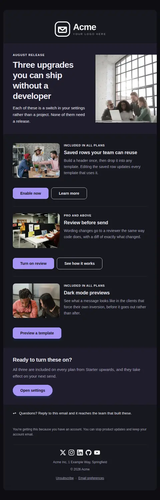

# Product tips and updates — free Laravel email template

Announces two or three things worth turning on, each with what it does, who gets it, and the one action that enables it.

A free, responsive, dark-mode marketing email template for Laravel and PHP, MIT licensed and ready to send. Part of [Mailyte Email Templates](../../README.md), the largest open-source catalog of designed transactional email for Laravel -- part of Mailyte, a product of [Techies Africa](https://techies.africa).

**`product-tips`** · **marketing** · **marketing** · **friendly**

**Subject** `{{ headline }}`  
**Preheader** Three things you can switch on today, none of which need a developer.

```bash
php artisan mailyte:list product-tips
```

```php
Mailyte::template('product-tips')->with([...])->send($user);
```

## Every layout, light and dark

Each shot is the real render at 600px, captured from the preview gallery.

| Layout | Light | Dark |
|---|---|---|
| **minimal** | <a href="../previews/product-tips/minimal-light.webp"></a> | <a href="../previews/product-tips/minimal-dark.webp"></a> |
| **branded** | <a href="../previews/product-tips/branded-light.webp"></a> | <a href="../previews/product-tips/branded-dark.webp"></a> |
| **editorial** | <a href="../previews/product-tips/editorial-light.webp"></a> | <a href="../previews/product-tips/editorial-dark.webp"></a> |

## Data it expects

| Variable | Type | Required | What it is |
|---|---|---|---|
| `action_url` | url | yes | Where the closing button goes. |
| `headline` | string | yes | What the whole email is about, in one claim. Also the subject line by default. |
| `button_label` | string |  | Closing button label. |
| `closing_heading` | string |  | Heading for the closing band. |
| `closing_text` | text |  | Closing paragraph, restating what is included. |
| `eyebrow` | string |  | Small label above the headline, naming the release or the month. |
| `features` | array |  | One entry per thing being announced: `image`, `chip` (who gets it), `title`, `text`, `action_label`, `action_url`, and optional `learn_label` / `learn_url` for the secondary action. |
| `hero_image` | url |  | Image for the opening split. A screenshot of the product beats a photograph of people; use a photograph only if you have nothing real to show. |
| `intro` | text |  | One paragraph setting up the list. Say what they have in common. |
| `reply_note` | text |  | The reply invitation. Sending from a monitored address and saying so measurably raises replies. |
| `unsubscribe_note` | text |  | How to stop these without leaving the product. Required in spirit on anything classed as marketing. |

## Credits

- Cheerful diverse colleagues working on a laptop during a startup project by Olly via Pexels — [source](https://www.pexels.com/photo/cheerful-diverse-colleagues-of-different-ages-working-on-laptop-during-startup-project-3865639/) (Pexels License, sample data only)
- Office workers discussing at a table with a laptop and colour swatches by Silverkblack via Pexels — [source](https://www.pexels.com/photo/office-workers-discussing-at-a-table-with-a-laptop-and-color-swatches-23496662/) (Pexels License, sample data only)
- Man having an online meeting in an office by Jack Sparrow via Pexels — [source](https://www.pexels.com/photo/man-having-online-meeting-in-office-5918384/) (Pexels License, sample data only)
- People brainstorming in an office by RDNE via Pexels — [source](https://www.pexels.com/photo/people-brainstorming-in-office-10375961/) (Pexels License, sample data only)

## More marketing email templates

[Promotional offer](promotion.md) · [What changed while you were away](re-engagement.md)

## Author

[Confidence Ugolo](https://www.linkedin.com/in/confidence-ugolo) · [Joel Omojefe](https://www.linkedin.com/in/joel-omojefe)

Part of Mailyte, a product of [Techies Africa](https://techies.africa). MIT licensed.

---

[← All 50 templates](../gallery.md) · [Package README](../../README.md) · [Sending](../sending.md) · [Theming](../theming.md) · [Deliverability](../deliverability.md)
