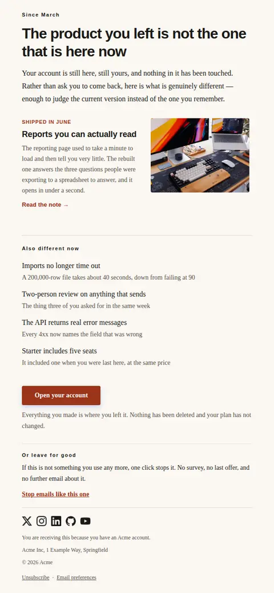
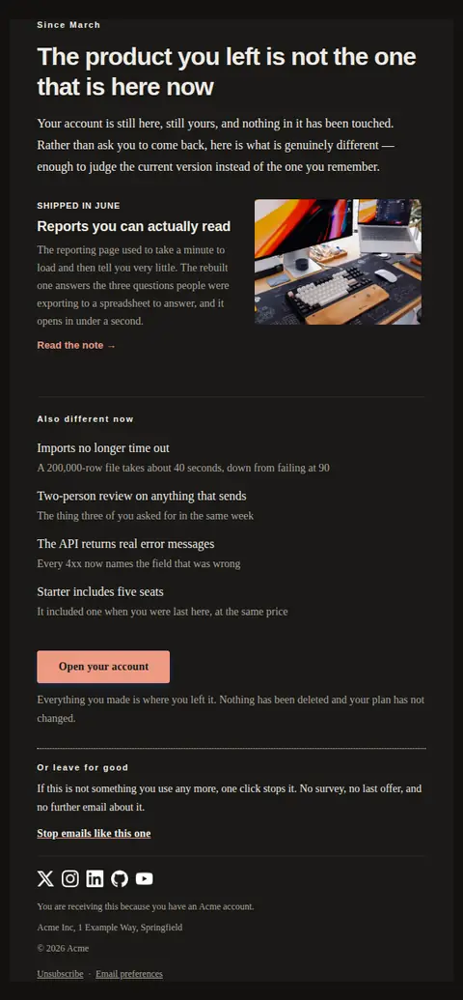
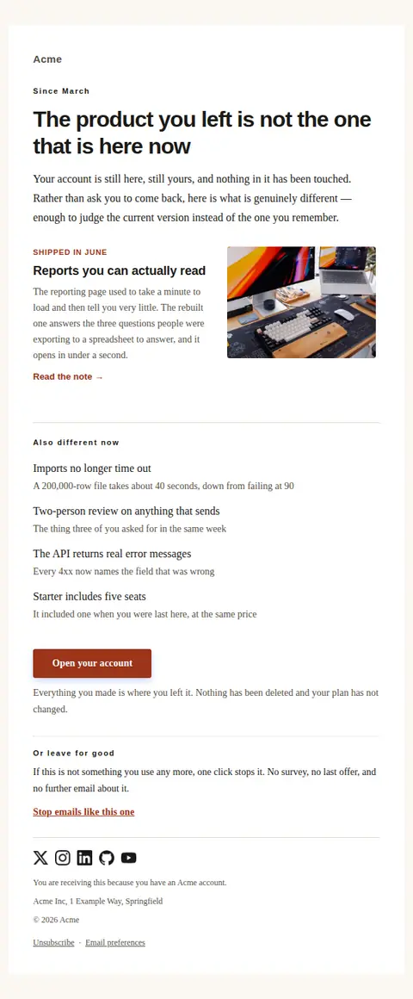
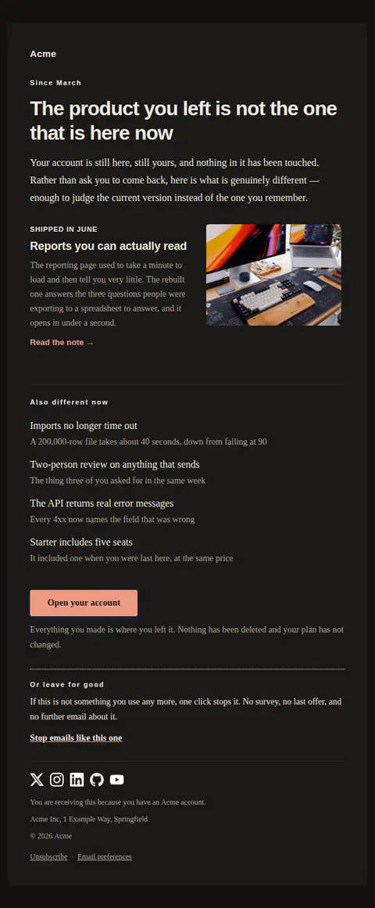
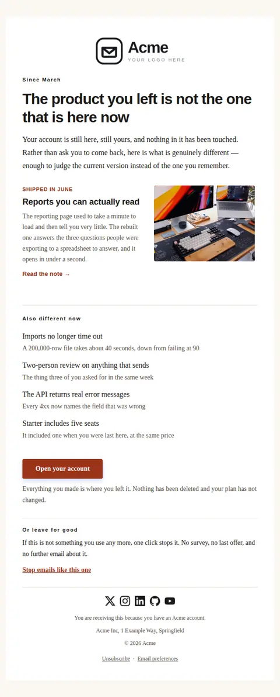
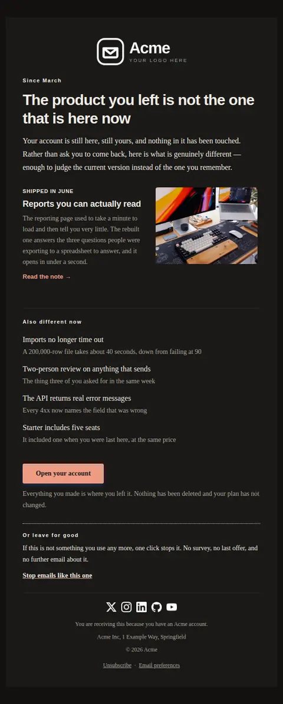

# What changed while you were away — free Laravel email template

Sent to a dormant account, leading with what the product has actually changed since their last visit and offering an unsubscribe as prominently as the invitation back.

A free, responsive, dark-mode marketing email template for Laravel and PHP, MIT licensed and ready to send. Part of [Mailyte Email Templates](../../README.md), the largest open-source catalog of designed transactional email for Laravel -- part of Mailyte, a product of [Techies Africa](https://techies.africa).

**`re-engagement`** · **marketing** · **marketing**

**Subject** `What changed in {{ product.name }} since {{ away_since }}`  
**Preheader** A short list of what is actually different, and an easy way out if it is not for you.

```bash
php artisan mailyte:list re-engagement
```

```php
Mailyte::template('re-engagement')->with([...])->send($user);
```

## Every layout, light and dark

Each shot is the real render at 600px, captured from the preview gallery.

| Layout | Light | Dark |
|---|---|---|
| **plain** | <a href="../previews/re-engagement/plain-light.webp"></a> | <a href="../previews/re-engagement/plain-dark.webp"></a> |
| **minimal** | <a href="../previews/re-engagement/minimal-light.webp"></a> | <a href="../previews/re-engagement/minimal-dark.webp"></a> |
| **branded** | <a href="../previews/re-engagement/branded-light.webp"></a> | <a href="../previews/re-engagement/branded-dark.webp"></a> |
| **editorial** | <a href="../previews/re-engagement/editorial-light.webp"></a> | <a href="../previews/re-engagement/editorial-dark.webp"></a> |

## Data it expects

| Variable | Type | Required | What it is |
|---|---|---|---|
| `action_url` | url | yes | The single way back in. One action only: a dormant reader given three links picks none of them. |
| `away_since` | string | yes | When they were last active, written as a period rather than a timestamp — "March" reads as context, "14 March 2026, 09:12 UTC" reads as surveillance. It opens the email and appears in the subject. |
| `action_note` | text |  | The small print under the action — what state their account is actually in. Someone who has been away for a year is mostly wondering whether their data survived. |
| `button_label` | string |  | Label for the way back. Describe the destination rather than issuing an instruction. |
| `changes` | array |  | The rest of what changed, as `text` with an optional `detail`. Keep them concrete and countable; four true small changes are more persuasive than one vague large one. An empty list is a legitimate state — send the lead change alone rather than padding it. |
| `headline` | string |  | The headline, which must be about the product and never about the reader's absence. "We miss you" asks them to manage your feelings; a list of changes gives them something to evaluate. |
| `highlight_eyebrow` | string |  | A short label over the lead change: the month it shipped, or the area it belongs to. |
| `highlight_image` | url |  | Picture for the lead change. Sample data only — a shipped default must never hotlink someone else's file, and the layout is designed to read correctly with images blocked. |
| `highlight_image_alt` | string |  | What the picture shows, for the many readers who will never see it. Describe the scene, not the marketing claim. |
| `highlight_text` | text |  | Two sentences on what the lead change does for them. Describe the difference, not the feature name — a returning user has no idea what your release notes call it. |
| `highlight_title` | string |  | The one change most likely to matter to a lapsed user. Everything else is a list; this one gets the picture and the space. Leave it empty and the section disappears cleanly. |
| `highlight_url` | url |  | Where the lead change is explained in full, usually a changelog entry rather than a landing page. |
| `intro` | text |  | One paragraph setting up the list. Its job is to be free of guilt, urgency and flattery, so that the changes below are read as information rather than as a pitch. |
| `leaving_note` | text |  | The honest exit. Placed under its own heading rather than hidden in the footer, because a one-click unsubscribe costs a name and a buried one costs a spam complaint — and because a message that makes leaving easy is the only kind entitled to argue for staying. |

## Credits

- A desk with a monitor showing a dashboard by Huy Phan via Unsplash — [source](https://unsplash.com/photos/a-modern-desk-setup-with-a-keyboard-and-monitor-Wqfpx-QnT-g) (Unsplash License, sample data only)

## More marketing email templates

[Product tips and updates](product-tips.md) · [Promotional offer](promotion.md)

## Author

[Confidence Ugolo](https://www.linkedin.com/in/confidence-ugolo) · [Joel Omojefe](https://www.linkedin.com/in/joel-omojefe)

Part of Mailyte, a product of [Techies Africa](https://techies.africa). MIT licensed.

---

[← All 50 templates](../gallery.md) · [Package README](../../README.md) · [Sending](../sending.md) · [Theming](../theming.md) · [Deliverability](../deliverability.md)
