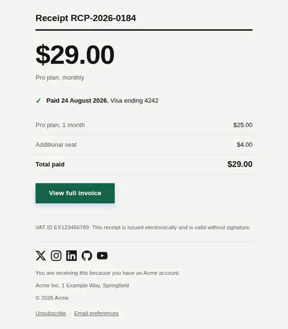
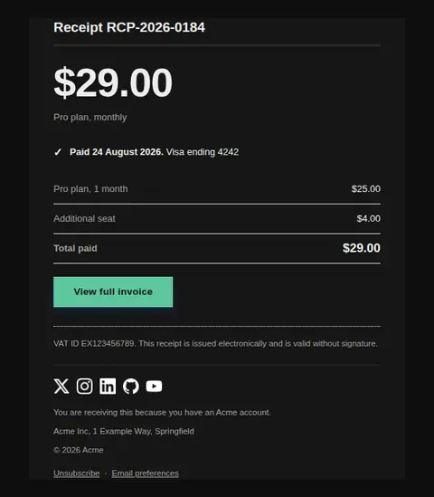
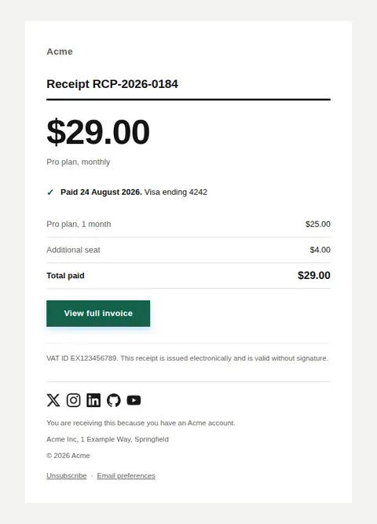
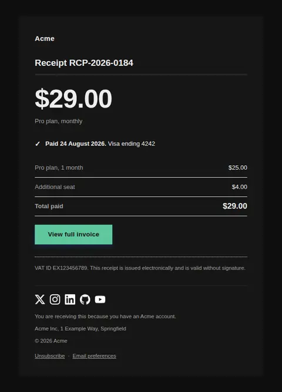

# Payment receipt — free Laravel email template

Confirms a payment already taken: what was charged, to which card, and where to find the invoice.

A free, responsive, dark-mode billing email template for Laravel and PHP, MIT licensed and ready to send. Part of [Mailyte Email Templates](../../README.md), the largest open-source catalog of designed transactional email for Laravel -- part of Mailyte, a product of [Techies Africa](https://techies.africa).

**`receipt`** · **billing** · **transactional**

**Subject** `Receipt for {{ amount }} — {{ product.name }}`  
**Preheader** Paid on {{ paid_at }}. Keep this for your records.

```bash
php artisan mailyte:list receipt
```

```php
Mailyte::template('receipt')->with([...])->send($user);
```

## Every layout, light and dark

Each shot is the real render at 600px, captured from the preview gallery.

| Layout | Light | Dark |
|---|---|---|
| **plain** | <a href="../previews/receipt/plain-light.webp"></a> | <a href="../previews/receipt/plain-dark.webp"></a> |
| **minimal** | <a href="../previews/receipt/minimal-light.webp"></a> | <a href="../previews/receipt/minimal-dark.webp"></a> |
| **branded** | <a href="../previews/receipt/branded-light.webp"></a> | <a href="../previews/receipt/branded-dark.webp"></a> |

## Data it expects

| Variable | Type | Required | What it is |
|---|---|---|---|
| `amount` | money | yes | What was charged, formatted at the call site — decimal separators are not universal. Set at display size as the one figure that matters. |
| `paid_at` | datetime | yes | When the payment went through. |
| `button_label` | string |  | Label for the invoice link. |
| `card_brand` | string |  | Card brand, for recognition. |
| `card_last4` | string |  | Last four digits. Never more than four — a receipt is not a place to restate a card number. |
| `description` | string |  | What the charge was for, in the words the customer would use. |
| `footer_legal` | text |  | Tax or company registration line, which varies by jurisdiction. |
| `invoice_url` | url |  | Where the full invoice or PDF lives. |
| `line_items` | array |  | Optional breakdown as `label`/`value` pairs. A single-line charge needs none. |
| `receipt_number` | string |  | Reference the customer can quote to support. |

## More billing email templates

[Card expiring soon](card-expiring.md) · [Invoice](invoice.md) · [Payment failed](payment-failed.md) · [Refund issued](refund-issued.md) · [Plan activated](subscription-activated.md) · [Subscription cancelled](subscription-cancelled.md) · [Subscription renewing](subscription-renewing.md) · [Usage limit approaching](usage-limit-warning.md)

## Author

[Confidence Ugolo](https://www.linkedin.com/in/confidence-ugolo) · [Joel Omojefe](https://www.linkedin.com/in/joel-omojefe)

Part of Mailyte, a product of [Techies Africa](https://techies.africa). MIT licensed.

---

[← All 50 templates](../gallery.md) · [Package README](../../README.md) · [Sending](../sending.md) · [Theming](../theming.md) · [Deliverability](../deliverability.md)
