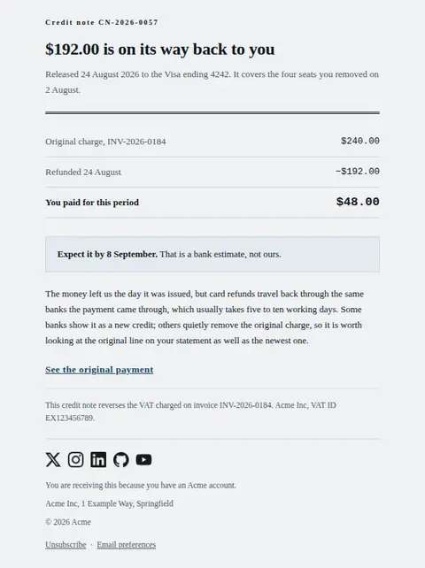
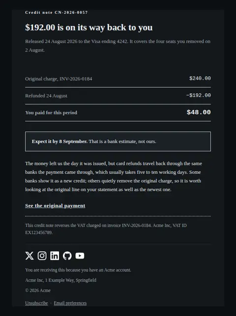
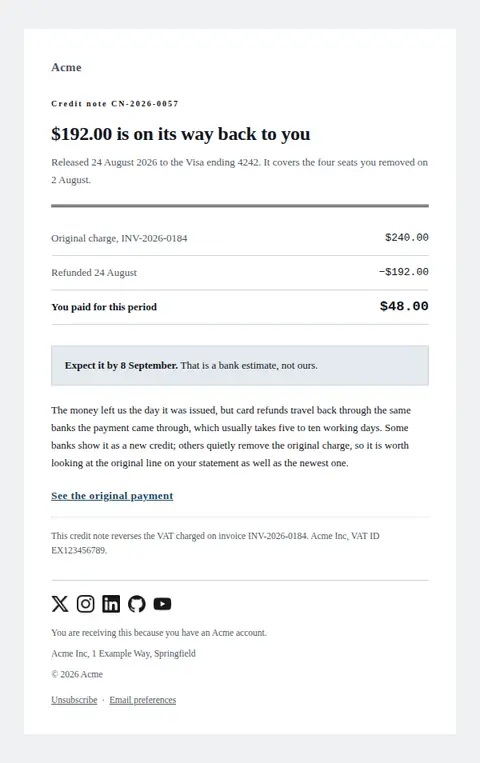
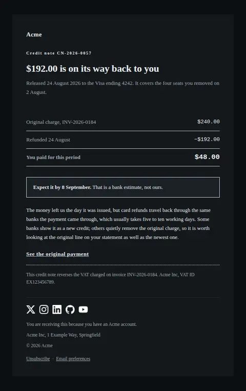

# Refund issued — free Laravel email template

Confirms money going back: how much, where it is going, and when it will realistically appear on the statement.

A free, responsive, dark-mode billing email template for Laravel and PHP, MIT licensed and ready to send. Part of [Mailyte Email Templates](../../README.md), the largest open-source catalog of designed transactional email for Laravel -- part of Mailyte, a product of [Techies Africa](https://techies.africa).

**`refund-issued`** · **billing** · **transactional**

**Subject** `Refund of {{ amount }} from {{ company.name }}`  
**Preheader** Released on {{ issued_on }}. Your bank decides the day it lands, not us.

```bash
php artisan mailyte:list refund-issued
```

```php
Mailyte::template('refund-issued')->with([...])->send($user);
```

## Every layout, light and dark

Each shot is the real render at 600px, captured from the preview gallery.

| Layout | Light | Dark |
|---|---|---|
| **plain** | <a href="../previews/refund-issued/plain-light.webp"></a> | <a href="../previews/refund-issued/plain-dark.webp"></a> |
| **minimal** | <a href="../previews/refund-issued/minimal-light.webp"></a> | <a href="../previews/refund-issued/minimal-dark.webp"></a> |
| **branded** | <a href="../previews/refund-issued/branded-light.webp"></a> | <a href="../previews/refund-issued/branded-dark.webp"></a> |

## Data it expects

| Variable | Type | Required | What it is |
|---|---|---|---|
| `amount` | money | yes | What is being returned, formatted at the call site — decimal separators and currency placement differ by locale, and the markup must never guess a symbol. This is the figure the heading is built from. |
| `arrives_by` | string | yes | The realistic outside date for the money appearing. Give the pessimistic end of the range: a customer who gets it early is pleased, and one who was promised Tuesday is on the phone on Wednesday. |
| `destination` | string | yes | Where the money is going, in the words a statement would use: the card brand and last four, or the account it was wired to. Never more of the number than the last four. |
| `issued_on` | date | yes | The day the refund left us. Distinct from the day it arrives, and the pair of dates is the whole reason this email avoids a support ticket. |
| `reversal_rows` | array | yes | The reversal as `label`/`value` pairs, right-aligned on tabular numerals: what was charged, what is coming back as a negative figure, and what the customer is left having paid. Format the figures and the minus sign at the call site; put the net line last, because the last row is emphasised. |
| `delay_note` | text |  | The honest explanation of why a refund is not instant, and what it looks like when it lands. Most refund complaints are really this paragraph being missing. |
| `footer_legal` | text |  | Tax treatment of the credit, which varies by jurisdiction and is why it is a variable rather than a fixed line. |
| `reason` | string |  | One clause on why the refund happened, when the customer might not know. A refund with no stated cause reads like a mistake, and a mistake gets a phone call. |
| `receipt_url` | url |  | The original payment or invoice this reverses, so the two documents can be read together. |
| `reference` | string |  | Credit-note reference, so the customer and their accountant can match this against the original invoice. Omit it and the document simply calls itself a credit note. |

## More billing email templates

[Card expiring soon](card-expiring.md) · [Invoice](invoice.md) · [Payment failed](payment-failed.md) · [Payment receipt](receipt.md) · [Plan activated](subscription-activated.md) · [Subscription cancelled](subscription-cancelled.md) · [Subscription renewing](subscription-renewing.md) · [Usage limit approaching](usage-limit-warning.md)

## Author

[Confidence Ugolo](https://www.linkedin.com/in/confidence-ugolo) · [Joel Omojefe](https://www.linkedin.com/in/joel-omojefe)

Part of Mailyte, a product of [Techies Africa](https://techies.africa). MIT licensed.

---

[← All 50 templates](../gallery.md) · [Package README](../../README.md) · [Sending](../sending.md) · [Theming](../theming.md) · [Deliverability](../deliverability.md)
