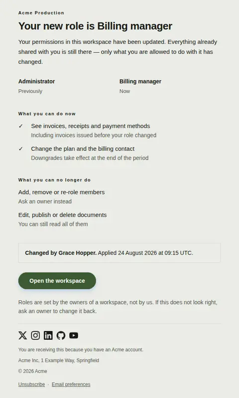
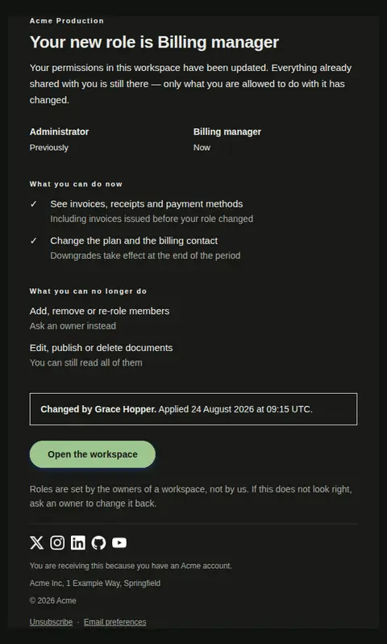
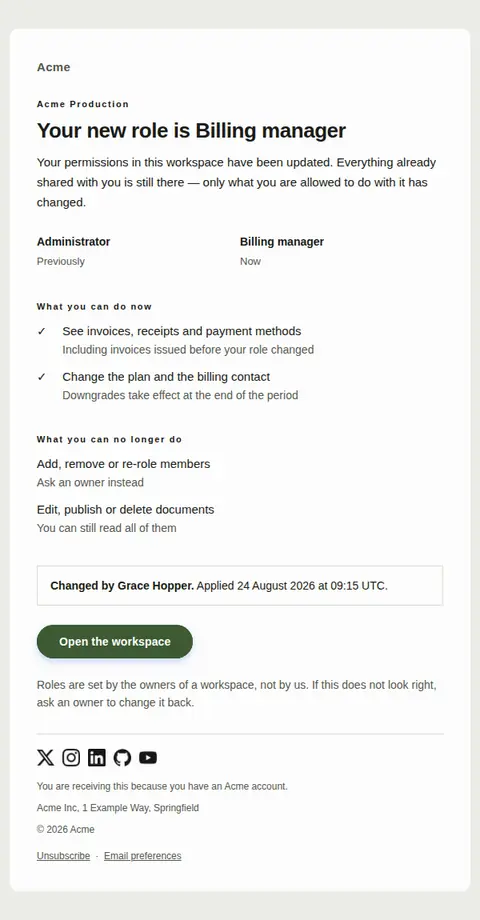
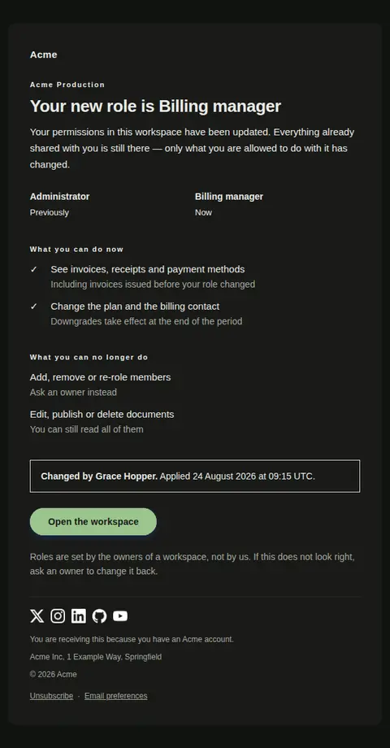

# Role changed in a workspace — free Laravel email template

Sent when someone's permissions in a shared workspace are changed, showing the old and new role side by side and spelling out what the person can and can no longer do.

A free, responsive, dark-mode collaboration email template for Laravel and PHP, MIT licensed and ready to send. Part of [Mailyte Email Templates](../../README.md), the largest open-source catalog of designed transactional email for Laravel -- part of Mailyte, a product of [Techies Africa](https://techies.africa).

**`role-changed`** · **collaboration** · **notification**

**Subject** `You're now {{ new_role }} in {{ workspace_name }}`  
**Preheader** What the new role lets you do, and what it no longer does.

```bash
php artisan mailyte:list role-changed
```

```php
Mailyte::template('role-changed')->with([...])->send($user);
```

## Every layout, light and dark

Each shot is the real render at 600px, captured from the preview gallery.

| Layout | Light | Dark |
|---|---|---|
| **plain** | <a href="../previews/role-changed/plain-light.webp"></a> | <a href="../previews/role-changed/plain-dark.webp"></a> |
| **minimal** | <a href="../previews/role-changed/minimal-light.webp"></a> | <a href="../previews/role-changed/minimal-dark.webp"></a> |
| **branded** | <a href="../previews/role-changed/branded-light.webp"></a> | <a href="../previews/role-changed/branded-dark.webp"></a> |

## Data it expects

| Variable | Type | Required | What it is |
|---|---|---|---|
| `new_role` | string | yes | The role now in force, exactly as it is named in the product. Inventing a friendlier word here means the reader cannot find it in the interface. |
| `previous_role` | string | yes | The role held until now. Present so the reader can tell whether this was a promotion or a restriction without having to remember what they had. |
| `workspace_name` | string | yes | Which workspace this concerns, used as the eyebrow. Someone who belongs to eleven of them needs this before anything else on the page. |
| `workspace_url` | url | yes | Where the workspace lives, so the reader can confirm what they see against what this email claims. |
| `body` | text |  | One sentence on what changed and where. Do not congratulate: a role change is as often a restriction as a promotion, and the same email is sent either way. |
| `button_label` | string |  | Label on the link into the workspace. Send them to the thing itself, not to a settings page about it. |
| `changed_at` | datetime |  | When the change took effect. Optional: some directories sync roles in bulk and cannot say honestly when a given one moved. |
| `changed_at_prefix` | string |  | The words before the timestamp in the attribution bar. |
| `changed_by` | string |  | Who made the change. Attribution turns an anonymous permission drop into something the reader can take up with a colleague instead of with support. |
| `changed_by_prefix` | string |  | The words before the name in the attribution bar, separated so a translation can reorder them. |
| `closing_note` | text |  | The route to a correction. Roles are set by people, and people make mistakes, so say who can undo this rather than making the reader guess. |
| `gained` | array |  | Abilities the new role adds, as `text` and optional `detail` pairs. Write them as actions the person would take, not as permission constants from your authorisation layer. |
| `gained_label` | string |  | Small heading over the list of new abilities. |
| `heading_lead` | string |  | The words before the role in the headline. Kept separate so the role itself can be any noun without the sentence needing an article that agrees with it. |
| `lost` | array |  | Abilities the new role removes, in the same shape. This is the list people actually need and the one most products leave out — an empty array simply hides the section. |
| `lost_label` | string |  | Small heading over the list of removed abilities. |
| `new_label` | string |  | Caption printed under the new role. |
| `previous_label` | string |  | Caption printed under the old role. It sits a step smaller and muted beneath the role itself, so keep it to one word — the two columns stack at 320px. |

## More collaboration email templates

[Invitation accepted](invite-accepted.md) · [Seat limit reached](seat-limit-reached.md) · [Team invitation](team-invitation.md)

## Author

[Confidence Ugolo](https://www.linkedin.com/in/confidence-ugolo) · [Joel Omojefe](https://www.linkedin.com/in/joel-omojefe)

Part of Mailyte, a product of [Techies Africa](https://techies.africa). MIT licensed.

---

[← All 50 templates](../gallery.md) · [Package README](../../README.md) · [Sending](../sending.md) · [Theming](../theming.md) · [Deliverability](../deliverability.md)
