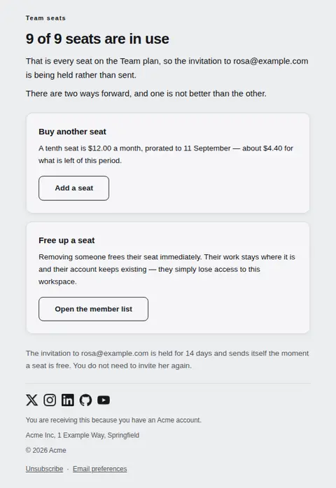
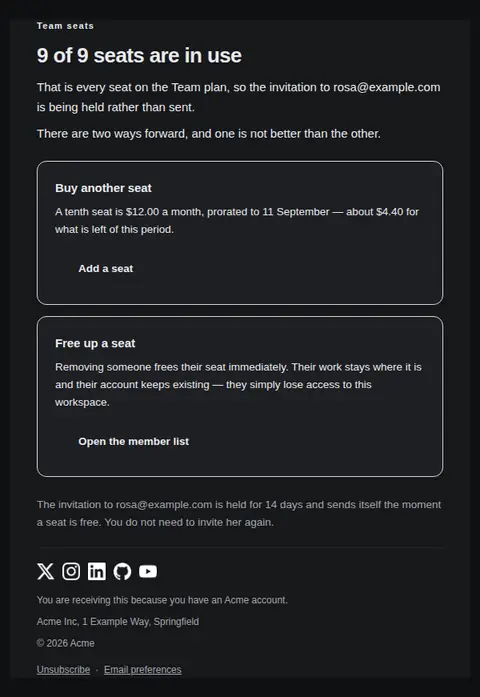
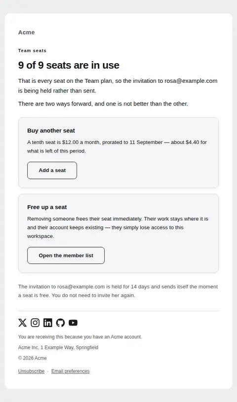
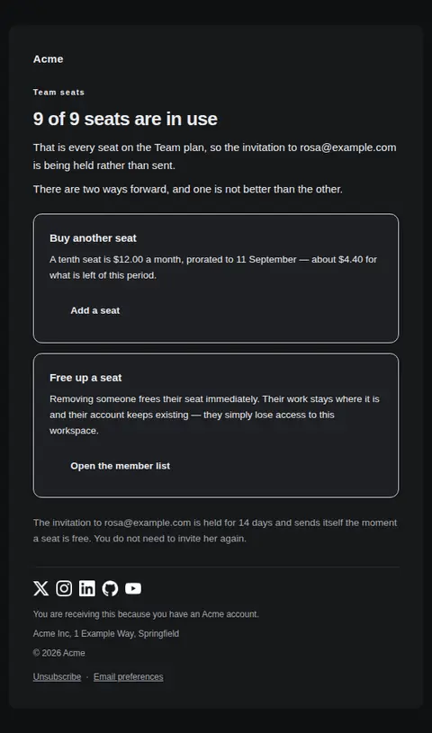
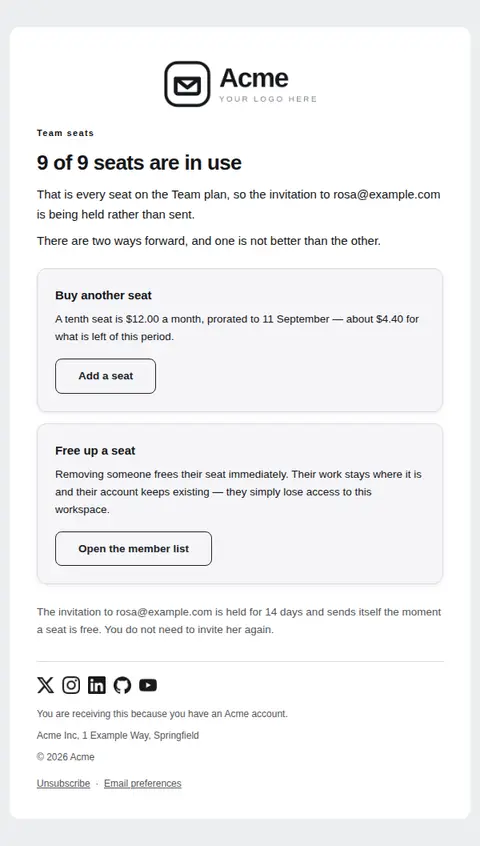
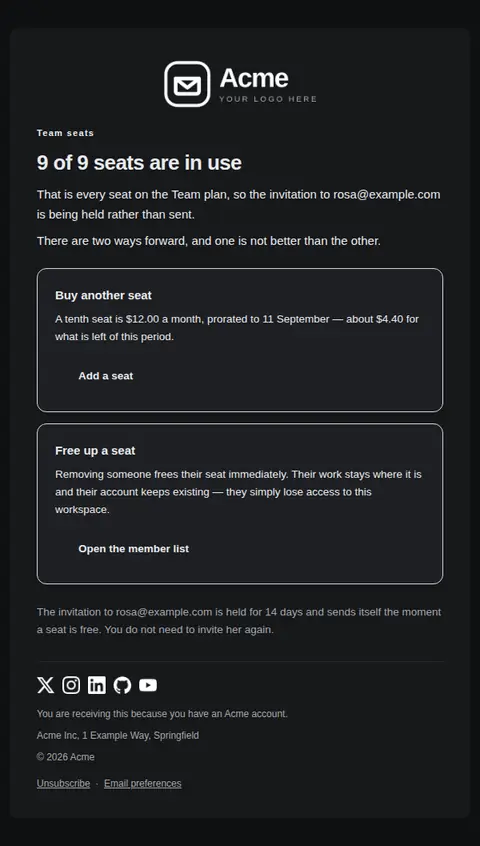

# Seat limit reached — free Laravel email template

Sent when someone tries to add a teammate and every seat on the plan is taken, offering the two ways out at equal weight.

A free, responsive, dark-mode collaboration email template for Laravel and PHP, MIT licensed and ready to send. Part of [Mailyte Email Templates](../../README.md), the largest open-source catalog of designed transactional email for Laravel -- part of Mailyte, a product of [Techies Africa](https://techies.africa).

**`seat-limit-reached`** · **collaboration** · **notification**

**Subject** `Your {{ product.name }} team is out of seats`  
**Preheader** Buy another seat or free one up — both take about a minute.

```bash
php artisan mailyte:list seat-limit-reached
```

```php
Mailyte::template('seat-limit-reached')->with([...])->send($user);
```

## Every layout, light and dark

Each shot is the real render at 600px, captured from the preview gallery.

| Layout | Light | Dark |
|---|---|---|
| **plain** | <a href="../previews/seat-limit-reached/plain-light.webp"></a> | <a href="../previews/seat-limit-reached/plain-dark.webp"></a> |
| **minimal** | <a href="../previews/seat-limit-reached/minimal-light.webp"></a> | <a href="../previews/seat-limit-reached/minimal-dark.webp"></a> |
| **branded** | <a href="../previews/seat-limit-reached/branded-light.webp"></a> | <a href="../previews/seat-limit-reached/branded-dark.webp"></a> |

## Data it expects

| Variable | Type | Required | What it is |
|---|---|---|---|
| `manage_url` | url | yes | The member list, which is the honest counterpart to the upgrade link and is always available even when buying seats is not. |
| `plan_name` | string | yes | The plan the limit belongs to, so an admin with several workspaces knows which one filled up. |
| `seat_total` | string | yes | Seats the plan includes. Stating both halves of the fraction stops the reader wondering whether they are one seat short or ten. |
| `seats_used` | string | yes | Seats currently filled, as a string so "9" and "unlimited pooled" can both be rendered. It leads the headline because the count is the entire fact. |
| `add_label` | string |  | Label for the buy action. Name the unit, not the upgrade. |
| `add_note` | text |  | What buying a seat costs and when it is charged, in plain money terms. Prorating is where trust is lost, so say how the first partial period is billed. |
| `add_url` | url |  | Where a seat is bought. Leave it empty on plans where seats are fixed for the term — the panel then explains that instead of offering a button that leads to a dead end. |
| `invited_email` | string |  | The person who could not be added. Naming them turns an abstract limit into the specific thing the admin was trying to do, and confirms the invitation was not lost. Leave empty when the limit was hit by an API call or a bulk import. |
| `manage_label` | string |  | Label for the member-list action. |
| `manage_note` | text |  | What removing someone actually does to their work. People hesitate here because they assume deletion follows, so answer that before they ask. |
| `options_intro` | text |  | The line that frames the two panels. It exists to say out loud that neither option is the recommended one — removing a colleague is a legitimate answer to a seat limit, and an email that pretends otherwise is selling. |
| `pending_note` | text |  | What becomes of the held invitation and how long it waits. Without it the admin has to guess whether to send the invite again, and usually sends three. |

## More collaboration email templates

[Invitation accepted](invite-accepted.md) · [Role changed in a workspace](role-changed.md) · [Team invitation](team-invitation.md)

## Author

[Confidence Ugolo](https://www.linkedin.com/in/confidence-ugolo) · [Joel Omojefe](https://www.linkedin.com/in/joel-omojefe)

Part of Mailyte, a product of [Techies Africa](https://techies.africa). MIT licensed.

---

[← All 50 templates](../gallery.md) · [Package README](../../README.md) · [Sending](../sending.md) · [Theming](../theming.md) · [Deliverability](../deliverability.md)
