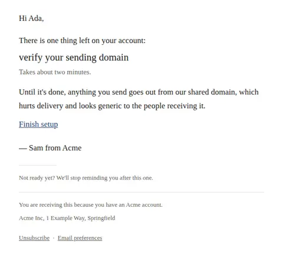
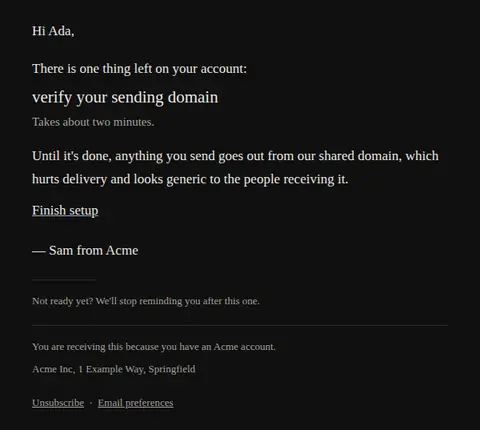
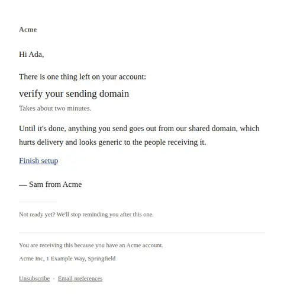
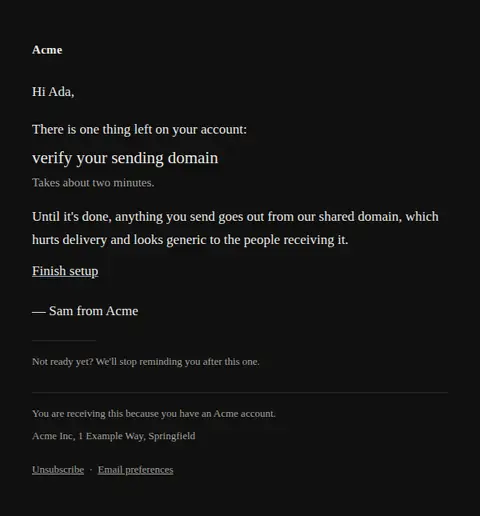

# Setup incomplete — free Laravel email template

A single nudge for an account that signed up and stopped halfway, naming the one step that is actually blocking them.

A free, responsive, dark-mode onboarding email template for Laravel and PHP, MIT licensed and ready to send. Part of [Mailyte Email Templates](../../README.md), the largest open-source catalog of designed transactional email for Laravel -- part of Mailyte, a product of [Techies Africa](https://techies.africa).

**`setup-incomplete`** · **onboarding** · **notification** · **friendly**

**Subject** `One step left: {{ blocking_step }}`  
**Preheader** It's the only thing standing between your account and a first send.

```bash
php artisan mailyte:list setup-incomplete
```

```php
Mailyte::template('setup-incomplete')->with([...])->send($user);
```

## Every layout, light and dark

Each shot is the real render at 600px, captured from the preview gallery.

| Layout | Light | Dark |
|---|---|---|
| **plain** | <a href="../previews/setup-incomplete/plain-light.webp"></a> | <a href="../previews/setup-incomplete/plain-dark.webp"></a> |
| **minimal** | <a href="../previews/setup-incomplete/minimal-light.webp"></a> | <a href="../previews/setup-incomplete/minimal-dark.webp"></a> |

## Data it expects

| Variable | Type | Required | What it is |
|---|---|---|---|
| `action_url` | url | yes | Direct link to the blocking step, not to a generic dashboard. |
| `blocking_step` | string | yes | The single step that is blocking them. One, not a list — a nudge that names three things gets ignored. |
| `button_label` | string |  | Call to action, rendered as a plain underlined link in keeping with the letter format. |
| `opt_out_text` | text |  | Way out of the nudge sequence. Offering it is what keeps it a nudge. |
| `sender_name` | string |  | Who the note is from. A real name outperforms a team name here, which is the entire point of this design. |
| `time_estimate` | string |  | Honest time estimate, set beside the step. Overstating it is better than understating it. |
| `user.first_name` | string |  | Recipient's first name. |
| `why_it_matters` | text |  | What that step unlocks. Motivation beats instruction. |

## More onboarding email templates

[Account activated](account-activated.md) · [First milestone reached](first-milestone.md) · [Getting started checklist](getting-started.md) · [Trial ending soon](trial-ending.md) · [Trial expired](trial-expired.md) · [Trial started](trial-started.md) · [Welcome](welcome.md)

## Author

[Confidence Ugolo](https://www.linkedin.com/in/confidence-ugolo) · [Joel Omojefe](https://www.linkedin.com/in/joel-omojefe)

Part of Mailyte, a product of [Techies Africa](https://techies.africa). MIT licensed.

---

[← All 50 templates](../gallery.md) · [Package README](../../README.md) · [Sending](../sending.md) · [Theming](../theming.md) · [Deliverability](../deliverability.md)
