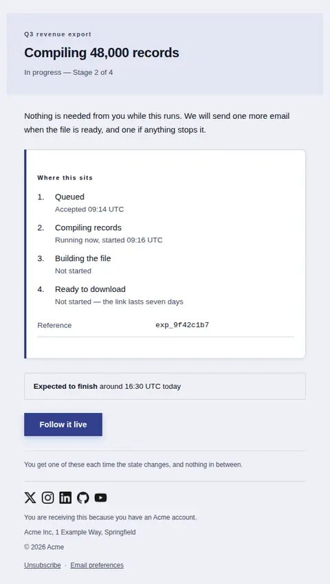
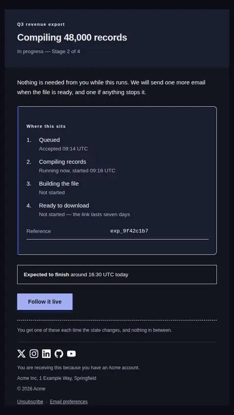
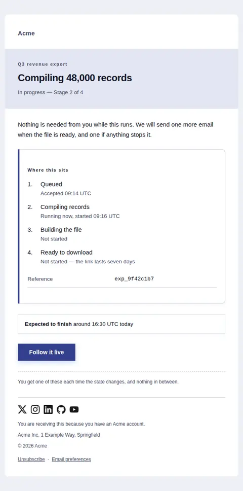
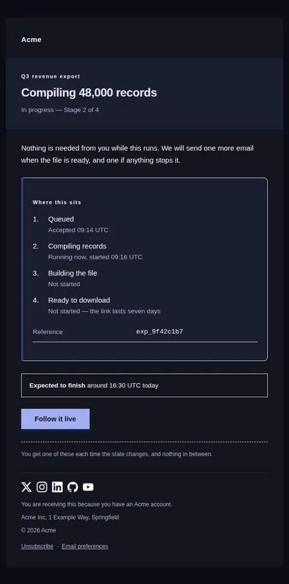
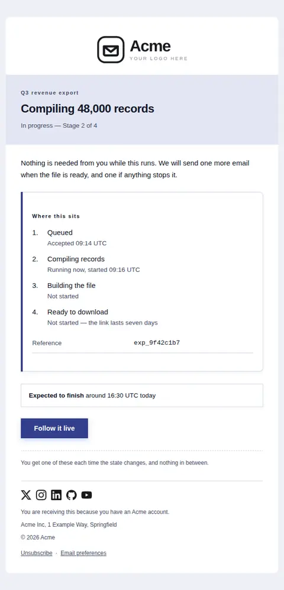
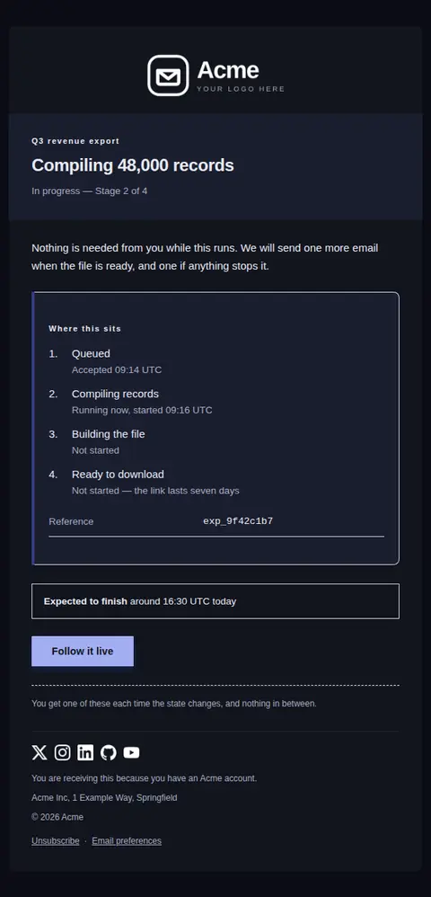

# Status update — free Laravel email template

Tells someone a long-running job, review or request has moved, which state it is in now, and where that state sits in the sequence.

A free, responsive, dark-mode system email template for Laravel and PHP, MIT licensed and ready to send. Part of [Mailyte Email Templates](../../README.md), the largest open-source catalog of designed transactional email for Laravel -- part of Mailyte, a product of [Techies Africa](https://techies.africa).

**`status-update`** · **system** · **notification**

**Subject** `{{ item_name }} — {{ state_label }}`  
**Preheader** Where this sits in the sequence, and when the next change is expected.

```bash
php artisan mailyte:list status-update
```

```php
Mailyte::template('status-update')->with([...])->send($user);
```

## Every layout, light and dark

Each shot is the real render at 600px, captured from the preview gallery.

| Layout | Light | Dark |
|---|---|---|
| **plain** | <a href="../previews/status-update/plain-light.webp"></a> | <a href="../previews/status-update/plain-dark.webp"></a> |
| **minimal** | <a href="../previews/status-update/minimal-light.webp"></a> | <a href="../previews/status-update/minimal-dark.webp"></a> |
| **branded** | <a href="../previews/status-update/branded-light.webp"></a> | <a href="../previews/status-update/branded-dark.webp"></a> |

## Data it expects

| Variable | Type | Required | What it is |
|---|---|---|---|
| `headline` | string | yes | One line saying what actually changed. Written as a statement about the work, not about the email — 'Compiling 48,000 records', not 'Your request has been updated'. |
| `item_name` | string | yes | What moved, named the way the recipient would name it rather than as an internal job id. It leads the subject line, so a queue name beats a UUID. |
| `state_label` | string | yes | The state it is in right now, in one or two words. This is the fact the recipient opened the email for, so it also carries the subject line. |
| `summary` | text | yes | A sentence or two on what this state means for the recipient — whether they need to do anything, and what happens without them. |
| `action_url` | url |  | Where the recipient can watch this themselves instead of waiting for the next email. |
| `button_label` | string |  | Label for the action. Name the destination, not the verb — 'Open the export', not 'Click here'. |
| `eta_label` | string |  | Lead-in for the expectation line, changed to suit the workflow — 'Expected to finish', 'Decision expected by'. |
| `eta_value` | string |  | When the next change is expected, stated with a timezone if it is a clock time. Leave empty rather than guessing; an absent estimate reads better than one that slips. |
| `footer_text` | text |  | The closing line. Says how often these go out, which is what stops a status email from feeling like noise. |
| `position_text` | string |  | Where the current state sits in the run, so the reader can tell a long wait from a nearly-finished one. Leave empty for workflows with no fixed number of stages. |
| `reference` | string |  | The identifier a support conversation will start from. Set in the mono face so a long id can be read aloud a character at a time. |
| `reference_label` | string |  | Label for the reference row. Say what support will ask for, e.g. 'Job reference' or 'Ticket'. |
| `stages` | array |  | The full sequence as `text` (the stage) and `detail` (what happened at it, or that it has not started). Listing the stages already passed is what turns a status into a position. |
| `stages_heading` | string |  | Heading over the sequence, so the numbered list is read as a route rather than as instructions. |

## More system email templates

[Import complete](import-complete.md) · [Incident notice](incident-notice.md) · [Incident resolved](incident-resolved.md) · [Scheduled maintenance](maintenance-scheduled.md)

## Author

[Confidence Ugolo](https://www.linkedin.com/in/confidence-ugolo) · [Joel Omojefe](https://www.linkedin.com/in/joel-omojefe)

Part of Mailyte, a product of [Techies Africa](https://techies.africa). MIT licensed.

---

[← All 50 templates](../gallery.md) · [Package README](../../README.md) · [Sending](../sending.md) · [Theming](../theming.md) · [Deliverability](../deliverability.md)
