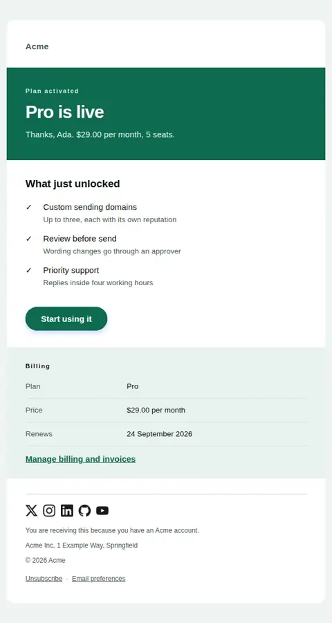
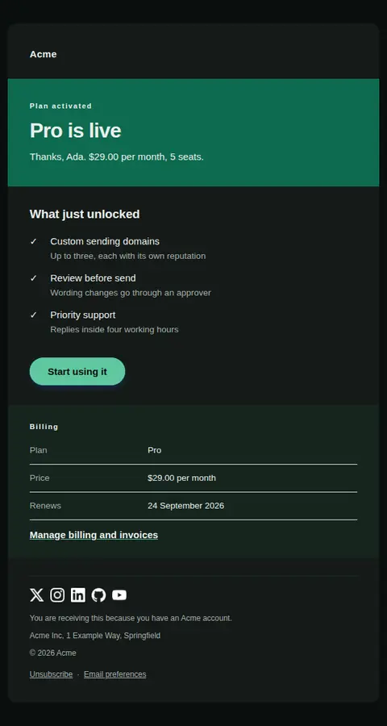
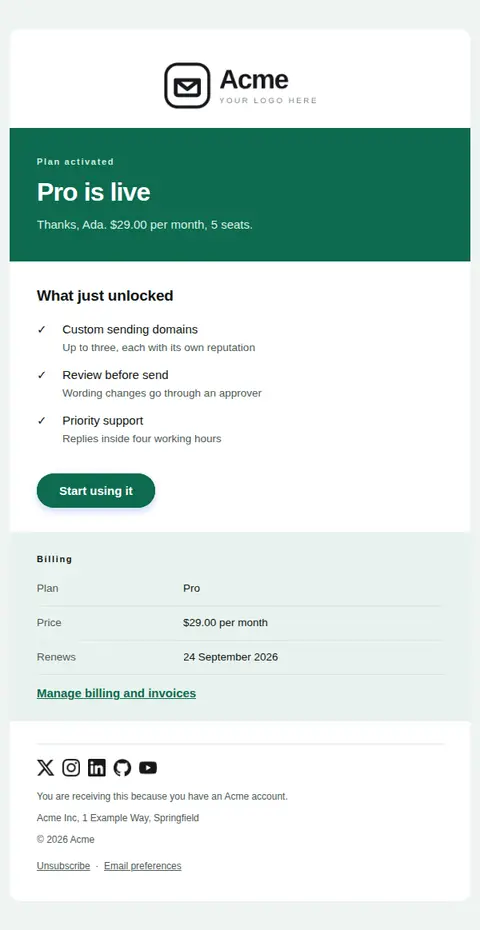
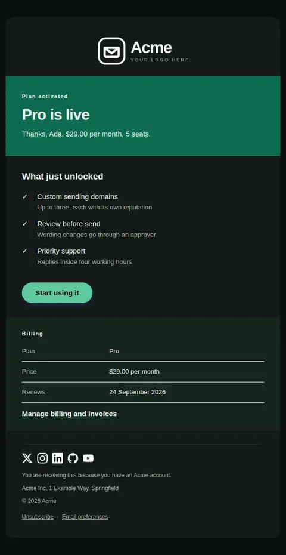

# Plan activated — free Laravel email template

Confirms a paid plan is live: what it costs, when it renews, and what the account can do now that it could not before.

A free, responsive, dark-mode billing email template for Laravel and PHP, MIT licensed and ready to send. Part of [Mailyte Email Templates](../../README.md), the largest open-source catalog of designed transactional email for Laravel -- part of Mailyte, a product of [Techies Africa](https://techies.africa).

**`subscription-activated`** · **billing** · **transactional** · **celebratory**

**Subject** `{{ plan_name }} is active on your account`  
**Preheader** Renews {{ renews_at }} at {{ amount }}. Here is what just unlocked.

```bash
php artisan mailyte:list subscription-activated
```

```php
Mailyte::template('subscription-activated')->with([...])->send($user);
```

## Every layout, light and dark

Each shot is the real render at 600px, captured from the preview gallery.

| Layout | Light | Dark |
|---|---|---|
| **minimal** | <a href="../previews/subscription-activated/minimal-light.webp"></a> | <a href="../previews/subscription-activated/minimal-dark.webp"></a> |
| **branded** | <a href="../previews/subscription-activated/branded-light.webp"></a> | <a href="../previews/subscription-activated/branded-dark.webp"></a> |

## Data it expects

| Variable | Type | Required | What it is |
|---|---|---|---|
| `action_url` | url | yes | Where to use the new capability first. |
| `amount` | money | yes | What it costs per period, formatted at the call site. |
| `plan_name` | string | yes | The plan now active, set at display size on the opening band. |
| `renews_at` | date | yes | Next renewal date. Stating it here prevents the surprise-charge support ticket. |
| `billing_url` | url |  | Where invoices and the payment method live. Easy access here reduces cancellations made in frustration. |
| `button_label` | string |  | Primary button label. |
| `period` | string |  | Billing period in words. |
| `seats` | string |  | Seat count or usage allowance, if the plan has one. |
| `unlocked` | array |  | What the account can do now that it could not before, as `text` / optional `detail`. Capabilities, not adjectives. |
| `user.first_name` | string |  | Recipient's first name. |

## More billing email templates

[Card expiring soon](card-expiring.md) · [Invoice](invoice.md) · [Payment failed](payment-failed.md) · [Payment receipt](receipt.md) · [Refund issued](refund-issued.md) · [Subscription cancelled](subscription-cancelled.md) · [Subscription renewing](subscription-renewing.md) · [Usage limit approaching](usage-limit-warning.md)

## Author

[Confidence Ugolo](https://www.linkedin.com/in/confidence-ugolo) · [Joel Omojefe](https://www.linkedin.com/in/joel-omojefe)

Part of Mailyte, a product of [Techies Africa](https://techies.africa). MIT licensed.

---

[← All 50 templates](../gallery.md) · [Package README](../../README.md) · [Sending](../sending.md) · [Theming](../theming.md) · [Deliverability](../deliverability.md)
