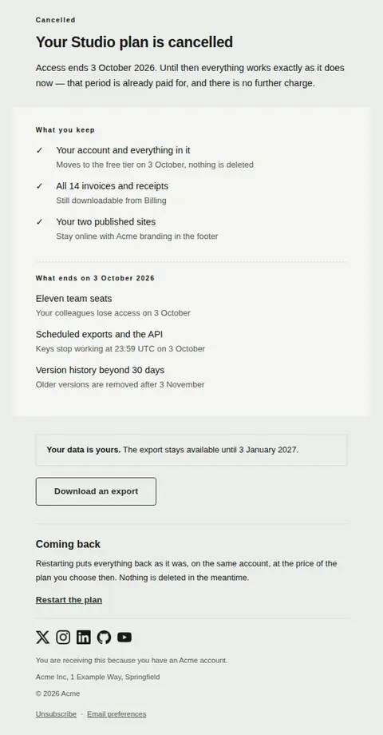
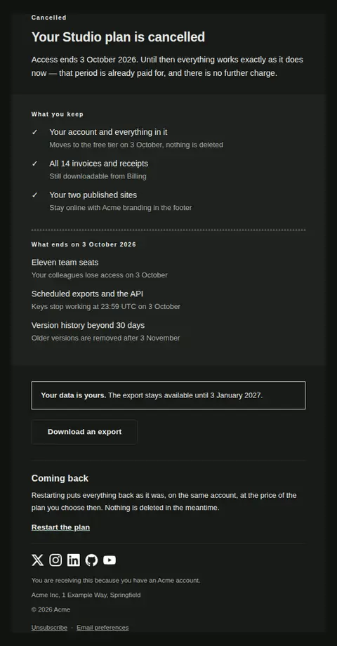
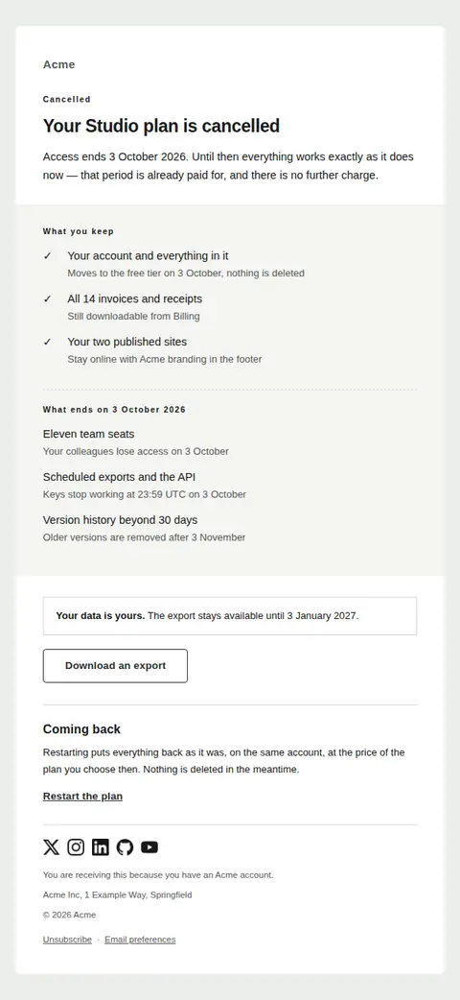
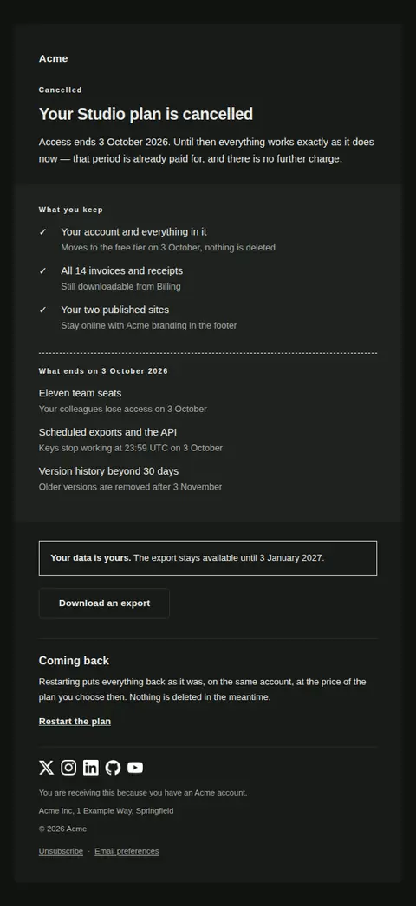
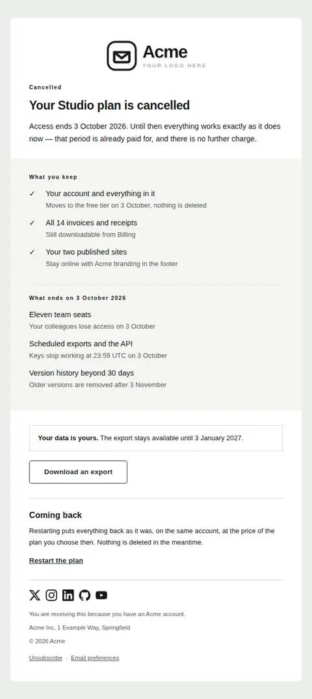
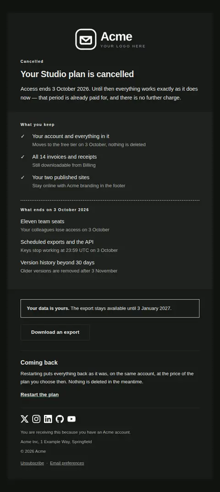

# Subscription cancelled — free Laravel email template

Confirms a cancellation the customer asked for: when access ends, what they keep, what stops, and how to come back if they choose to.

A free, responsive, dark-mode billing email template for Laravel and PHP, MIT licensed and ready to send. Part of [Mailyte Email Templates](../../README.md), the largest open-source catalog of designed transactional email for Laravel -- part of Mailyte, a product of [Techies Africa](https://techies.africa).

**`subscription-cancelled`** · **billing** · **transactional**

**Subject** `Your {{ plan_name }} plan is cancelled`  
**Preheader** Full access until {{ ends_on }}, then here is exactly what changes.

```bash
php artisan mailyte:list subscription-cancelled
```

```php
Mailyte::template('subscription-cancelled')->with([...])->send($user);
```

## Every layout, light and dark

Each shot is the real render at 600px, captured from the preview gallery.

| Layout | Light | Dark |
|---|---|---|
| **plain** | <a href="../previews/subscription-cancelled/plain-light.webp"></a> | <a href="../previews/subscription-cancelled/plain-dark.webp"></a> |
| **minimal** | <a href="../previews/subscription-cancelled/minimal-light.webp"></a> | <a href="../previews/subscription-cancelled/minimal-dark.webp"></a> |
| **branded** | <a href="../previews/subscription-cancelled/branded-light.webp"></a> | <a href="../previews/subscription-cancelled/branded-dark.webp"></a> |

## Data it expects

| Variable | Type | Required | What it is |
|---|---|---|---|
| `ends_on` | date | yes | The day access actually stops. It is the fact the whole email hangs on, and it appears both in the opening sentence and as the heading over the ending column — a customer who reads one line should still read the right date. |
| `plan_name` | string | yes | The plan being cancelled, named the way the customer knows it, so a person with two subscriptions can tell which one this is. |
| `access_note` | text |  | The half-sentence after the end date, covering the paid period and the absence of a further charge. It is a variable because an immediate cancellation and an end-of-term one are two different facts, and one sentence cannot be true of both. |
| `ending_items` | array |  | Everything that stops, as `text` with an optional `detail` giving the date or the consequence. Include the unglamorous ones — seats, integrations, scheduled jobs — because the ones you leave out are the ones that break someone's Monday. |
| `export_until` | date |  | How long the export stays available. A deadline stated here is a deadline they can meet; one discovered later is a complaint. |
| `export_url` | url |  | Where the customer downloads their own data. Offering it in the cancellation email, rather than waiting to be asked, is the difference between an offboarding and a hostage situation. |
| `kept_items` | array |  | Everything that survives the cancellation, as `text` with an optional `detail` line. List it first and list it honestly: a free tier, exports, invoices, the account itself. This half is why the email is not frightening. |
| `reactivate_url` | url |  | Self-serve path back, set as a plain link rather than a button so it reads as an option rather than an ask. Leave it empty where restarting means talking to someone. |
| `return_note` | text |  | What restarting actually involves — same account, same data, or not. Written as a fact and kept short, because this is the paragraph most likely to be rewritten into a plea. |

## More billing email templates

[Card expiring soon](card-expiring.md) · [Invoice](invoice.md) · [Payment failed](payment-failed.md) · [Payment receipt](receipt.md) · [Refund issued](refund-issued.md) · [Plan activated](subscription-activated.md) · [Subscription renewing](subscription-renewing.md) · [Usage limit approaching](usage-limit-warning.md)

## Author

[Confidence Ugolo](https://www.linkedin.com/in/confidence-ugolo) · [Joel Omojefe](https://www.linkedin.com/in/joel-omojefe)

Part of Mailyte, a product of [Techies Africa](https://techies.africa). MIT licensed.

---

[← All 50 templates](../gallery.md) · [Package README](../../README.md) · [Sending](../sending.md) · [Theming](../theming.md) · [Deliverability](../deliverability.md)
