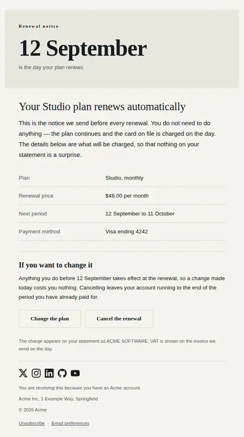
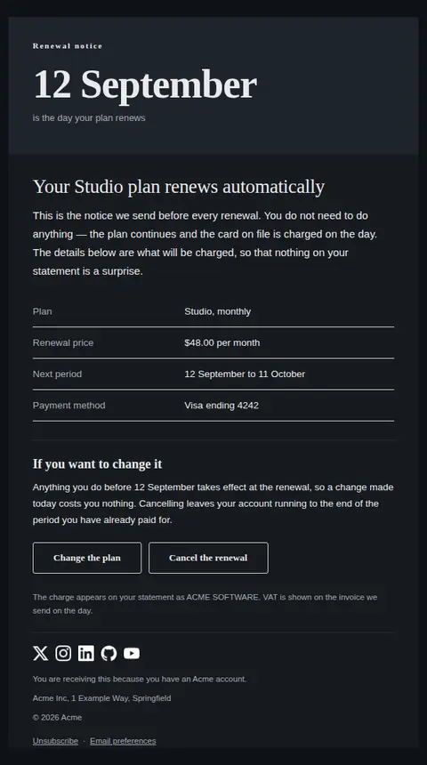
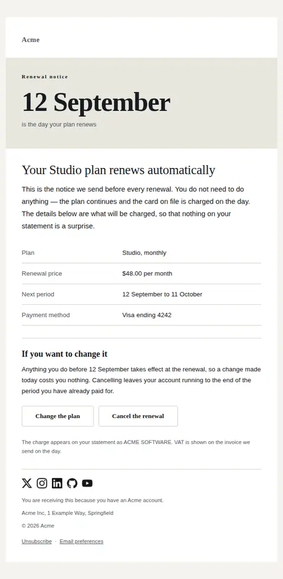
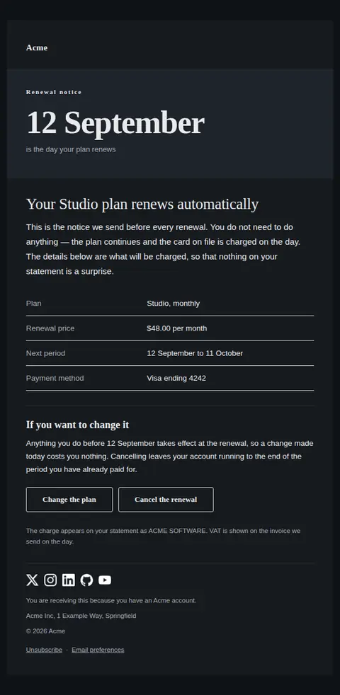

# Subscription renewing — free Laravel email template

The advance notice before a subscription renews: the date, what renews, the price, and how to change or cancel while it is still free to do so.

A free, responsive, dark-mode billing email template for Laravel and PHP, MIT licensed and ready to send. Part of [Mailyte Email Templates](../../README.md), the largest open-source catalog of designed transactional email for Laravel -- part of Mailyte, a product of [Techies Africa](https://techies.africa).

**`subscription-renewing`** · **billing** · **notification**

**Subject** `Your {{ plan_name }} plan renews on {{ renews_on }}`  
**Preheader** The terms, the amount and the way out, while changing your mind is still free.

```bash
php artisan mailyte:list subscription-renewing
```

```php
Mailyte::template('subscription-renewing')->with([...])->send($user);
```

## Every layout, light and dark

Each shot is the real render at 600px, captured from the preview gallery.

| Layout | Light | Dark |
|---|---|---|
| **plain** | <a href="../previews/subscription-renewing/plain-light.webp"></a> | <a href="../previews/subscription-renewing/plain-dark.webp"></a> |
| **minimal** | <a href="../previews/subscription-renewing/minimal-light.webp"></a> | <a href="../previews/subscription-renewing/minimal-dark.webp"></a> |
| **branded** | <a href="../previews/subscription-renewing/branded-light.webp"></a> | <a href="../previews/subscription-renewing/branded-dark.webp"></a> |

## Data it expects

| Variable | Type | Required | What it is |
|---|---|---|---|
| `manage_url` | url | yes | Where the plan itself is changed — a different destination from the cancel path, because a customer who wants a smaller plan should not have to walk through a cancellation flow to find one. |
| `plan_name` | string | yes | The plan as the customer knows it, not the internal price-book name. |
| `renews_on` | date | yes | The renewal date, set at display size and repeated in the sentence about changing your mind. Keep it short-form — this is the largest text in the email and a full date with a year wraps on a phone. |
| `terms_rows` | array | yes | The renewal terms as `label`/`value` pairs: plan, price, period, payment method. Money is formatted here at the call site because decimal separators and currency placement are not universal, and the price appears in this table only — stating it twice in one email is how a reader ends up unsure which number is real. |
| `body` | text |  | One paragraph under the heading. Its job is to say that no action is required, so that the actions below read as options rather than demands. |
| `cancel_label` | string |  | Label for the cancel action. Say the word — "cancel" — rather than a euphemism. |
| `cancel_url` | url |  | The direct cancel path. Given equal visual weight on purpose: a renewal notice that buries the exit is the thing regulators and customers both read as a trap. Leave it empty only where cancellation genuinely is not self-serve. |
| `change_label` | string |  | Label for the change action. |
| `statement_note` | text |  | The descriptor the charge appears under on a bank statement, and any tax note. It is here so that an unrecognised line on a statement does not become a chargeback. |

## More billing email templates

[Card expiring soon](card-expiring.md) · [Invoice](invoice.md) · [Payment failed](payment-failed.md) · [Payment receipt](receipt.md) · [Refund issued](refund-issued.md) · [Plan activated](subscription-activated.md) · [Subscription cancelled](subscription-cancelled.md) · [Usage limit approaching](usage-limit-warning.md)

## Author

[Confidence Ugolo](https://www.linkedin.com/in/confidence-ugolo) · [Joel Omojefe](https://www.linkedin.com/in/joel-omojefe)

Part of Mailyte, a product of [Techies Africa](https://techies.africa). MIT licensed.

---

[← All 50 templates](../gallery.md) · [Package README](../../README.md) · [Sending](../sending.md) · [Theming](../theming.md) · [Deliverability](../deliverability.md)
