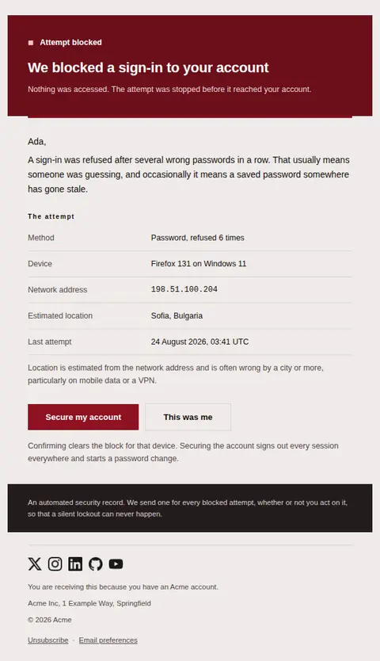
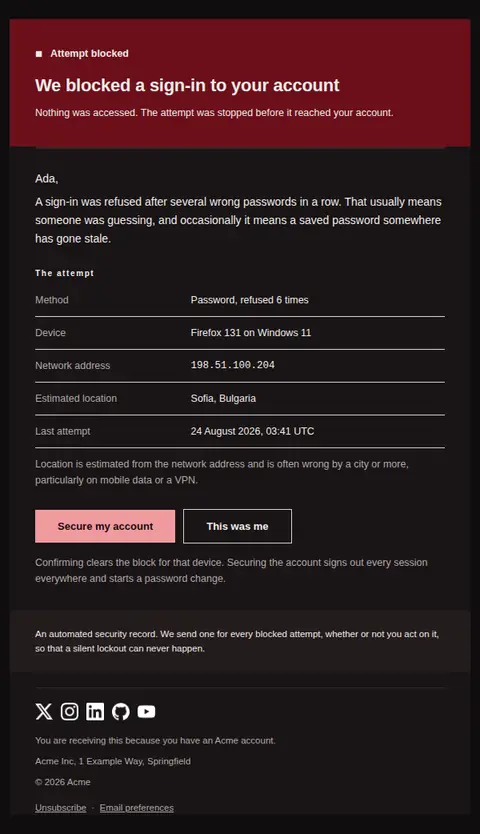
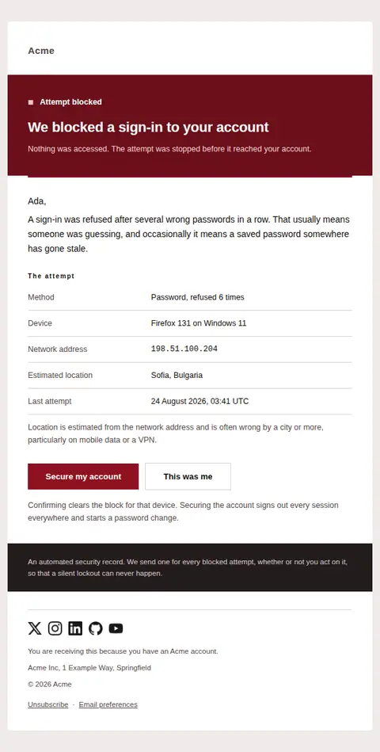
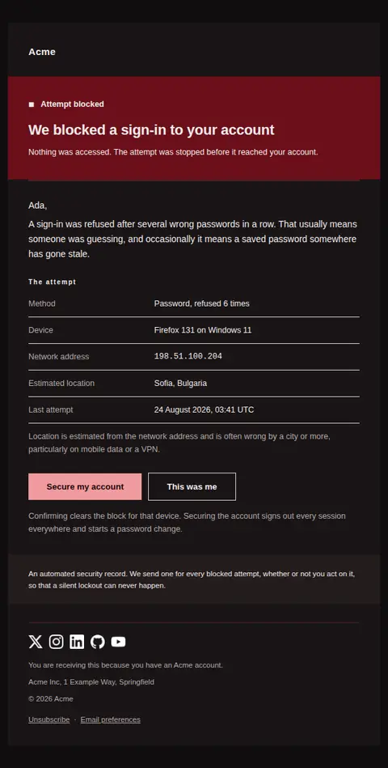

# Sign-in attempt blocked — free Laravel email template

Sent when a sign-in to the account was refused — repeated wrong passwords, a failed second factor, or a network we do not trust — and the account holder has to say whether it was them.

A free, responsive, dark-mode security email template for Laravel and PHP, MIT licensed and ready to send. Part of [Mailyte Email Templates](../../README.md), the largest open-source catalog of designed transactional email for Laravel -- part of Mailyte, a product of [Techies Africa](https://techies.africa).

**`suspicious-activity`** · **security** · **transactional** · **urgent**

**Subject** `We blocked a sign-in to your {{ product.name }} account`  
**Preheader** The attempt did not succeed. We need to know whether it was yours.

```bash
php artisan mailyte:list suspicious-activity
```

```php
Mailyte::template('suspicious-activity')->with([...])->send($user);
```

## Every layout, light and dark

Each shot is the real render at 600px, captured from the preview gallery.

| Layout | Light | Dark |
|---|---|---|
| **plain** | <a href="../previews/suspicious-activity/plain-light.webp"></a> | <a href="../previews/suspicious-activity/plain-dark.webp"></a> |
| **minimal** | <a href="../previews/suspicious-activity/minimal-light.webp"></a> | <a href="../previews/suspicious-activity/minimal-dark.webp"></a> |
| **branded** | <a href="../previews/suspicious-activity/branded-light.webp"></a> | <a href="../previews/suspicious-activity/branded-dark.webp"></a> |

## Data it expects

| Variable | Type | Required | What it is |
|---|---|---|---|
| `secure_url` | url | yes | The lock-down path: sign out every session and force a password change. This is the heavy action and carries the filled button. |
| `attempt` | array |  | What was observed, as `label` / `value` pairs. Set `mono` on anything a person may have to read character by character, such as an IP address. Send only what you actually recorded; a row reading "Unknown" invites a support ticket. |
| `attempt_label` | string |  | Heading above the metadata table. A separate field because teams word this differently — "The attempt", "Request detail", "What we saw". |
| `band_line` | text |  | The one reassurance that has to arrive before anything else: this was an attempt, not a breach. |
| `body` | text |  | Why the block happened, in the plainest terms available. Guessing is worse than admitting the trigger is mundane. |
| `choice_note` | text |  | What each button actually does. People hesitate over security buttons precisely because nobody tells them the consequence. |
| `confirm_label` | string |  | Label for the light action. Deliberately outlined, never filled — it must not compete with locking down. |
| `confirm_url` | url |  | Optional acknowledgement that clears the block for that device. Offering it stops people locking themselves out over their own forgotten password. |
| `heading_text` | string |  | The headline, reversed out of the alarm band. Keep it short — it is the only line most people read on a lock screen. |
| `location_caveat` | text |  | Pre-empts the commonest reply to this email, which is "that isn't my city". IP geolocation is routinely wrong by a region. |
| `record_note` | text |  | The closing band. States that the message is a record rather than a demand, so ignoring it is a legitimate choice. |
| `secure_label` | string |  | Label for the lock-down action. Write it in the first person so it reads as the reader's decision, not an instruction. |
| `status_label` | string |  | The severity word inside the alarm band. It is set beside a square mark so the state survives colour blindness, greyscale and forced inversion. |
| `user.first_name` | string |  | Names the person so the alert reads as being about their account and not a broadcast. Omitted cleanly when unknown. |

## More security email templates

[API key created](api-key-created.md) · [New device sign-in](new-device-login.md) · [Password found in a breach](password-breach.md) · [Two-step verification changed](two-factor-enabled.md)

## Author

[Confidence Ugolo](https://www.linkedin.com/in/confidence-ugolo) · [Joel Omojefe](https://www.linkedin.com/in/joel-omojefe)

Part of Mailyte, a product of [Techies Africa](https://techies.africa). MIT licensed.

---

[← All 50 templates](../gallery.md) · [Package README](../../README.md) · [Sending](../sending.md) · [Theming](../theming.md) · [Deliverability](../deliverability.md)
