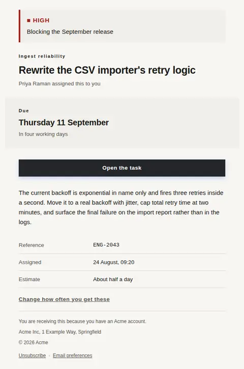
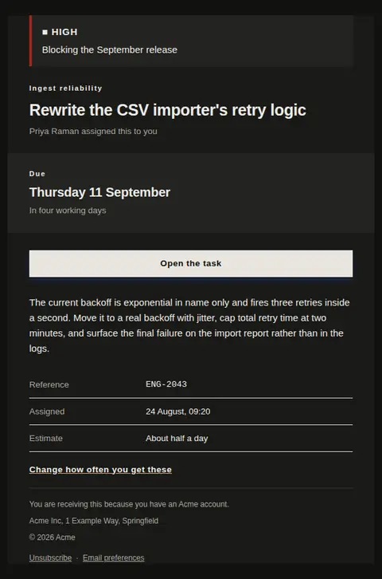
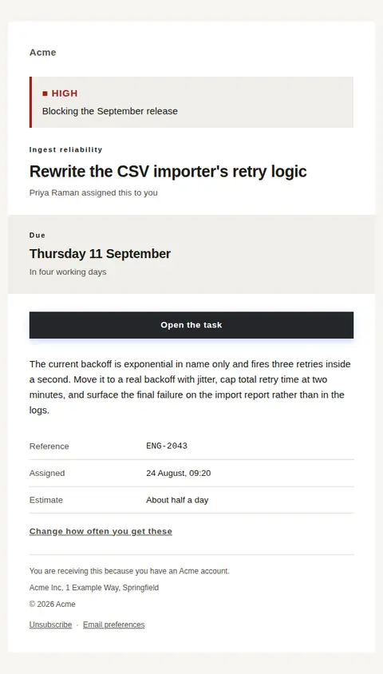
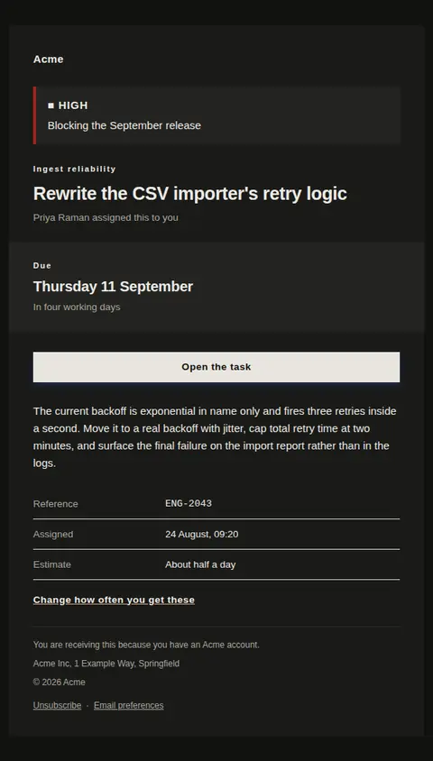

# A task was assigned to you — free Laravel email template

Hands someone a piece of work: what it is, who gave it to them, when it is due and how urgent it is, in that order.

A free, responsive, dark-mode notifications email template for Laravel and PHP, MIT licensed and ready to send. Part of [Mailyte Email Templates](../../README.md), the largest open-source catalog of designed transactional email for Laravel -- part of Mailyte, a product of [Techies Africa](https://techies.africa).

**`task-assigned`** · **notifications** · **notification**

**Subject** `Assigned to you: {{ task_title }}`  
**Preheader** The due date and the priority are both above the fold; the tracker detail sits under the button.

```bash
php artisan mailyte:list task-assigned
```

```php
Mailyte::template('task-assigned')->with([...])->send($user);
```

## Every layout, light and dark

Each shot is the real render at 600px, captured from the preview gallery.

| Layout | Light | Dark |
|---|---|---|
| **plain** | <a href="../previews/task-assigned/plain-light.webp"></a> | <a href="../previews/task-assigned/plain-dark.webp"></a> |
| **minimal** | <a href="../previews/task-assigned/minimal-light.webp"></a> | <a href="../previews/task-assigned/minimal-dark.webp"></a> |
| **branded** | <a href="../previews/task-assigned/branded-light.webp"></a> | <a href="../previews/task-assigned/branded-dark.webp"></a> |

## Data it expects

| Variable | Type | Required | What it is |
|---|---|---|---|
| `action_url` | url | yes | Deep link to the task itself, so accepting or reassigning it is one tap rather than a search through a board. |
| `task_title` | string | yes | The work itself, in the words the tracker holds. It carries the subject line too, so a title written as "fix it" produces an unusable email. |
| `action_label` | string |  | Label on the full-width action. Name the task, not the tool. |
| `assigned_at` | string |  | When the assignment happened, for the record kept under the button. |
| `assigned_by` | string |  | Who handed the work over. Work arrives from a person, not from a system, and naming them is what makes the task negotiable. |
| `due_at` | string |  | The date, set as the largest thing in the message after the title. Written out rather than numeric, because 09/11 means two different days on two continents. |
| `due_label` | string |  | Heading over the date band. Change it when your team says "target" or "needed by" rather than "due". |
| `due_relative` | string |  | The same date as a distance — "in four working days". People act on the distance and forget the date. |
| `estimate` | string |  | How much work this was sized at, if your team sizes work. It is the fact people use to decide whether to accept the assignment today or tomorrow. |
| `no_due_text` | text |  | What the band says when there is no date. An empty band would read as a rendering fault, and "no date" is itself information worth stating. |
| `notification_settings_label` | string |  | Wording of that link. Offer the frequency, not the preferences page. |
| `notification_settings_url` | url |  | Where assignment mail gets batched or turned off. Someone on a busy board may want a daily list instead of twelve of these. |
| `priority_label` | string |  | The urgency in one word. Use the vocabulary your team already argues in, not the tracker's internal enum. |
| `priority_level` | string |  | Severity of the priority bar. Carried as a word, a shape and a rule weight as well as a colour, so it survives a client that inverts the palette. |
| `priority_text` | string |  | Why it carries that priority. "High" on its own is a colour; "High — blocking the September release" is a reason someone can act on or push back against. |
| `project_name` | string |  | Which board, project or client this belongs to. Set as the eyebrow, because someone holding six projects needs it before they read the title. |
| `task_description` | text |  | A short brief on what finished looks like. Deliberately placed under the action rather than above it, so the reader can open the task without reading it. |
| `task_reference` | string |  | The tracker's own identifier, shown monospaced so it can be pasted into a branch name or a standup without transcription errors. |

## More notifications email templates

[New reply in a thread](comment-reply.md) · [You were mentioned](mention.md) · [Notification](notification.md) · [Weekly digest](weekly-digest.md)

## Author

[Confidence Ugolo](https://www.linkedin.com/in/confidence-ugolo) · [Joel Omojefe](https://www.linkedin.com/in/joel-omojefe)

Part of Mailyte, a product of [Techies Africa](https://techies.africa). MIT licensed.

---

[← All 50 templates](../gallery.md) · [Package README](../../README.md) · [Sending](../sending.md) · [Theming](../theming.md) · [Deliverability](../deliverability.md)
