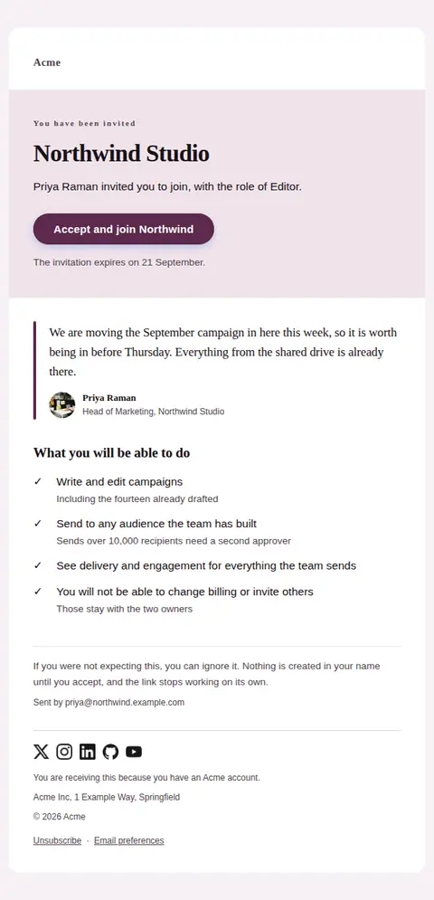
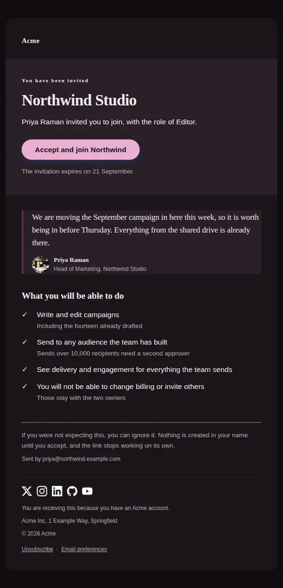
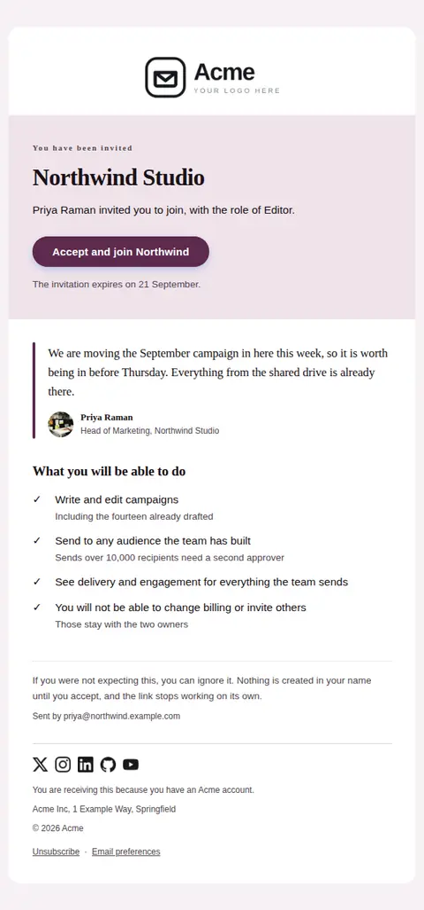
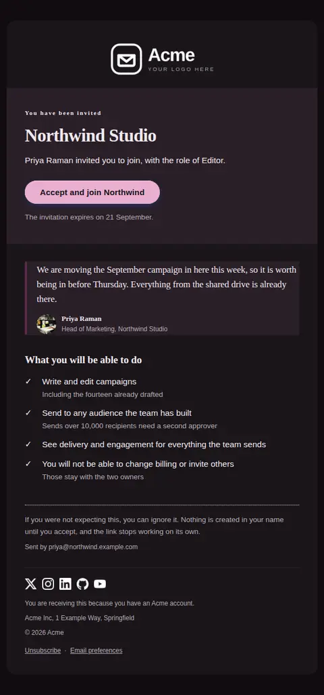
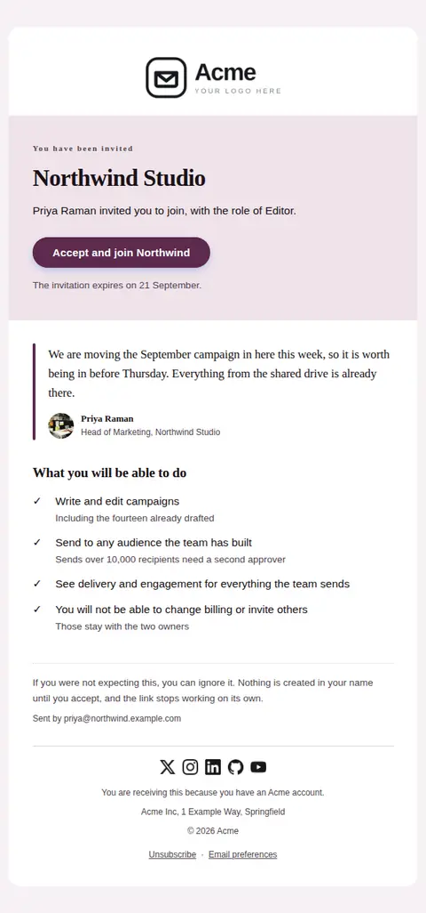
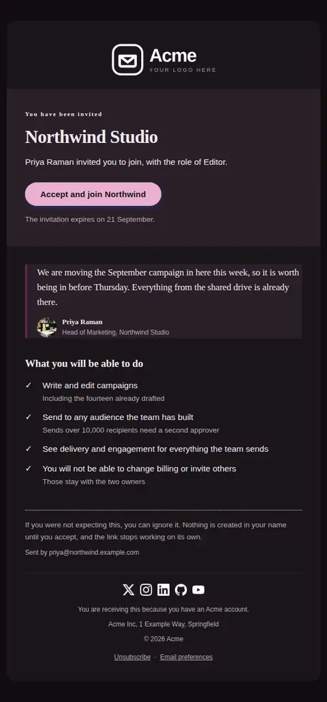

# Team invitation — free Laravel email template

Invites someone into a workspace: who invited them, what they will be able to do, one action to accept, and the date the invitation stops working.

A free, responsive, dark-mode collaboration email template for Laravel and PHP, MIT licensed and ready to send. Part of [Mailyte Email Templates](../../README.md), the largest open-source catalog of designed transactional email for Laravel -- part of Mailyte, a product of [Techies Africa](https://techies.africa).

**`team-invitation`** · **collaboration** · **transactional** · **friendly**

**Subject** `{{ inviter_name }} invited you to join {{ workspace_name }}`  
**Preheader** One action to accept, and what the invitation lets you do once you are in.

```bash
php artisan mailyte:list team-invitation
```

```php
Mailyte::template('team-invitation')->with([...])->send($user);
```

## Every layout, light and dark

Each shot is the real render at 600px, captured from the preview gallery.

| Layout | Light | Dark |
|---|---|---|
| **minimal** | <a href="../previews/team-invitation/minimal-light.webp"></a> | <a href="../previews/team-invitation/minimal-dark.webp"></a> |
| **branded** | <a href="../previews/team-invitation/branded-light.webp"></a> | <a href="../previews/team-invitation/branded-dark.webp"></a> |
| **editorial** | <a href="../previews/team-invitation/editorial-light.webp"></a> | <a href="../previews/team-invitation/editorial-dark.webp"></a> |

## Data it expects

| Variable | Type | Required | What it is |
|---|---|---|---|
| `accept_url` | url | yes | The single-use acceptance link. This email carries one action and no competing links, because a second button measurably costs acceptances. |
| `expires_at` | string | yes | When the link stops working, stated as a date rather than a countdown so it is still true when the email is read a week later. An invitation with no expiry is a credential with no expiry. |
| `inviter_email` | email | yes | The inviter's address, printed in full so the recipient can check it against someone they already correspond with before clicking anything. |
| `inviter_name` | string | yes | Who is inviting them, by name. An invitation from a person converts; an invitation from a product does not, which is why the name leads the subject line as well. |
| `role_name` | string | yes | The role they are being given, in the product's own vocabulary and without an article — the sentence supplies its own. It sets the expectation that the permissions list then keeps. |
| `workspace_name` | string | yes | The workspace, team or organisation being joined, set as the largest thing on the page. People accept an invitation to a place they recognise, so this is the name they know it by rather than an account slug. |
| `accept_label` | string |  | Label for the one action this email exists for. Name the outcome — 'Accept and join Northwind' beats 'Continue'. |
| `capabilities` | array |  | What the role actually permits, as `text` and optional `detail`. Concrete abilities, and the notable limits too — someone who accepts expecting more than they get is a support ticket on their first day. |
| `capabilities_heading` | string |  | Heading over the permissions list. |
| `expiry_label` | string |  | Lead-in for the expiry. |
| `eyebrow` | string |  | Small label above the workspace name. It does the work of a subject line for anyone who reads the email before the header. |
| `ignore_text` | text |  | What to do if the invitation was unexpected. Saying that nothing happens until they accept is what makes it safe to ignore, and what makes the email look unlike a phishing attempt. |
| `inviter_avatar` | url |  | Square photograph of the inviter, shown at 36px beside their name. Use a real photograph of the real person or leave it empty — a generated monogram in an email is a small lie that the reader can spot. |
| `inviter_role` | string |  | The inviter's job or role, shown under their name on the quotation. It answers the recipient's first question, which is whether this person can actually grant access. |
| `message` | text |  | The inviter's own note, shown as a quotation in their voice. Optional, and worth prompting for in the product — a sentence of context is the difference between an invitation and a system message. |
| `sender_label` | string |  | Lead-in for the sender address line. |

## Credits

- Man having an online meeting in an office by Jack Sparrow via Pexels — [source](https://www.pexels.com/photo/man-having-online-meeting-in-office-5918384/) (Pexels License, sample data only)

## More collaboration email templates

[Invitation accepted](invite-accepted.md) · [Role changed in a workspace](role-changed.md) · [Seat limit reached](seat-limit-reached.md)

## Author

[Confidence Ugolo](https://www.linkedin.com/in/confidence-ugolo) · [Joel Omojefe](https://www.linkedin.com/in/joel-omojefe)

Part of Mailyte, a product of [Techies Africa](https://techies.africa). MIT licensed.

---

[← All 50 templates](../gallery.md) · [Package README](../../README.md) · [Sending](../sending.md) · [Theming](../theming.md) · [Deliverability](../deliverability.md)
