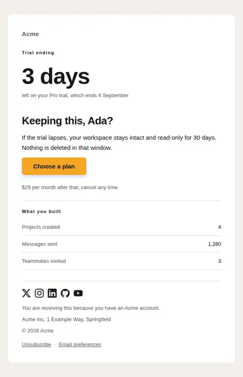
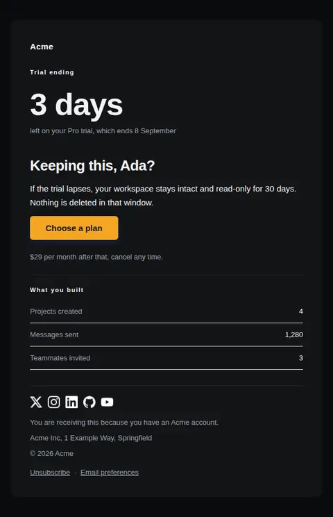
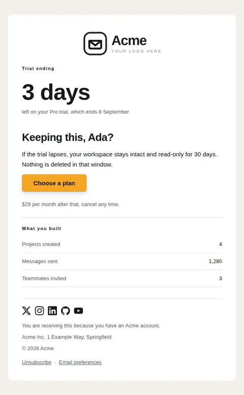
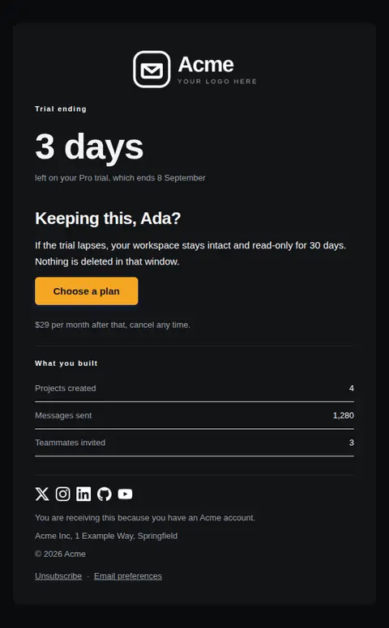

# Trial ending soon — free Laravel email template

Sent a few days before a trial lapses: what they built, what they lose, and one clear way to keep it.

A free, responsive, dark-mode onboarding email template for Laravel and PHP, MIT licensed and ready to send. Part of [Mailyte Email Templates](../../README.md), the largest open-source catalog of designed transactional email for Laravel -- part of Mailyte, a product of [Techies Africa](https://techies.africa).

**`trial-ending`** · **onboarding** · **transactional** · **urgent**

**Subject** `Your trial ends {{ trial_ends_at }}`  
**Preheader** Keep your projects and settings by choosing a plan before then.

```bash
php artisan mailyte:list trial-ending
```

```php
Mailyte::template('trial-ending')->with([...])->send($user);
```

## Every layout, light and dark

Each shot is the real render at 600px, captured from the preview gallery.

| Layout | Light | Dark |
|---|---|---|
| **minimal** | <a href="../previews/trial-ending/minimal-light.webp"></a> | <a href="../previews/trial-ending/minimal-dark.webp"></a> |
| **branded** | <a href="../previews/trial-ending/branded-light.webp"></a> | <a href="../previews/trial-ending/branded-dark.webp"></a> |

## Data it expects

| Variable | Type | Required | What it is |
|---|---|---|---|
| `action_url` | url | yes | Where to choose a plan. |
| `days_left` | number | yes | Days remaining, set at 56px as the focal point of the design. Keep it accurate at send time. |
| `trial_ends_at` | date | yes | The end date in words. |
| `button_label` | string |  | Primary button label. |
| `consequences` | text |  | What happens if they do nothing. Say it straight; vagueness here reads as a trap. |
| `plan_name` | string |  | Plan they have been trialling. |
| `price_note` | string |  | What it costs to continue, stated once and plainly. |
| `usage_summary` | array |  | What they actually did during the trial, as `label`/`value` pairs. Specific numbers beat encouragement. |
| `user.first_name` | string |  | Recipient's first name. |

## More onboarding email templates

[Account activated](account-activated.md) · [First milestone reached](first-milestone.md) · [Getting started checklist](getting-started.md) · [Setup incomplete](setup-incomplete.md) · [Trial expired](trial-expired.md) · [Trial started](trial-started.md) · [Welcome](welcome.md)

## Author

[Confidence Ugolo](https://www.linkedin.com/in/confidence-ugolo) · [Joel Omojefe](https://www.linkedin.com/in/joel-omojefe)

Part of Mailyte, a product of [Techies Africa](https://techies.africa). MIT licensed.

---

[← All 50 templates](../gallery.md) · [Package README](../../README.md) · [Sending](../sending.md) · [Theming](../theming.md) · [Deliverability](../deliverability.md)
