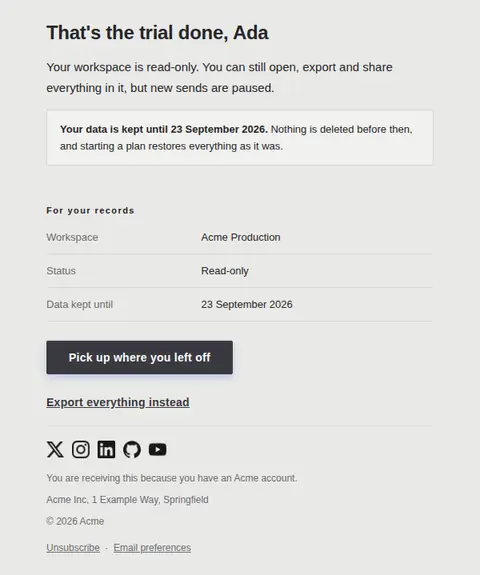
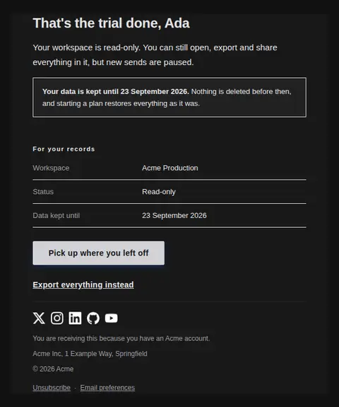
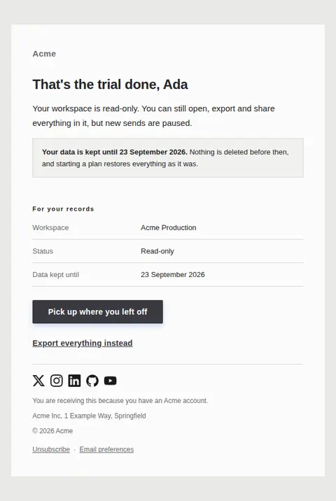
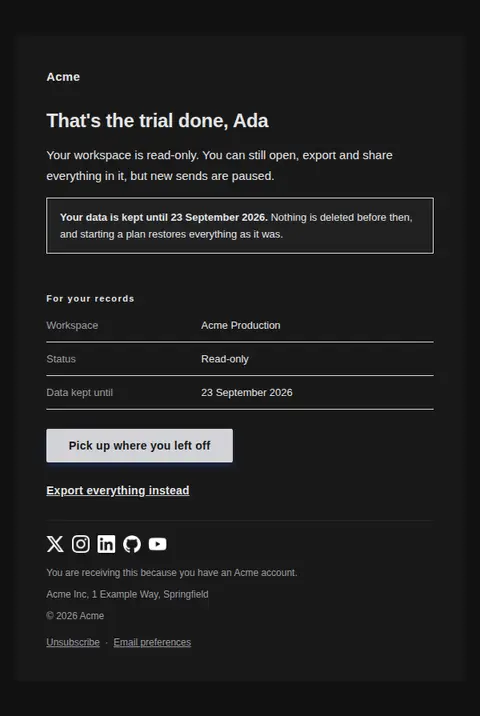

# Trial expired — free Laravel email template

Sent the day a trial lapses: what state the account is in now, how long the data is kept, and how to pick it back up.

A free, responsive, dark-mode onboarding email template for Laravel and PHP, MIT licensed and ready to send. Part of [Mailyte Email Templates](../../README.md), the largest open-source catalog of designed transactional email for Laravel -- part of Mailyte, a product of [Techies Africa](https://techies.africa).

**`trial-expired`** · **onboarding** · **transactional**

**Subject** `Your {{ product.name }} trial has ended`  
**Preheader** Your workspace is read-only. Everything in it is still there.

```bash
php artisan mailyte:list trial-expired
```

```php
Mailyte::template('trial-expired')->with([...])->send($user);
```

## Every layout, light and dark

Each shot is the real render at 600px, captured from the preview gallery.

| Layout | Light | Dark |
|---|---|---|
| **plain** | <a href="../previews/trial-expired/plain-light.webp"></a> | <a href="../previews/trial-expired/plain-dark.webp"></a> |
| **minimal** | <a href="../previews/trial-expired/minimal-light.webp"></a> | <a href="../previews/trial-expired/minimal-dark.webp"></a> |
| **branded** | <a href="../previews/trial-expired/branded-light.webp"></a> | <a href="../previews/trial-expired/branded-dark.webp"></a> |

## Data it expects

| Variable | Type | Required | What it is |
|---|---|---|---|
| `action_url` | url | yes | Where to restart on a paid plan. |
| `button_label` | string |  | Primary button label. |
| `current_state` | text |  | Plain description of what still works and what does not. |
| `deletion_date` | date |  | The date the data actually goes. A date is harder to misread than a countdown, and this is the fact people come back to the email for. |
| `export_url` | url |  | Link to export their data. Offering the exit honestly is what makes the rest believable. |
| `retention_days` | number |  | How long the data is kept before deletion. A real number, honoured by the system that sends this. |
| `user.first_name` | string |  | Recipient's first name. |
| `workspace_name` | string |  | Which workspace this concerns. |

## More onboarding email templates

[Account activated](account-activated.md) · [First milestone reached](first-milestone.md) · [Getting started checklist](getting-started.md) · [Setup incomplete](setup-incomplete.md) · [Trial ending soon](trial-ending.md) · [Trial started](trial-started.md) · [Welcome](welcome.md)

## Author

[Confidence Ugolo](https://www.linkedin.com/in/confidence-ugolo) · [Joel Omojefe](https://www.linkedin.com/in/joel-omojefe)

Part of Mailyte, a product of [Techies Africa](https://techies.africa). MIT licensed.

---

[← All 50 templates](../gallery.md) · [Package README](../../README.md) · [Sending](../sending.md) · [Theming](../theming.md) · [Deliverability](../deliverability.md)
