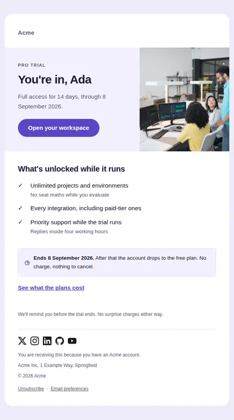
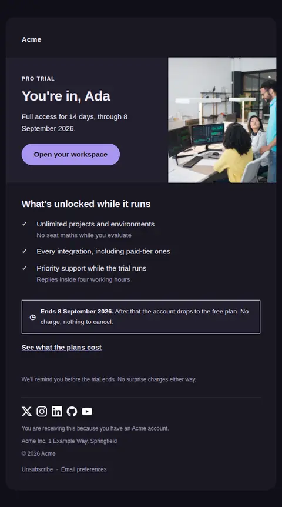
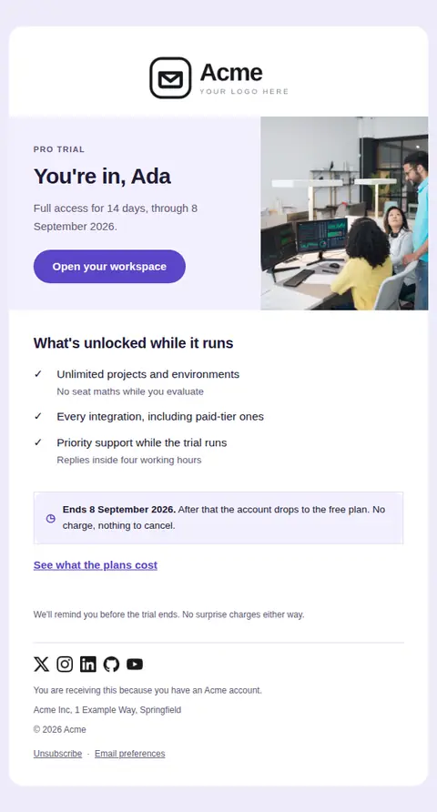
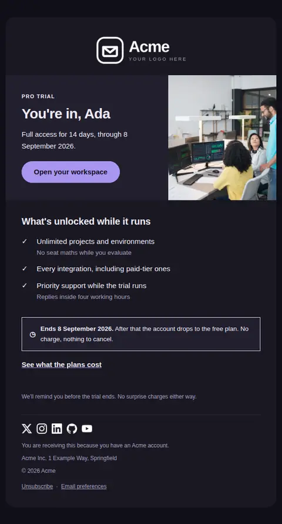

# Trial started — free Laravel email template

Confirms a free trial has begun, states plainly when it ends and what happens then, and points at the first thing worth doing.

A free, responsive, dark-mode onboarding email template for Laravel and PHP, MIT licensed and ready to send. Part of [Mailyte Email Templates](../../README.md), the largest open-source catalog of designed transactional email for Laravel -- part of Mailyte, a product of [Techies Africa](https://techies.africa).

**`trial-started`** · **onboarding** · **transactional** · **friendly**

**Subject** `Your {{ product.name }} trial is running`  
**Preheader** Full access until {{ trial_ends_at }}. No card on file, nothing to cancel.

```bash
php artisan mailyte:list trial-started
```

```php
Mailyte::template('trial-started')->with([...])->send($user);
```

## Every layout, light and dark

Each shot is the real render at 600px, captured from the preview gallery.

| Layout | Light | Dark |
|---|---|---|
| **minimal** | <a href="../previews/trial-started/minimal-light.webp"></a> | <a href="../previews/trial-started/minimal-dark.webp"></a> |
| **branded** | <a href="../previews/trial-started/branded-light.webp"></a> | <a href="../previews/trial-started/branded-dark.webp"></a> |

## Data it expects

| Variable | Type | Required | What it is |
|---|---|---|---|
| `action_url` | url | yes | Primary destination, usually the workspace. |
| `trial_ends_at` | date | yes | Human-readable end date. State it explicitly — "14 days" makes people do arithmetic. |
| `button_label` | string |  | Primary button label. |
| `card_required` | boolean |  | Whether a card is on file. Drives the sentence about what happens at the end, which is the sentence people actually look for. |
| `closing` | text |  | Sign-off. |
| `hero_image` | url |  | Optional image for the opening split. Leave empty for a text-only opening, which is faster and survives image blocking. |
| `included` | array |  | What the trial unlocks, as `text` / optional `detail`. Concrete capabilities, not adjectives. |
| `included_heading` | string |  | Heading above the list of what is included. |
| `plan_name` | string |  | Plan the trial grants access to. |
| `plans_url` | url |  | Optional secondary action for people who want to see pricing before the trial ends. |
| `trial_days` | number |  | Length of the trial in days. |
| `user.first_name` | string |  | Recipient's first name. |

## Credits

- Four people working in the office by Kampus via Pexels — [source](https://www.pexels.com/photo/four-people-working-in-the-office-8204363/) (Pexels License, sample data only)

## More onboarding email templates

[Account activated](account-activated.md) · [First milestone reached](first-milestone.md) · [Getting started checklist](getting-started.md) · [Setup incomplete](setup-incomplete.md) · [Trial ending soon](trial-ending.md) · [Trial expired](trial-expired.md) · [Welcome](welcome.md)

## Author

[Confidence Ugolo](https://www.linkedin.com/in/confidence-ugolo) · [Joel Omojefe](https://www.linkedin.com/in/joel-omojefe)

Part of Mailyte, a product of [Techies Africa](https://techies.africa). MIT licensed.

---

[← All 50 templates](../gallery.md) · [Package README](../../README.md) · [Sending](../sending.md) · [Theming](../theming.md) · [Deliverability](../deliverability.md)
