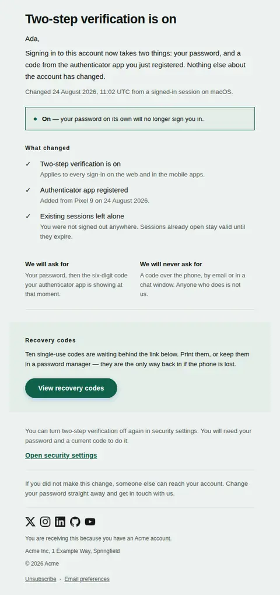
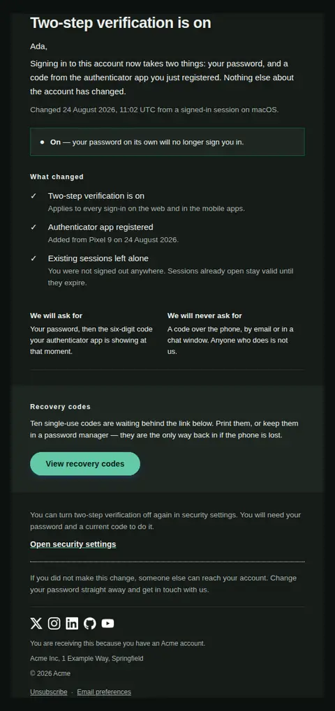
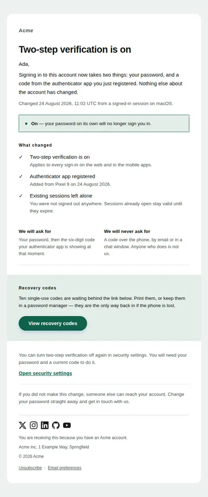
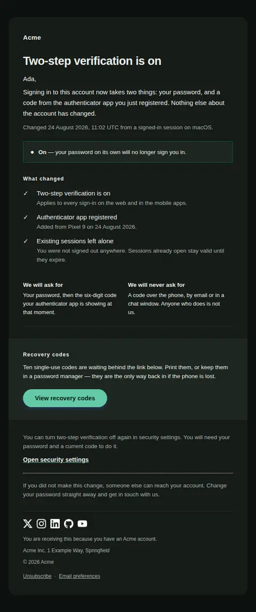

# Two-step verification changed — free Laravel email template

Confirms that two-step verification was switched on — or off — says what changes at the next sign-in, points at the recovery codes, and explains how to reverse it.

A free, responsive, dark-mode security email template for Laravel and PHP, MIT licensed and ready to send. Part of [Mailyte Email Templates](../../README.md), the largest open-source catalog of designed transactional email for Laravel -- part of Mailyte, a product of [Techies Africa](https://techies.africa).

**`two-factor-enabled`** · **security** · **transactional**

**Subject** `{{ product.name }} two-step verification: {{ state_word }}`  
**Preheader** What changes at your next sign-in, where the recovery codes are, and how to reverse it.

```bash
php artisan mailyte:list two-factor-enabled
```

```php
Mailyte::template('two-factor-enabled')->with([...])->send($user);
```

## Every layout, light and dark

Each shot is the real render at 600px, captured from the preview gallery.

| Layout | Light | Dark |
|---|---|---|
| **plain** | <a href="../previews/two-factor-enabled/plain-light.webp"></a> | <a href="../previews/two-factor-enabled/plain-dark.webp"></a> |
| **minimal** | <a href="../previews/two-factor-enabled/minimal-light.webp"></a> | <a href="../previews/two-factor-enabled/minimal-dark.webp"></a> |
| **branded** | <a href="../previews/two-factor-enabled/branded-light.webp"></a> | <a href="../previews/two-factor-enabled/branded-dark.webp"></a> |

## Data it expects

| Variable | Type | Required | What it is |
|---|---|---|---|
| `body` | text |  | What the change means in practice, before any list of details. Say what is now required and what was left alone. |
| `change_line` | string |  | Who made the change and when, if you record it. Provenance is what lets someone recognise a change they did not make; leave it empty rather than guess. |
| `changes` | array |  | One entry per setting that actually moved, as `text` with an optional `detail` line under it. Listing only real deltas keeps the mail short enough that people read it. |
| `changes_title` | string |  | Heading above the list of deltas. Kept separate because teams word it differently — "What changed", "Summary", "Applied". |
| `enabled` | boolean |  | True when the control was switched on, false when it was switched off. Drives the mark and the colour of the state bar; it does not write any copy, so the wording stays yours. |
| `expectations` | array |  | Two cells set side by side, each `heading` plus `text`: what you will ask for, and what you will never ask for. This is the anti-phishing pair, and it belongs in the one email that teaches someone what a code request looks like. Two items only — three do not fit a 320px screen. |
| `heading_text` | string |  | The headline. Name the control and its new state; a reader scanning a notification list should not have to open the mail to learn which way it went. |
| `not_you_text` | text |  | The line for the reader who did not make this change. It sits last and stays plain: if it were styled as an alarm, the ninety-nine people who did make the change would read the whole email as one. |
| `recovery_label` | string |  | Label for the recovery-codes action — the only filled button in this email, because it is the only thing worth doing today. |
| `recovery_text` | text |  | Why the codes matter and where to keep them. Most lockouts after a second factor is enabled are people who never read this paragraph. |
| `recovery_title` | string |  | Heading for the recovery-codes band. |
| `recovery_url` | url |  | Where the codes can be viewed or regenerated. Omit it if your product shows the codes only once at setup, and the band will state the fact without offering a link. |
| `settings_label` | string |  | Label for the settings link. |
| `settings_url` | url |  | Deep link to the security settings page. Rendered as an underlined link rather than a button so it never competes with the recovery codes. |
| `state_detail` | text |  | The consequence, continuing the sentence the state word starts. Begin it with a dash so the bar reads as one line. |
| `state_word` | string |  | The state in one word, set in bold beside the mark and reused in the subject line. It is the reading that has to survive a greyscale screen, so it can never be implied by colour alone. |
| `undo_text` | text |  | How to reverse the change, including what it will cost them. A security control nobody can find the off switch for is a support ticket. |
| `user.first_name` | string |  | Names the person, so a settings change reads as something that happened to their account rather than an announcement. Omitted cleanly when unknown. |

## More security email templates

[API key created](api-key-created.md) · [New device sign-in](new-device-login.md) · [Password found in a breach](password-breach.md) · [Sign-in attempt blocked](suspicious-activity.md)

## Author

[Confidence Ugolo](https://www.linkedin.com/in/confidence-ugolo) · [Joel Omojefe](https://www.linkedin.com/in/joel-omojefe)

Part of Mailyte, a product of [Techies Africa](https://techies.africa). MIT licensed.

---

[← All 50 templates](../gallery.md) · [Package README](../../README.md) · [Sending](../sending.md) · [Theming](../theming.md) · [Deliverability](../deliverability.md)
