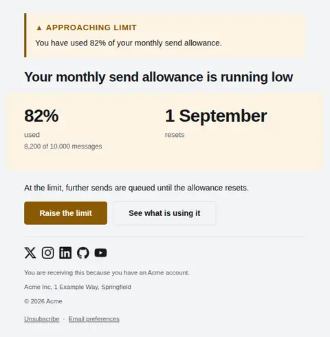
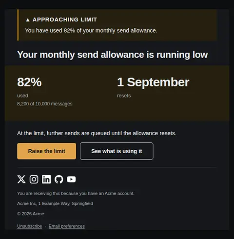
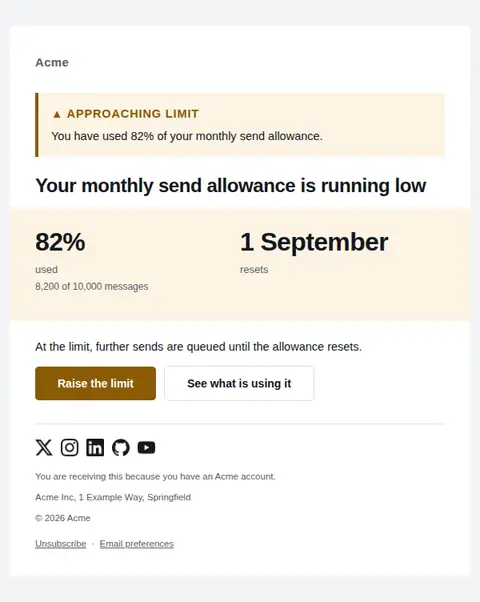
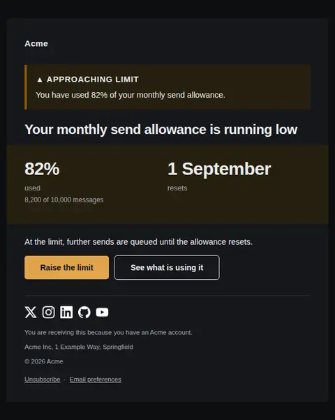
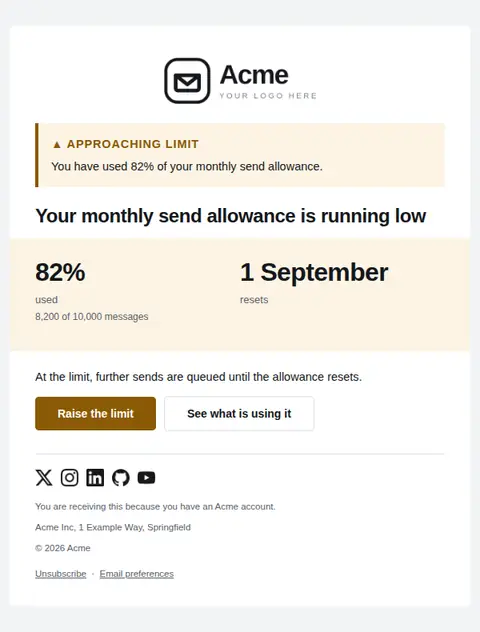
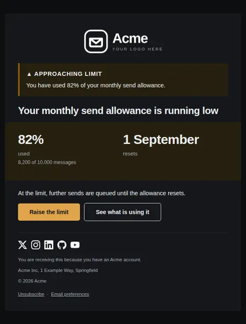

# Usage limit approaching — free Laravel email template

Warns that an account is close to a plan limit, showing how much is used, what happens at the ceiling, and the two ways out.

A free, responsive, dark-mode billing email template for Laravel and PHP, MIT licensed and ready to send. Part of [Mailyte Email Templates](../../README.md), the largest open-source catalog of designed transactional email for Laravel -- part of Mailyte, a product of [Techies Africa](https://techies.africa).

**`usage-limit-warning`** · **billing** · **notification** · **urgent**

**Subject** `You've used {{ used_percent }} of your {{ limit_name }}`  
**Preheader** At the limit, {{ at_limit_behaviour }}. Two ways to avoid it.

```bash
php artisan mailyte:list usage-limit-warning
```

```php
Mailyte::template('usage-limit-warning')->with([...])->send($user);
```

## Every layout, light and dark

Each shot is the real render at 600px, captured from the preview gallery.

| Layout | Light | Dark |
|---|---|---|
| **plain** | <a href="../previews/usage-limit-warning/plain-light.webp"></a> | <a href="../previews/usage-limit-warning/plain-dark.webp"></a> |
| **minimal** | <a href="../previews/usage-limit-warning/minimal-light.webp"></a> | <a href="../previews/usage-limit-warning/minimal-dark.webp"></a> |
| **branded** | <a href="../previews/usage-limit-warning/branded-light.webp"></a> | <a href="../previews/usage-limit-warning/branded-dark.webp"></a> |

## Data it expects

| Variable | Type | Required | What it is |
|---|---|---|---|
| `limit_name` | string | yes | What is running out, in the customer's language. |
| `upgrade_url` | url | yes | Where to raise the limit. |
| `used_percent` | string | yes | How much is used, as a percentage string. Shown at display size. |
| `at_limit_behaviour` | text |  | What happens at the ceiling. Say it exactly: throttled, queued, blocked or charged. |
| `resets_at` | date |  | When the allowance resets, if it does. Often the cheapest answer is simply waiting. |
| `upgrade_label` | string |  | Label for the upgrade action. |
| `usage_url` | url |  | Where the detailed usage breakdown lives, for people who want to reduce instead of upgrade. |
| `used_label` | string |  | The same fact in absolute numbers, which is what people actually act on. |

## More billing email templates

[Card expiring soon](card-expiring.md) · [Invoice](invoice.md) · [Payment failed](payment-failed.md) · [Payment receipt](receipt.md) · [Refund issued](refund-issued.md) · [Plan activated](subscription-activated.md) · [Subscription cancelled](subscription-cancelled.md) · [Subscription renewing](subscription-renewing.md)

## Author

[Confidence Ugolo](https://www.linkedin.com/in/confidence-ugolo) · [Joel Omojefe](https://www.linkedin.com/in/joel-omojefe)

Part of Mailyte, a product of [Techies Africa](https://techies.africa). MIT licensed.

---

[← All 50 templates](../gallery.md) · [Package README](../../README.md) · [Sending](../sending.md) · [Theming](../theming.md) · [Deliverability](../deliverability.md)
