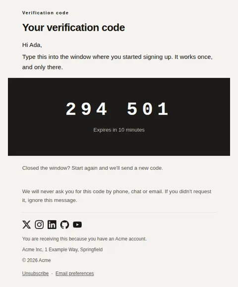
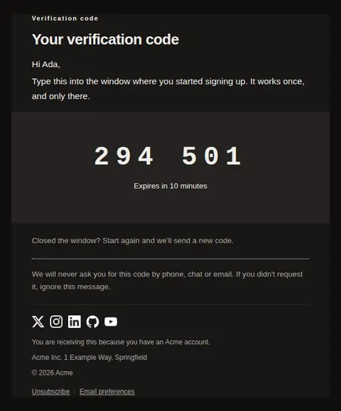
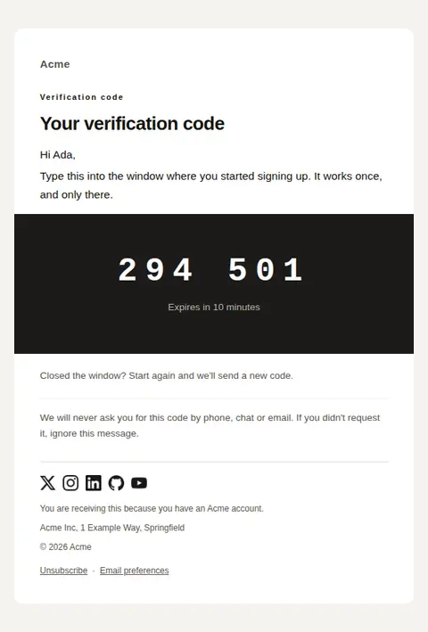
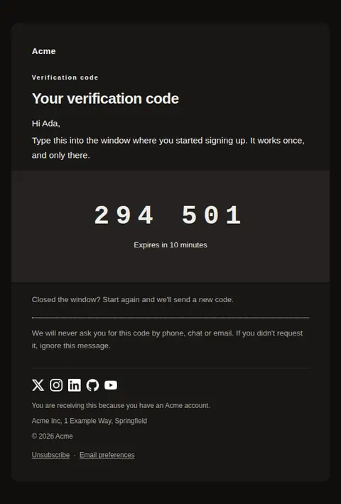
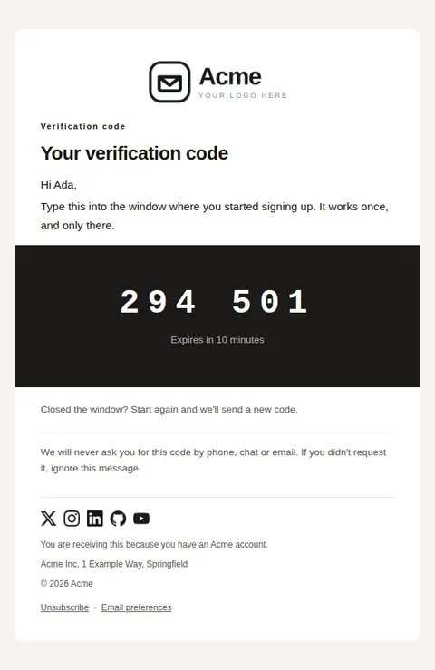
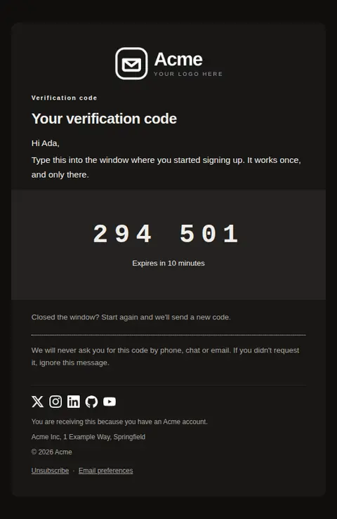

# Verify email address — Code only — free Laravel email template

Confirms an address with a code and no link at all, for flows that must survive link rewriting by a security gateway or complete on another device.

A free, responsive, dark-mode account email template for Laravel and PHP, MIT licensed and ready to send. Part of [Mailyte Email Templates](../../README.md), the largest open-source catalog of designed transactional email for Laravel -- part of Mailyte, a product of [Techies Africa](https://techies.africa).

**`verify-email-code`** · **account** · **transactional**

**Subject** `{{ verification_code }} is your {{ product.name }} code`  
**Preheader** Type it into the window you already have open. Good for {{ expires_in }}.

Same job, different design: [verify-email](verify-email.md) · **verify-email-code** · [verify-email-link](verify-email-link.md) (link only) · [verify-email-typeset](verify-email-typeset.md) (typeset) · [verify-email-vivid](verify-email-vivid.md) (vivid)

```bash
php artisan mailyte:list verify-email-code
```

```php
Mailyte::template('verify-email-code')->with([...])->send($user);
```

## Every layout, light and dark

Each shot is the real render at 600px, captured from the preview gallery.

| Layout | Light | Dark |
|---|---|---|
| **plain** | <a href="../previews/verify-email-code/plain-light.webp"></a> | <a href="../previews/verify-email-code/plain-dark.webp"></a> |
| **minimal** | <a href="../previews/verify-email-code/minimal-light.webp"></a> | <a href="../previews/verify-email-code/minimal-dark.webp"></a> |
| **branded** | <a href="../previews/verify-email-code/branded-light.webp"></a> | <a href="../previews/verify-email-code/branded-dark.webp"></a> |

## Data it expects

| Variable | Type | Required | What it is |
|---|---|---|---|
| `verification_code` | string | yes | The code, set at 46px as the entire point of the message. |
| `body` | text |  | Opening paragraph. Say where the code goes, since there is no link to carry them there. |
| `expires_in` | string |  | How long the code stays valid. |
| `heading_text` | string |  | Main headline. |
| `security_note` | text |  | Closing reassurance. Codes are phished more often than links, so this line does real work. |
| `user.first_name` | string |  | Recipient's first name. |
| `wrong_window_note` | text |  | What to do if they no longer have the window open. Worth stating: a code-only flow has no way to recover otherwise. |

## More account email templates

[Account scheduled for deletion](account-deleted.md) · [Email address changed](email-changed.md) · [Password changed](password-changed.md) · [Reset your password](password-reset.md)

## Author

[Confidence Ugolo](https://www.linkedin.com/in/confidence-ugolo) · [Joel Omojefe](https://www.linkedin.com/in/joel-omojefe)

Part of Mailyte, a product of [Techies Africa](https://techies.africa). MIT licensed.

---

[← All 50 templates](../gallery.md) · [Package README](../../README.md) · [Sending](../sending.md) · [Theming](../theming.md) · [Deliverability](../deliverability.md)
