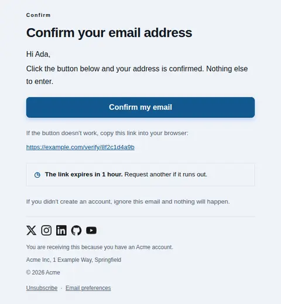
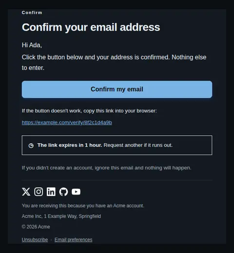
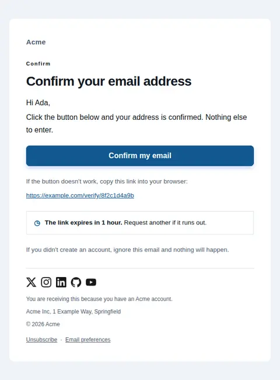
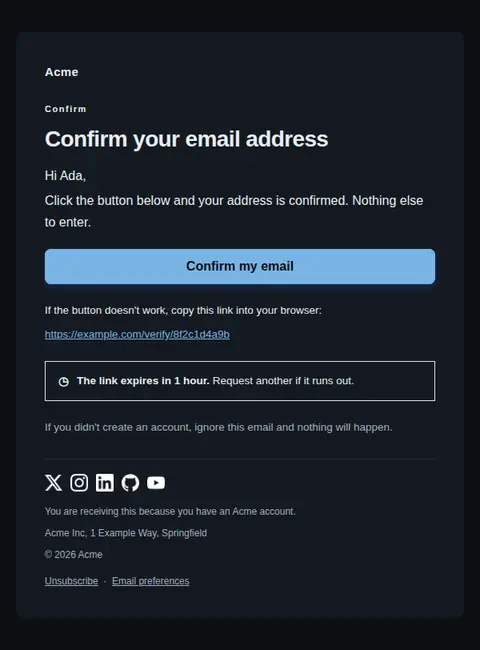
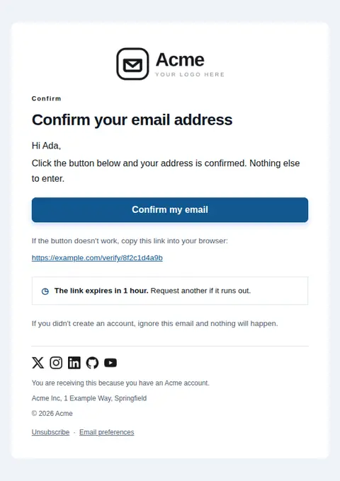
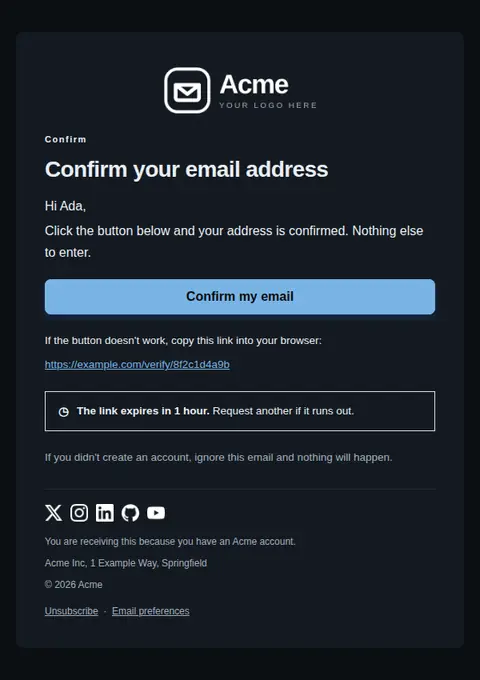

# Verify email address — Link only — free Laravel email template

Confirms an address with a single click and no code, for flows where verification always completes on the device that opened the email.

A free, responsive, dark-mode account email template for Laravel and PHP, MIT licensed and ready to send. Part of [Mailyte Email Templates](../../README.md), the largest open-source catalog of designed transactional email for Laravel -- part of Mailyte, a product of [Techies Africa](https://techies.africa).

**`verify-email-link`** · **account** · **transactional**

**Subject** `Confirm your email address`  
**Preheader** One click and you're done. The link is good for {{ expires_in }}.

Same job, different design: [verify-email](verify-email.md) · [verify-email-code](verify-email-code.md) (code only) · **verify-email-link** · [verify-email-typeset](verify-email-typeset.md) (typeset) · [verify-email-vivid](verify-email-vivid.md) (vivid)

```bash
php artisan mailyte:list verify-email-link
```

```php
Mailyte::template('verify-email-link')->with([...])->send($user);
```

## Every layout, light and dark

Each shot is the real render at 600px, captured from the preview gallery.

| Layout | Light | Dark |
|---|---|---|
| **plain** | <a href="../previews/verify-email-link/plain-light.webp"></a> | <a href="../previews/verify-email-link/plain-dark.webp"></a> |
| **minimal** | <a href="../previews/verify-email-link/minimal-light.webp"></a> | <a href="../previews/verify-email-link/minimal-dark.webp"></a> |
| **branded** | <a href="../previews/verify-email-link/branded-light.webp"></a> | <a href="../previews/verify-email-link/branded-dark.webp"></a> |

## Data it expects

| Variable | Type | Required | What it is |
|---|---|---|---|
| `action_url` | url | yes | The verification link. Required here — this variant has no code, so there is no second path. |
| `body` | text |  | Opening paragraph. With no code to fall back on, say plainly what the button does. |
| `button_label` | string |  | Call to action. |
| `expires_in` | string |  | How long the link stays valid. |
| `fallback_note` | text |  | Line above the raw URL. Not optional in a link-only flow: a stripped or rewritten button leaves the recipient with nothing. |
| `heading_text` | string |  | Main headline. |
| `security_note` | text |  | Closing reassurance. |
| `user.first_name` | string |  | Recipient's first name. Falls back to a generic greeting when absent. |

## More account email templates

[Account scheduled for deletion](account-deleted.md) · [Email address changed](email-changed.md) · [Password changed](password-changed.md) · [Reset your password](password-reset.md)

## Author

[Confidence Ugolo](https://www.linkedin.com/in/confidence-ugolo) · [Joel Omojefe](https://www.linkedin.com/in/joel-omojefe)

Part of Mailyte, a product of [Techies Africa](https://techies.africa). MIT licensed.

---

[← All 50 templates](../gallery.md) · [Package README](../../README.md) · [Sending](../sending.md) · [Theming](../theming.md) · [Deliverability](../deliverability.md)
