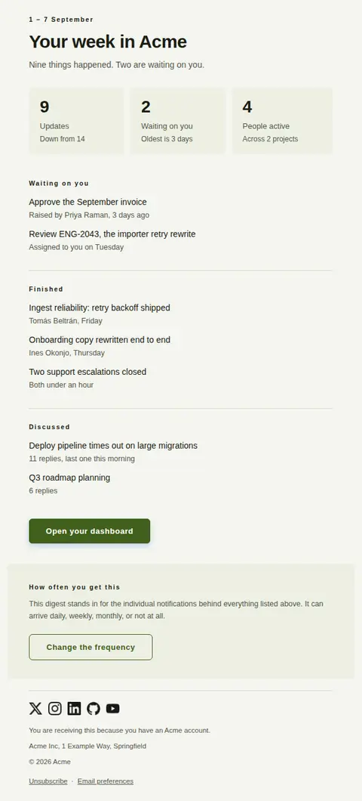
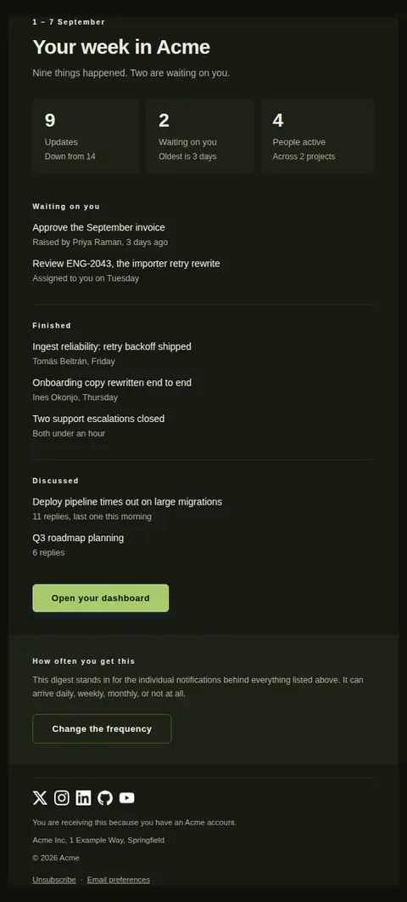
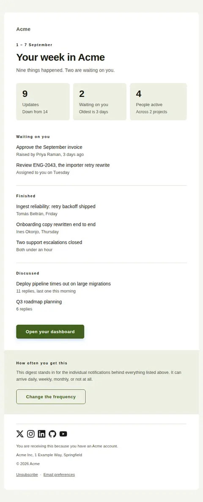
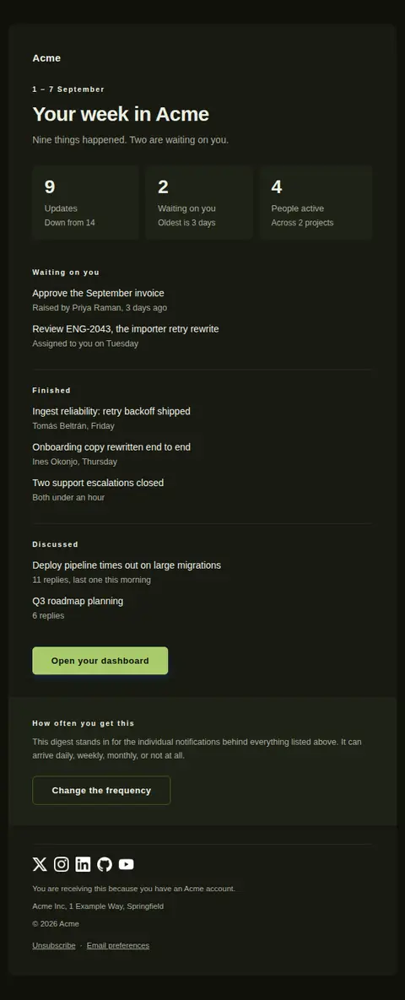
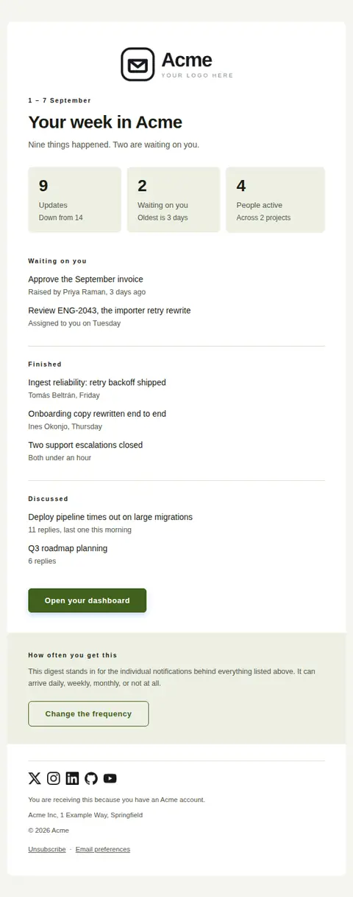
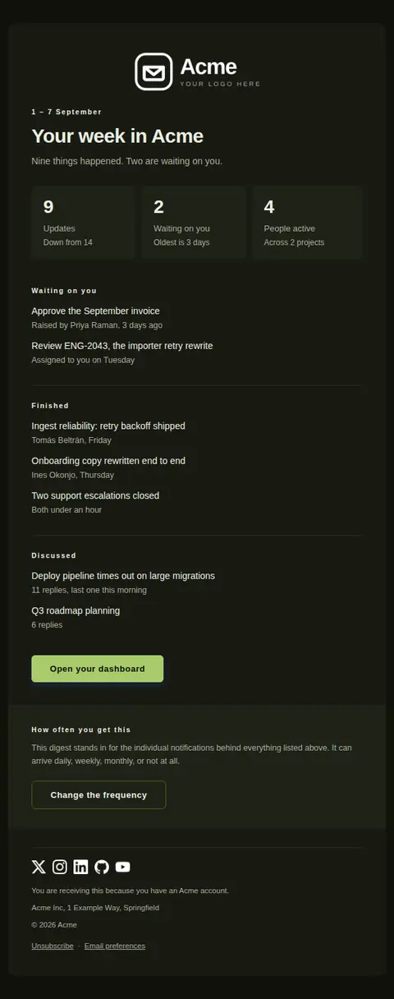

# Weekly digest — free Laravel email template

Batches a period's activity into one message — figures first, then grouped lists — so the per-event notifications behind it can be switched off.

A free, responsive, dark-mode notifications email template for Laravel and PHP, MIT licensed and ready to send. Part of [Mailyte Email Templates](../../README.md), the largest open-source catalog of designed transactional email for Laravel -- part of Mailyte, a product of [Techies Africa](https://techies.africa).

**`weekly-digest`** · **notifications** · **notification**

**Subject** `{{ digest_title }}, {{ period_label }}`  
**Preheader** Everything from the period in one message, grouped, with a way to make it arrive less often.

```bash
php artisan mailyte:list weekly-digest
```

```php
Mailyte::template('weekly-digest')->with([...])->send($user);
```

## Every layout, light and dark

Each shot is the real render at 600px, captured from the preview gallery.

| Layout | Light | Dark |
|---|---|---|
| **plain** | <a href="../previews/weekly-digest/plain-light.webp"></a> | <a href="../previews/weekly-digest/plain-dark.webp"></a> |
| **minimal** | <a href="../previews/weekly-digest/minimal-light.webp"></a> | <a href="../previews/weekly-digest/minimal-dark.webp"></a> |
| **branded** | <a href="../previews/weekly-digest/branded-light.webp"></a> | <a href="../previews/weekly-digest/branded-dark.webp"></a> |

## Data it expects

| Variable | Type | Required | What it is |
|---|---|---|---|
| `action_url` | url | yes | Where the full activity lives for anyone who wants more than the summary. |
| `digest_title` | string | yes | What the reader calls this thing when it lands. Keep it the same every send — a digest earns its place by being recognisable in a list of unread mail. |
| `notification_settings_url` | url | yes | Where the frequency actually gets changed. Required rather than optional here: a batched message that offers no way out is how a digest turns into a spam report. |
| `period_label` | string | yes | The window this covers, stated exactly. A digest that does not say what it covers cannot be trusted to be complete, which is the only thing it is selling. |
| `action_label` | string |  | Label on the action under the lists. It is an overflow route for anything the digest summarised too briefly, not the point of the email. |
| `digest_summary` | string |  | One line separating what happened from what needs the reader. Written by you, not counted by the template, because "two of these need you" is a judgement. |
| `empty_text` | text |  | What the digest says when the period was genuinely quiet. Sending it anyway keeps the rhythm and proves the digest is not broken, so this line has to make a quiet week feel deliberate. |
| `frequency_label` | string |  | Label on the outlined button in that band. Offer the change, not the settings screen. |
| `frequency_text` | text |  | The offer, in plain terms: this message replaces the individual notifications, and it can arrive more or less often. State it every time — the reader has forgotten what they chose. |
| `frequency_title` | string |  | Heading on the closing band. This template exists so per-event mail can be switched off, so the switch gets a heading of its own. |
| `groups` | array |  | The activity itself, grouped by what it is rather than when it happened — each entry a `title` and a list of `items`, and each item a `text` with an optional `detail` line under it. Grouping is the whole reason a digest beats nine separate emails. |
| `stats` | array |  | Two or three figures for the period, each with `value`, `label` and an optional `caption` carrying the comparison that makes the figure mean anything. Four fit; three read. |

## More notifications email templates

[New reply in a thread](comment-reply.md) · [You were mentioned](mention.md) · [Notification](notification.md) · [A task was assigned to you](task-assigned.md)

## Author

[Confidence Ugolo](https://www.linkedin.com/in/confidence-ugolo) · [Joel Omojefe](https://www.linkedin.com/in/joel-omojefe)

Part of Mailyte, a product of [Techies Africa](https://techies.africa). MIT licensed.

---

[← All 50 templates](../gallery.md) · [Package README](../../README.md) · [Sending](../sending.md) · [Theming](../theming.md) · [Deliverability](../deliverability.md)
