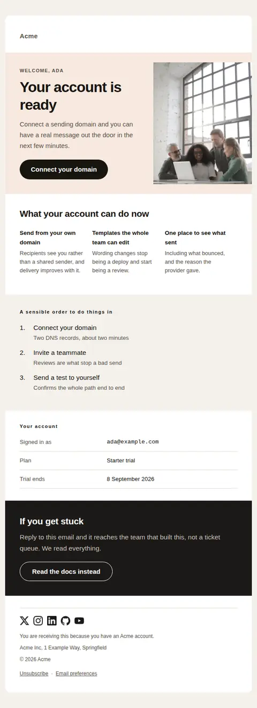
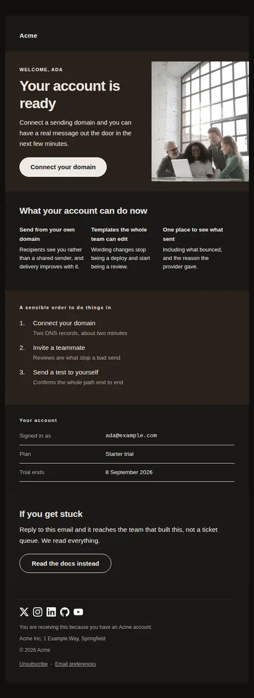
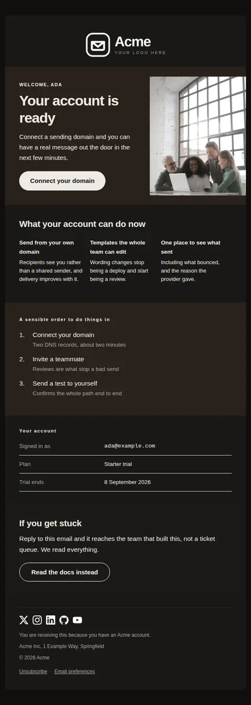
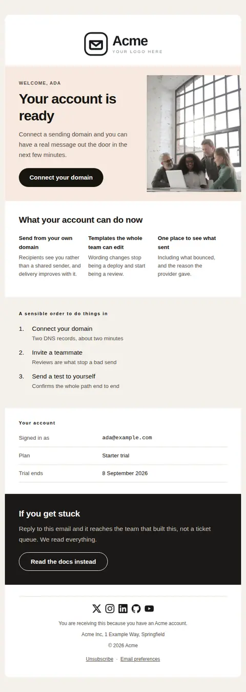
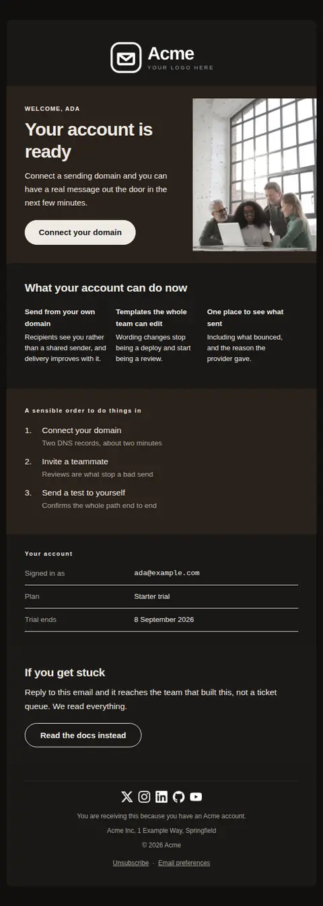

# Welcome — free Laravel email template

Sent once the account is confirmed, to orient a new user, state what they now have, and point at one first action.

A free, responsive, dark-mode onboarding email template for Laravel and PHP, MIT licensed and ready to send. Part of [Mailyte Email Templates](../../README.md), the largest open-source catalog of designed transactional email for Laravel -- part of Mailyte, a product of [Techies Africa](https://techies.africa).

**`welcome`** · **onboarding** · **transactional** · **friendly**

**Subject** `Welcome to {{ product.name }}`  
**Preheader** Your account is ready. Here is the one thing worth doing first.

```bash
php artisan mailyte:list welcome
```

```php
Mailyte::template('welcome')->with([...])->send($user);
```

## Every layout, light and dark

Each shot is the real render at 600px, captured from the preview gallery.

| Layout | Light | Dark |
|---|---|---|
| **minimal** | <a href="../previews/welcome/minimal-light.webp"></a> | <a href="../previews/welcome/minimal-dark.webp"></a> |
| **branded** | <a href="../previews/welcome/branded-light.webp"></a> | <a href="../previews/welcome/branded-dark.webp"></a> |
| **editorial** | <a href="../previews/welcome/editorial-light.webp"></a> | <a href="../previews/welcome/editorial-dark.webp"></a> |

## Data it expects

| Variable | Type | Required | What it is |
|---|---|---|---|
| `action_url` | url | yes | The one action this email is for. Stated once, not repeated in every band. |
| `account_rows` | array |  | The facts a new user comes back to this email for: which address they signed up with, which plan, when a trial ends. |
| `body` | text |  | The paragraph under the headline. Say what the first action gets them, not that they should take it. |
| `button_label` | string |  | Primary button label. |
| `capabilities` | array |  | Two or three capabilities as `heading` / `text` pairs, shown side by side. Concrete abilities, not adjectives, and no icons — platform emoji render differently everywhere and read as juvenile. |
| `capabilities_heading` | string |  | Heading for the capability row. |
| `eyebrow` | string |  | Small label above the headline. |
| `heading_text` | string |  | The headline, set at 34px across two lines. Write it to break well. |
| `help_heading` | string |  | Heading for the closing band. |
| `help_link_label` | string |  | Label for the documentation link. |
| `help_text` | text |  | The closing offer. A named person outperforms a help-centre link, which is why this is a sentence rather than a button. |
| `help_url` | url |  | Optional documentation link for people who would rather not write to anyone. |
| `hero_image` | url |  | Image for the opening split. A screenshot of the product beats a photograph; use a photograph only when you have nothing real to show, and never use decoration that says nothing. |
| `steps` | array |  | First actions worth taking, in order, as `text` / optional `detail`. Three or fewer; a longer list reads as homework. |
| `steps_heading` | string |  | Heading for the ordered first-run list. |
| `user.first_name` | string |  | Recipient's first name. |

## Credits

- Cheerful diverse colleagues working on a laptop during a startup project by Olly via Pexels — [source](https://www.pexels.com/photo/cheerful-diverse-colleagues-of-different-ages-working-on-laptop-during-startup-project-3865639/) (Pexels License, sample data only)

## More onboarding email templates

[Account activated](account-activated.md) · [First milestone reached](first-milestone.md) · [Getting started checklist](getting-started.md) · [Setup incomplete](setup-incomplete.md) · [Trial ending soon](trial-ending.md) · [Trial expired](trial-expired.md) · [Trial started](trial-started.md)

## Author

[Confidence Ugolo](https://www.linkedin.com/in/confidence-ugolo) · [Joel Omojefe](https://www.linkedin.com/in/joel-omojefe)

Part of Mailyte, a product of [Techies Africa](https://techies.africa). MIT licensed.

---

[← All 50 templates](../gallery.md) · [Package README](../../README.md) · [Sending](../sending.md) · [Theming](../theming.md) · [Deliverability](../deliverability.md)
